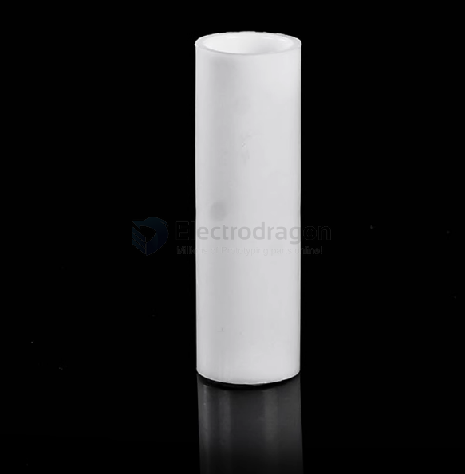
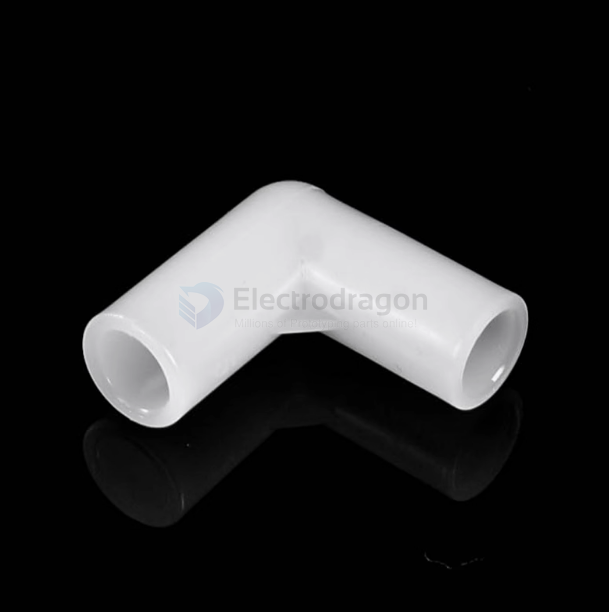
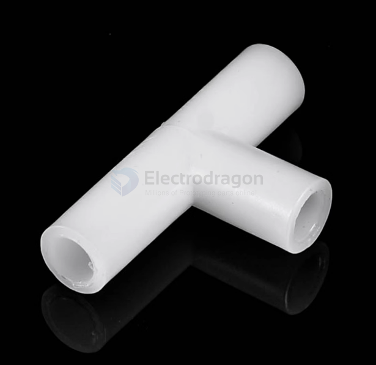
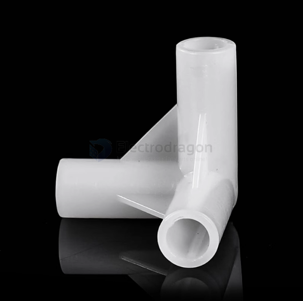
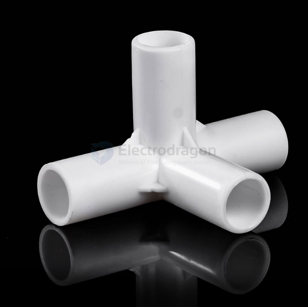

# mechnical-structure-dat.md

### PVC tube build 

| Outer diameter | thickness | length    |
| -------------- | --------- | --------- |
| 6mm            | 1mm       | [1 meter] |
| 7mm            | 1mm       | [1 meter] |
| 8mm            | 1mm       | [1 meter] |
| 9mm            | 1mm       | [1 meter] |
| 10mm           | 1mm       | [1 meter] |
| 11mm           | 1mm       | [1 meter] |
| 12mm           | 1mm       | [1 meter] |
| 13mm           | 1mm       | [1 meter] |
| 14mm           | 1mm       | [1 meter] |
| 16mm           | 2mm       | [1 meter] |

#### Connector 

1D 

2D 

3D-flat 

3D

4D

### aluminum profile

3030 Profile: This refers to an aluminum profile that is 30mm x 30mm in cross-section.
- It is often used for smaller frames, workstations, and lighter structural applications.
  
4040 Profile: This refers to an aluminum profile that is 40mm x 40mm in cross-section.
- It is typically used for slightly larger and more robust frames and structures, ideal for heavier-duty applications or larger equipment.

### turnover box

