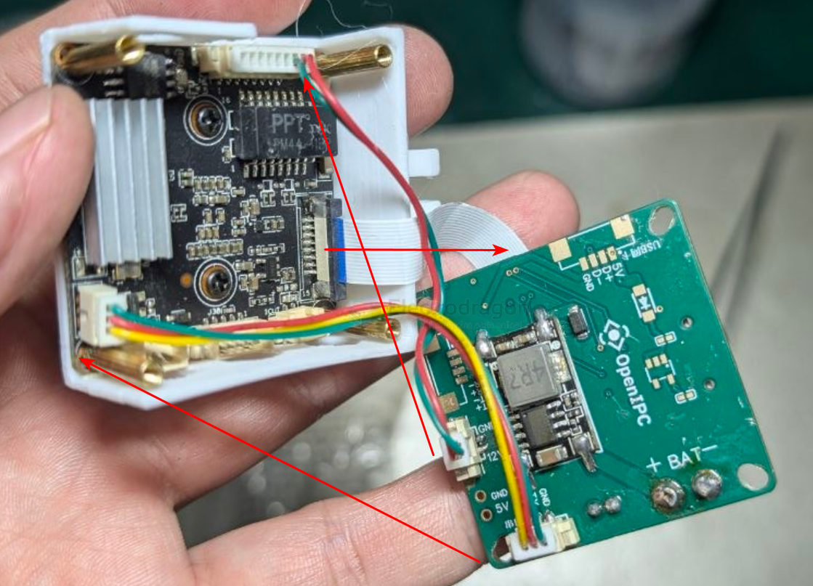
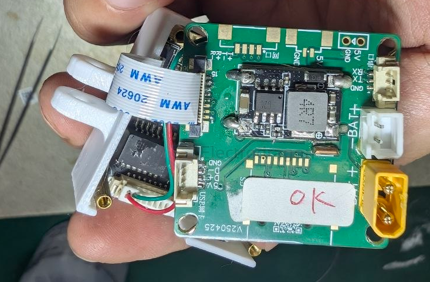
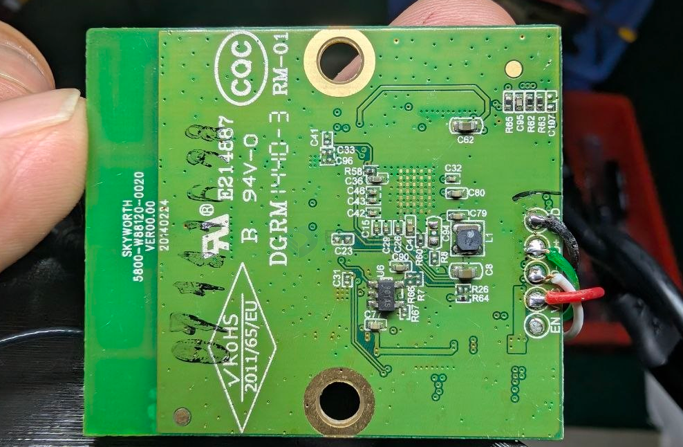
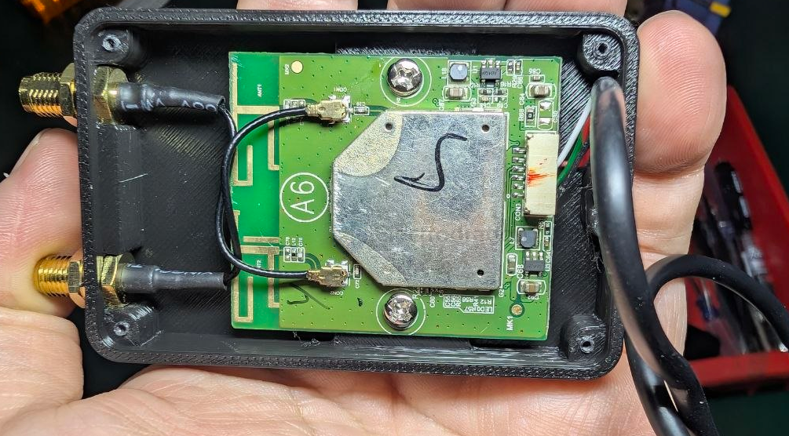
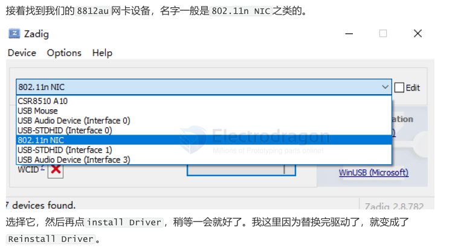

# VRX-openIPC-dat

- [[VRX-dat]] - [[VRX-openIPC-dat]] - [[openIPC-dat]]

- [[wifi-WFB-ng-dat]]


- [[VRX-dat]] - [[openIPC-dat]] - [[VRX-openIPC-dat]] - [[VRX-openIPC-bonnet-dat]]


- [[VTX-openIPC-dat]] 


## tech stack 


- [[VRX-openIPC-bonnet-dat]] 


地面端需要：
- SBC（树莓派 / NanoPi / Radxa）+ ⭐️ RTL8812AU 网卡
- 或 Ubuntu PC（官方有指南）
- 输出：UDP 视频流（可指向局域网内任意设备）


地面端（三选一）

- WFB-ng（OpenIPC 官方 WiFi Broadcast 链路方案）
- PixelPilot_rk（Rockchip 板 → 专用地面站 + 显示输出）
- OpenIPC Bonnet（板载 HDMI→DisplayPort 桥）
- 或自组：树莓派 + 网卡 → HDMI 输出

→ HDMI 线 → 眼镜 HDMI IN

WFB-ng        = 怎么传（链路协议）
PixelPilot_rk = 怎么解（地面站软件，Rockchip）
Bonnet        = 怎么接（硬件板，可单独配手机）
        ↓
⭐️ 三者可叠加：Bonnet(硬件) + wfb-ng(协议) + PixelPilot(软件) = 完整地面站


## goggles 

- [[FPV-goggles-dat]]

⭐️ 社区共识：

 "There are no OpenIPC goggles. There's ground stations. Link them to a phone, tablet..."


OpenIPC 地面站（SBC + WiFi 网卡解码）
        ↓ ⭐️ HDMI 输出
接【有 HDMI 输入的眼镜】/ 显示器 / 手机 / AR 眼镜
        ↓
⭐️ 关键要求 = 眼镜必须有 HDMI IN


## 地面端与接收平台方案（怎么接屏幕）

WFB-NG 接收到无线射频并解包后，需要将视频流（RTP/UDP）输出给显示设备。目前主流的地面端承载方案有：

**Linux 笔记本 / PC 方案（Ubuntu / Debian）**

直接在电脑上插兼容网卡，运行 WFB-NG 接收端，配合 GStreamer 或 QGroundControl 显示，延迟最低、性能最强。

**树莓派 / 嵌入式 Linux 盒子方案（Raspberry Pi / Radxa / 随身Wi-Fi）**

采用小型的树莓派（如 Pi Zero 2W / Pi 4）或香橙派作为“图传接收盒”，插网卡收数传和图传，再通过局域网 Wi-Fi 将画面转发给平板或手机。

**Android 手机 / 平板方案（如 PixelPilot 等开源地面站软件）**

专门为 Android 开发的地面端显示软件，但它极少直接通过 USB OTG 驱动外置高功率网卡（因为 Android 内核限制），通常需要配合上述的“接收盒子”使用，或者使用特定移植了驱动的极少数定制 Android 开发板。


## PixelPilot_rk

OpenIPC/PixelPilot_rk

https://github.com/OpenIPC/PixelPilot_rk

WFB-ng client (Video Decoder) for Rockchip platform powered by the Rockchip MPP library. It also displays a simple LVGL based OSD that shows the bandwidth, decoding latency, and framerate of the decoded video, and wfb-ng link statistics.


- [[pixelpilot-dat]] - [[openIPC-dat]]


## USB tether 

⭐️⭐️ 方案 B：USB 线连地面站（最稳，RubyFPV 官方方案）

地面站（树莓派/Radxa + OpenIPC/Ruby）
        ↓ 普通 USB 线
手机（开【USB 网络共享 / Tethering】）
        ↓
手机装 FPV VR App（Google Play 任意一个）
        ↓
⭐️ 优点：手机只当显示器，【不需要给手机插 USB 网卡】


1. 地面站（树莓派/Rockchip）刷 OpenIPC/Ruby 地面镜像
2. 手机用 Type-C 数据线连到地面站 USB 口
3. 手机设置 → 打开【USB 网络共享】
4. 手机装 PixelPilot（首选）或任意 FPV VR App
5. App 内选视频流（UDP/RTSP）→ 显示画面
6. （可选）手机塞进 VR 盒子 → 头戴飞行

- [[video-streaming-dat]]

## ubuntu PC 

Ubuntu PC + RTL8812AU USB 网卡 + wfb-ng
→ 大屏、强解码能力


## WIFI hotspot

- [[wifi-hotspot-dat]]

方案 C：地面站开 WiFi 热点 → 手机连热点

无需接线，但延迟略增


## android obselete ?? 

**Android 系统的驱动限制：**

原生 Android 系统内核并没有编译进绝大多数外置 USB 无线网卡的驱动（特别是需要支持 Monitor 模式的底层驱动，如 8812au 等）。

~~除非你的 Pixel 8 Pro 已经解锁 Bootloader 并刷入了经过特制、编译了无线网卡驱动与 Wireshark/Monitor 补丁的 Kernel（内核），否则标准的 Android 系统无法直接驱动这款 USB 网卡去接收 WFB-NG 图传~~

~~替代推演：通常玩 OpenIPC + WFB-NG 手机地面端时，大家更多会用 Android 手机连接一个车机/图传接收盒（例如用树莓派 Zero 2W、香橙派、或者专门的随身Wi-Fi刷机作为接收端）。接收端负责插 USB 网卡收图传，然后通过 Wi-Fi 热点把视频流发给 Pixel 8 Pro 显示。~~


## build 


### build 2 





### build 1 



SKYWORTH - [[skyworth-dat]]
5800-W88120-0020
VER00.00
20140224

~~原裝創維液晶電視機通用無線網卡 WiFi模塊U8192E1 NTUD-B5~~


- [[USB-type-C-dat]] - [[USB-SDK-dat]]



- [[pixelpilot-dat]]


## PC config 



config.yaml

```yaml
captures:
  - name: dronel # 这一路的唯一名字，随便起，但不能重复
    type: wfb # windows 上固定是 wfb（走 devourer USB 采集）
    usb_vid: 0x0bda # 网卡 USB VID
    usb_pid: 0x881a # 网卡 USB PID，0bda:881a 就是 RTL8812AU-VS
    key: gs.key # 密钥路径；建议和 exe 放一起直接写 gs.key
    link_id: 7669206 # 天空端链路 ID，默认不用改
    radio_port: 0 # 视频端口，默认不用改
    epoch: 0 # 默认不用改
    channel: 161 # 信道，要和天空端一致
    bandwidth: HT20 # 带宽，要和天空端一致（HT20／HT40+）
    region: BO # 监管域，一般不用改
    codec: h265 # 天空端是 H265 就写 h265，H264 就写 h264
    forward:
      - "127.0.0.1:5700" # 本机接收端 (低延迟播放)
      - "192.168.1.50:5600" # 局域网里另一台电脑/手机
```

这里最关键的是  usb_vid   /  usb_pid  、 key  、 channel  、 codec   和  forward 。

`usb_vid   /  usb_pid`  ：用  lsusb   或设备管理器里的硬件 ID 确认，一般是  0bda:881a  。设备管理
器里看“硬件 ID”是  USB\VID_0BDA&PID_881A   这种格式，对应填  0x0bda   和  0x881a 。

`key`  ：如果  gs.key   和 exe 在同一目录，直接写  gs.key   就行；否则写绝对路径，例如  C:/fpv-
relay/gs.key  。注意 YAML 里路径的反斜杠要写成  /  或者双反斜杠。

`channel   /  bandwidth   /  region`  ：这三个必须和天空端一致，不一致就解不出画面（日志里会一
直有解密错误）。默认  161 / HT20 / BO ，天空端没动过就别动。

`codec`  ：填错会导致能收到包但预览黑屏，H265 填  h265  ，H264 填  h264 。

`forward`  ：解出来的裸 RTP 要往哪里推。 127.0.0.1:5700   是本机，想看画面就留着；想给局域
网里别的机器就加一条  目标IP:端口 。可以写多条。


captures:   # 必填：每一路图传（一块接收卡或一个 UDP 输入）
uplink:     # 可选：电脑 → 无人机 的上行（mavlink / 遥控）
status:     # 可选：HTTP 状态页
rtsp:       # 可选：RTSP 兼容输出


## linux 

captures:
  - name: drone1
    type: wfb
    iface: wfb0
    key: /opt/fpv-relay/gs.key
    link_id: 7669206
    radio_port: 0
    epoch: 0
    channel: 161
    bandwidth: HT20
    region: BO
    codec: h265
    forward:
      - "127.0.0.1:5700"


## ref 

