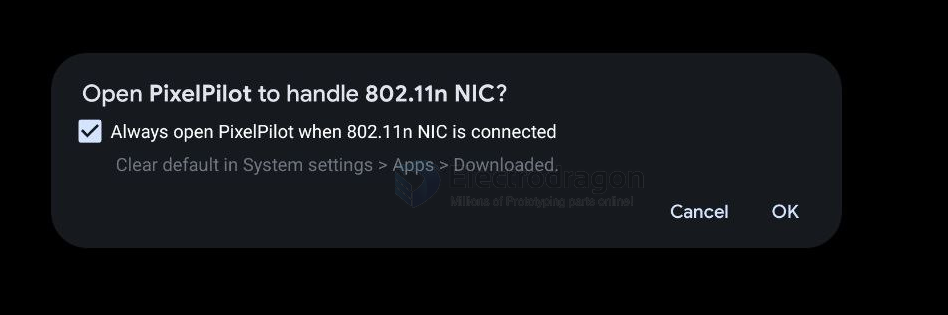
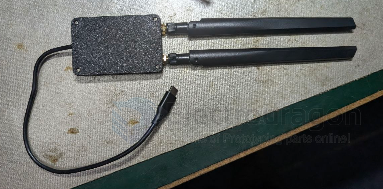

# pixelpilot-dat

- [[pixelpilot-dat]] - [[openIPC-dat]]

## setup 

地面端：网卡插到手机上，设置：WIFI信道161，频宽20，视频解码H265,
出现下图，就识别到网卡了（绝大部分安卓机都可以使用,如果不能用，请看下手机是否开启OTG）

## requirements

- USB-C 支持 OTG ✅（安卓标配）
- USB 3.2 Gen 2（10Gbps）✅ —— 符合"建议 USB 3.0"
- 性能足够解码 H.264/H.265

## steps 

第一步（最低成本验证）：
  1. 买个 RTL8812AU USB 网卡（¥50-100）
  2. 买个质量好的 USB-C OTG 转接头
  3. GitHub 下载 PixelPilot APK 安装
  4. 网卡接 OTG → 插 Pixel 8 Pro
  5. 开天空端 → App 看画面
        ↓
⭐️ 成功 = 零地面站硬件看图传
⭐️ 失败（供电/驱动）→ 加带供电 Hub 再试
             → 或改用"地面站 SBC + USB 线连手机"

## info 

- [[USB-OTG-dat]] - [[USB-3.0-dat]] - [[USB-SDK-type-C-dat]]

https://github.com/OpenIPC/pixelpilot

- [[wifi-adapter-dat]] - [[wifi-router-dat]]

RTL8812AU 等网卡 → OTG 接手机

⭐️ OpenIPC 官方文档原话：
 "For Viewing (Ground Station): Android: PixelPilot app (recommended)"

手机装 PixelPilot → 接收 OpenIPC 视频流（1080p）

📱 官方实测设备列表（⭐️ 关键！）

- ⭐️ Google Pixel 7 Pro ✅ ← 你的 Pixel 有戏！
- • Samsung Galaxy A54（Exynos 1380）
- • Poco X6 Pro
- • ⭐️ Meta Quest 2 / Quest 3 ✅

❌ MediaTek 芯片有 USB 传输问题

Dimensity 810 / Helio G99 / MT6765
→ LIBUSB 超时、零接收、无画面

⚠️ 其他：
- 需要 USB OTG 适配器（不work 就换一个，质量差异大）
- 建议设备支持 USB 3.0（Reddit 提到低端机 USB2 可能不行）
- 官方文档写"Snapdragon based"，但实测列表已有 Exynos / Tensor（说明该建议偏保守）

## ref 

- [[antenna-dat]]

