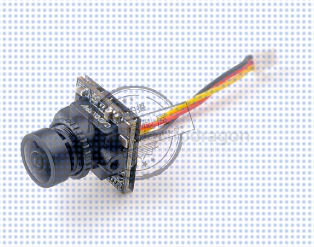
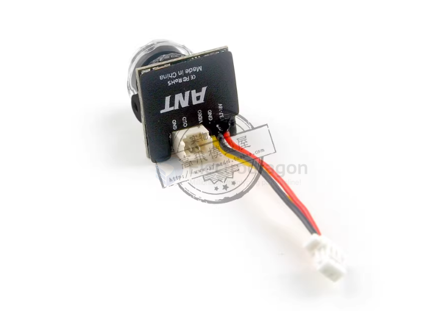

# VTX-dat

The Video Transmitter (VTX) is a crucial component of the FPV system, wirelessly transmitting camera images to FPV goggles.

- [[FPV-dat]]

## integrated solutions

- [[DJI-air-unit-dat]] - [[DJI-O4-dat]] == 100 usd - [[DJI-O3-dat]] 

- [[runCAM-dat]]

    - [[runCAM-nano4-dat]]
    - runcam nano 3

- [[worksnail-dat]]

- openIPC ? 

- [[FPV-load-dat]] == [[TX800-dat]] + [[MS-519-dat]] + [[camera-action-dat]] = RMB 250 + 500 = 750

- [[fiber-analog-video-dat]]

- [[video-transmission-dat]]

- [[goggles-dat]]

## caddx 

- [[mobula8-dat]] == Caddx ANT 1200TVL == 4:3

- [[caddx-dat]]

- Caddx ANT 1200TVL
- caddx nano 
- Baby Ratel2

## camera 

- [[camera-digital-dat]]

- [[camera-analog-dat]] - [[TX800-dat]] - [[MS-519-dat]]

## ref 

- [[VTX-dat]] - [[camera-dat]] - [[wireless-camera-dat]]

- [[FPV-dat]]