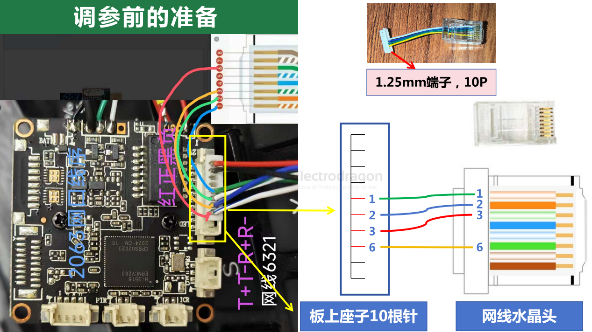
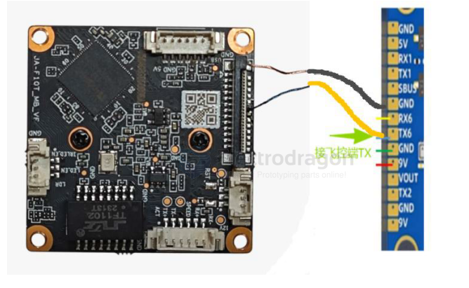
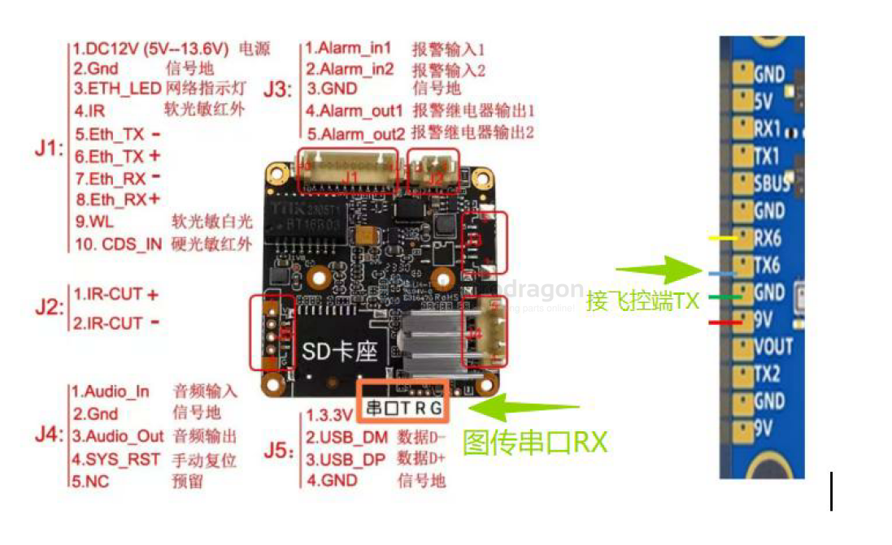
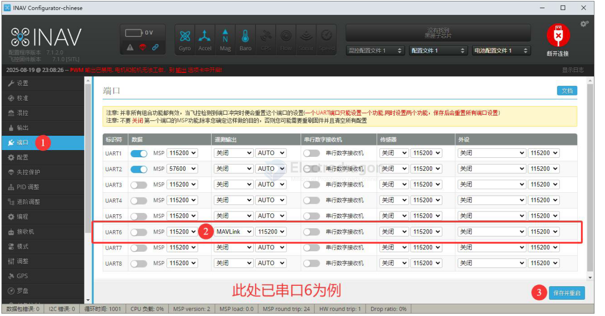
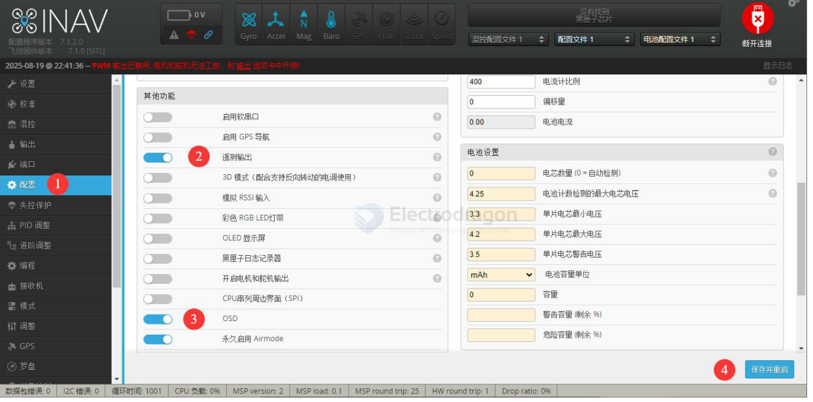

# VTX-openIPC-dat

- [[VTX-openIPC-dat]] - [[VRX-openIPC-dat]]

- [[OSD-dat]]

## connect to PC for debugging 

查看路由器的设备，可以看到新的连接上来了（主板使用DHCP获取IP地址，用路由器方便看地址和分配地址，直接网线插电脑也可以，但是IP需要自己想办法获取

## build 1 

- [[openIPC-dat]]

- [[MSPOSD-dat]] - [[mavlink-dat]] - [[OSD-dat]] - [[VTX-openIPC-dat]]

- [[VTX-openIPC-dat]] - [[VTX-dat]]

- [[hi3516-dat]]

## OSD 

- [[hi3516-dat]] - [[OSD-dat]]

PWM1 

关于OSD接线：飞控端口设置：mavlink，波特率115200，飞控TX接的摄像头上的pwm1 

## parameters 

账号root，密码12345，

- [[serial-dat]] - [[SSH-dat]] 

输入vi/etc/wfb.conf回车，注意空格
vi /etc/wfb.conf

切换Msposd输入vi /etc/telemetry.conf回车 - [[MSPOSD-dat]] - [[mavlink-dat]] - [[OSD-dat]] - [[VTX-openIPC-dat]]

vi /etc/wfb.conf
vi /etc/telemetry.conf

resolutions 

vi /etc/majestic.yaml

## connect to flight controller 

飞控 5V接摄像头USB线正极(如果想用12V供电，可以改到另一个座子供电，要到群里确认，接错板子会烧掉)
飞控 GND接板上金色飞线(下方有示意图)
飞控 T6摄像头串口 R

飞控 5V 或者 9v 接 图传 JST 母座红线 5V-12V（建议直接接到 2-3S 电池上）
飞控 GND 接 图传 JST 母座黑线（建议直接接到 2-3S 电池上）
飞控 TX6 接 图传杜邦线（黄线 R 上）
飞控 RX6 接 未焊线（一般不用）

- [[INAV-dat]] - [[VTX-openIPC-dat]] - [[OSD-dat]] - [[mavlink-dat]] - [[rc-system-dat]]

## ref 

