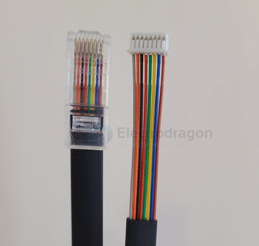
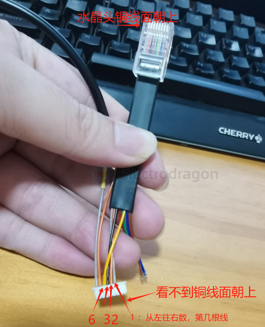
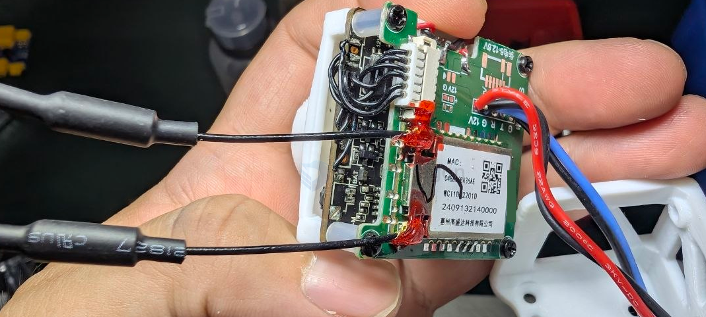
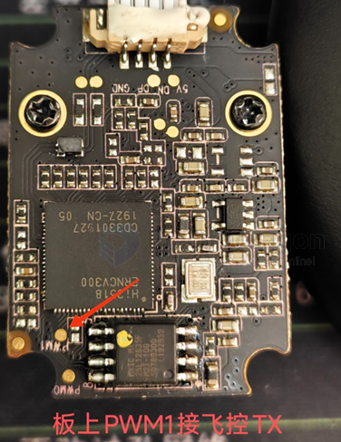
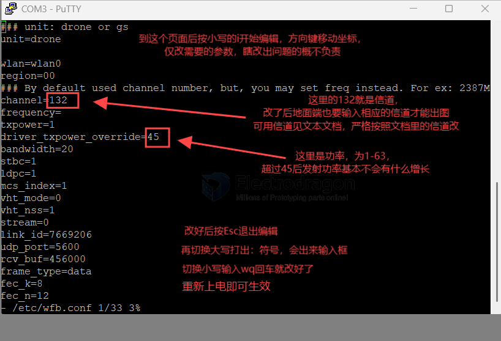
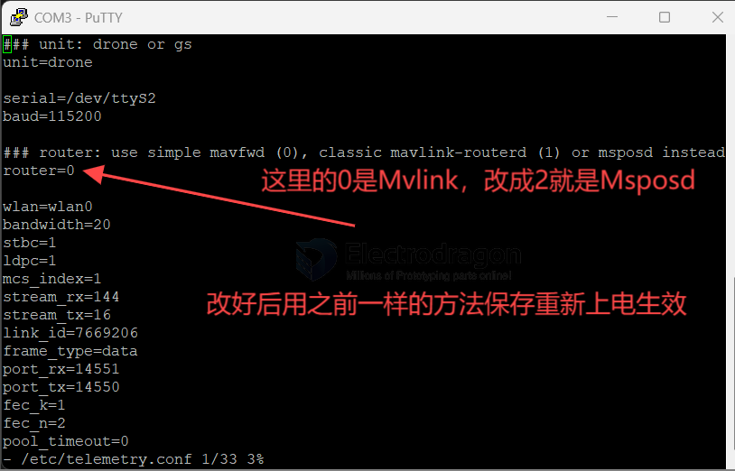
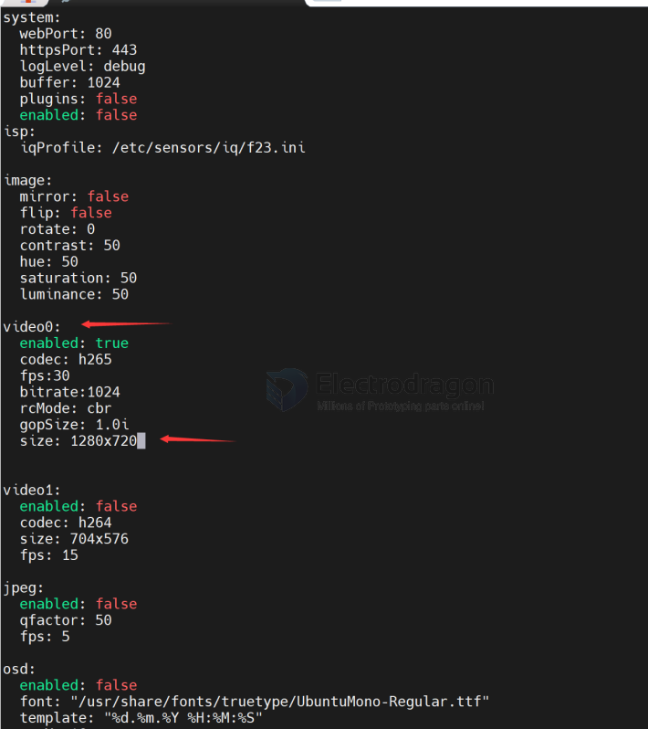

# VTX-openIPC-dat

## connect to PC for debugging 

查看路由器的设备，可以看到新的连接上来了（主板使用DHCP获取IP地址，用路由器方便看地址和分配地址，直接网线插电脑也可以，但是IP需要自己想办法获取

## build 1 

IVG-G2S == https://www.xiongmaitech.com/en/index.php/product/product-detail/204/227/456

https://github.com/OpenIPC/sandbox-fpv/blob/master/notes_start_ivg-g2s.md

- [[openIPC-dat]]

- [[MSPOSD-dat]] - [[mavlink-dat]] - [[OSD-dat]] - [[VTX-openIPC-dat]]

- [[VTX-openIPC-dat]] - [[VTX-dat]]

- [[hi3516-dat]]

## OSD 

- [[hi3516-dat]] - [[OSD-dat]]

PWM1 

关于OSD接线：飞控端口设置：mavlink，波特率115200，飞控TX接的摄像头上的pwm1 

## parameters 

账号root，密码12345，

- [[serial-dat]] - [[SSH-dat]] 

输入vi/etc/wfb.conf回车，注意空格
vi /etc/wfb.conf

切换Msposd输入vi /etc/telemetry.conf回车 - [[MSPOSD-dat]] - [[mavlink-dat]] - [[OSD-dat]] - [[VTX-openIPC-dat]]

vi /etc/wfb.conf
vi /etc/telemetry.conf

resolutions 

vi /etc/majestic.yaml

## ref 

