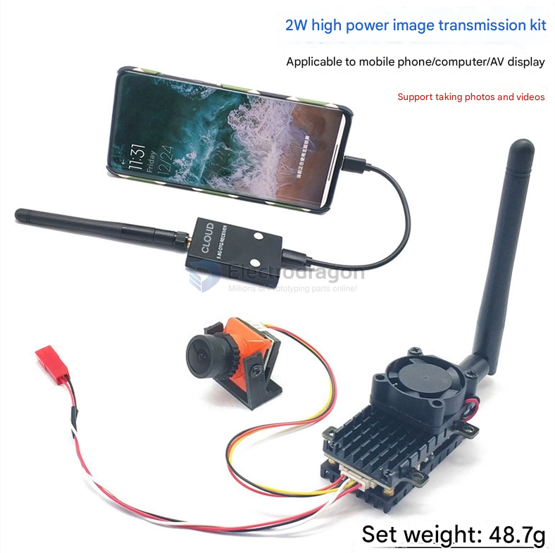
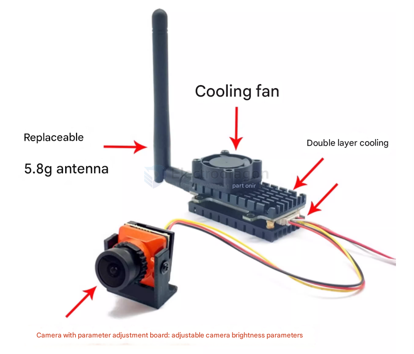

# video-analog-dat

- [[video-analog-dat]] - [[video-digital-dat]] - [[video-transmission-dat]] - [[video-dat]]

- [[VTX-dat]] - [[VRX-dat]]

- [[video-analog-dat]] - [[video-transmission-dat]] - [[video-dat]] - [[camera-analog-dat]]

- [[video-digital-dat]] - [[video-dat]] - [[video-analog-dat]]

- [[CVBS-dat]] - [[AHD-dat]] - [[TVI-dat]] - [[CVI-dat]] - [[analog-video-dat]]

- [[sensor-camera-dat]] - [[camera-analog-dat]] - [[camera-FPV-dat]]

### ⚠️ 模拟图传做不到 10-20km（不划算）
- 实用 2-5km；极限 10-20km 需 1-2W + 高增益定向天线 + **地面跟踪云台**（画质仍差）

### Other RC video transmission

## Can a 2W Analog FPV Transmission System Run 24/7?

**Yes, but with precautions:**

#### ✅ Conditions for Safe 24/7 Operation:
- **Good cooling** (heatsink + fan recommended)
- **Stable power supply**
- **Antenna always connected**
- **High-quality VTX components**

#### ⚠️ Risks:
- Overheating
- Component wear/failure
- Possible RF interference

#### 🔧 Tips:
- Add active cooling
- Use lower power if long range isn’t needed
- Monitor temperature
- Consider industrial-grade VTX or digital systems for reliability

#### Issue: This device is not well-suited for continuous surveillance applications.

Limitation: Requires a cool-down period after 4-5 hours of operation, suggesting potential overheating or reliability concerns with extended use.

## improve the performance of analog video

Ranked by cost-effectiveness:

### 1 Antenna system (VTX + goggles) ⭐️⭐️⭐️ best value

- Stock antennas (especially the ones bundled with goggles) are usually low quality — the biggest waste
- Replace with circular-polarized antennas: Foxeer Lollipop / TrueRC / VAS
- Effect: ~+3~6dB equivalent, multipath interference greatly reduced, snow/static noticeably delayed
- Cost ¥30-100 each — the cheapest way to get a qualitative jump

### 2 Camera focus check (free!) ⭐️⭐️ often overlooked

- Many cameras are not focused correctly from the factory (infinity not set) → the image is inherently soft
- How to check: aim at a target 5-10 m away and see if it is sharp
- If soft → turn the lens to adjust focus (some models are adjustable) → zero-cost sharpness gain

### 3 Camera sensor size ⭐️⭐️⭐️ determines the image quality ceiling

- 1/3" → 1/1.8" (e.g. Caddx Ratel Pro) is a qualitative jump:
  - Exponentially more light intake → very little noise at night / on overcast days
  - Wider dynamic range (WDR) → no crushed blacks when backlit
- Cost ¥100-200
- ⚠️ Note: TVL numbers (1200/1800 lines) are useless — analog format tops out at 480-576 lines, don't pay for the number

### 4 Goggle receiver module ⭐️⭐️ the core of snow/static resistance

- High-end diversity receivers (RapidFIRE / SteadyView) with anti-multipath and anti-rolling-screen algorithms
- Effect: with the same signal the image is far more stable (not stronger — just usable)
- Cost: ¥300-800 (or upgrade goggles, e.g. Skyzone 04X)

### 5 VTX power — diminishing returns

- 25mW → 400mW is worthwhile, but doubling power only gives +3dB
- Once at 400mW, stop increasing it (heat / power consumption cost too much)

### 6 Channel selection + environment (free)

- Use Raceband to avoid crowded bands, stay away from WiFi / other pilots
- Separate your frequency when flying with others

### 7 Camera parameter tuning (free)

- Fine-tune contrast / sharpness / brightness (some cameras have an OSD menu or potentiometer)
- But don't over-sharpen (it creates white edging and looks worse)

## chip 

- [[chip-cn-dat]] - [[fullhan-dat]] - [[FH8686-dat]] - [[media-ISP-dat]] - [[video-dat]] - [[video-analog-dat]] - [[caddx-ant-dat]] 

## Analog FPV Transmission System

## ref 

