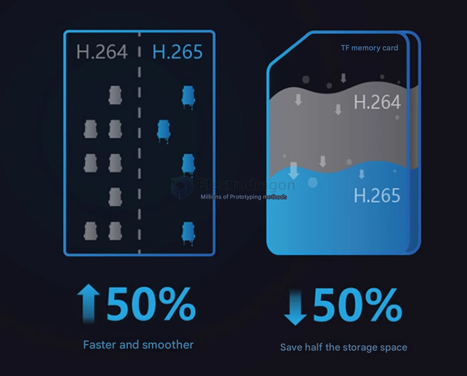

# video-dat

## resolution compare 

| Resolution Name | short | Megapixels (MP) | Pixel Dimensions         | Aspect Ratio | Common Use Cases             |
| --------------- | ----- | --------------- | ------------------------ | ------------ | ---------------------------- |
| 1080p (Full HD) | FHD   | ~2.1 MP         | 1920 × 1080              | 16:9         | HD video, streaming          |
| 3MP             |       | 3.0 MP          | 2048 × 1536 (or similar) | 4:3          | Budget security cameras      |
| 4MP             |       | 4.0 MP          | 2560 × 1440              | 16:9         | Mid-range security systems   |
| 5MP             |       | 5.0 MP          | 2592 × 1944              | 4:3          | Higher-res CCTV, imaging     |
| 4K (Ultra HD)   | UHD   | ~8.3 MP         | 3840 × 2160              | 16:9         | High-end video, surveillance |

## analog video 

### 720p Analog Video Over 1 Mbps Bandwidth

It is possible to transmit **720p analog video** over a **1 Mbps** data bandwidth, but it depends on the **compression** and **encoding** used to convert the analog signal into a digital format.

#### Key Factors:
1. **Analog Video to Digital Conversion**: Analog video signals (such as **CVBS** or **AHD**) need to be converted into a digital format (e.g., **H.264**, **MJPEG**) for network transmission.
   
2. **720p Resolution**: **720p** video has a resolution of **1280 x 720 pixels**, with common frame rates around **30 FPS**.

3. **Compression**: 
   - **H.264** compression can compress **720p** video to about **1-2 Mbps** without significant quality loss, making it feasible for streaming over **1 Mbps**.
   - **H.265 (HEVC)** offers better compression efficiency, potentially allowing **720p** video to be streamed at **1 Mbps** or even less.
   - **MJPEG** tends to be less efficient and may require more bandwidth than **1 Mbps** for good quality.

#### Conclusion:
- **Yes**, it is possible to run **720p analog video** over a **1 Mbps** bandwidth using modern video compression techniques, especially **H.264** or **H.265**. However, the quality and bandwidth usage can vary depending on the scene complexity and the chosen encoding settings.

## ref 

- [[camera-dat]]