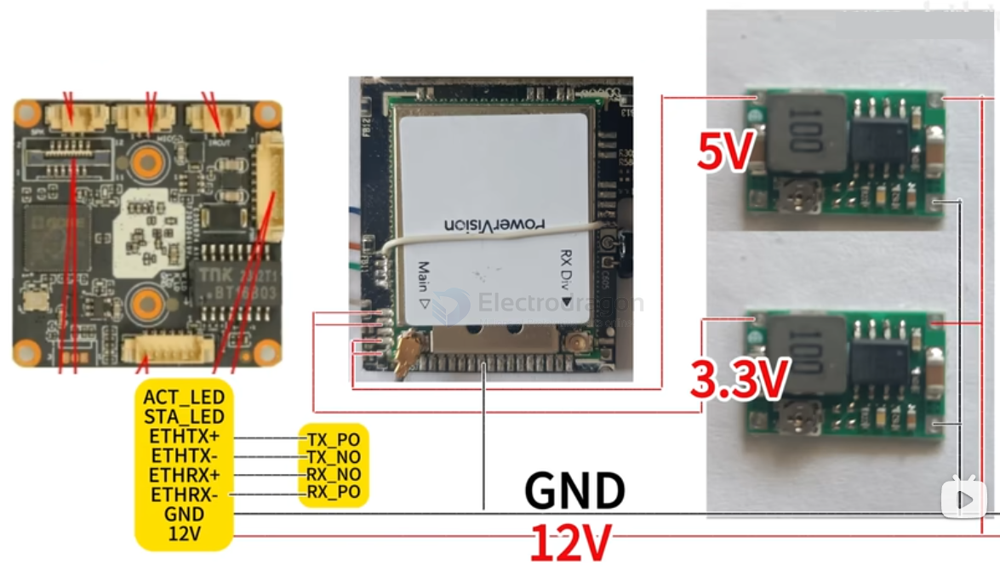
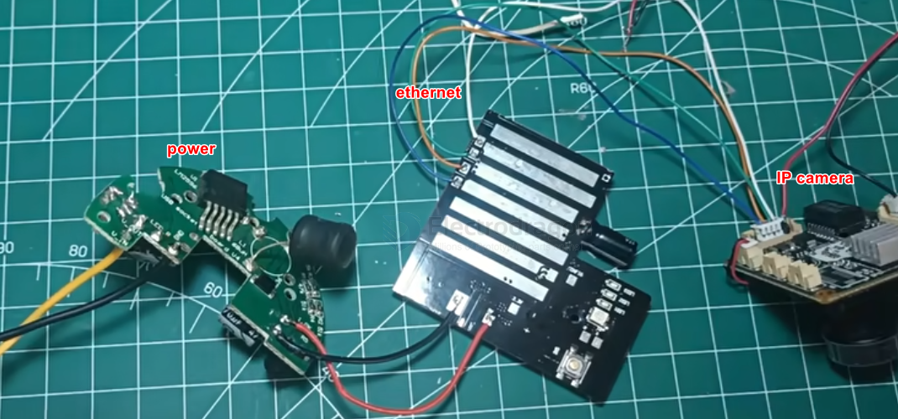
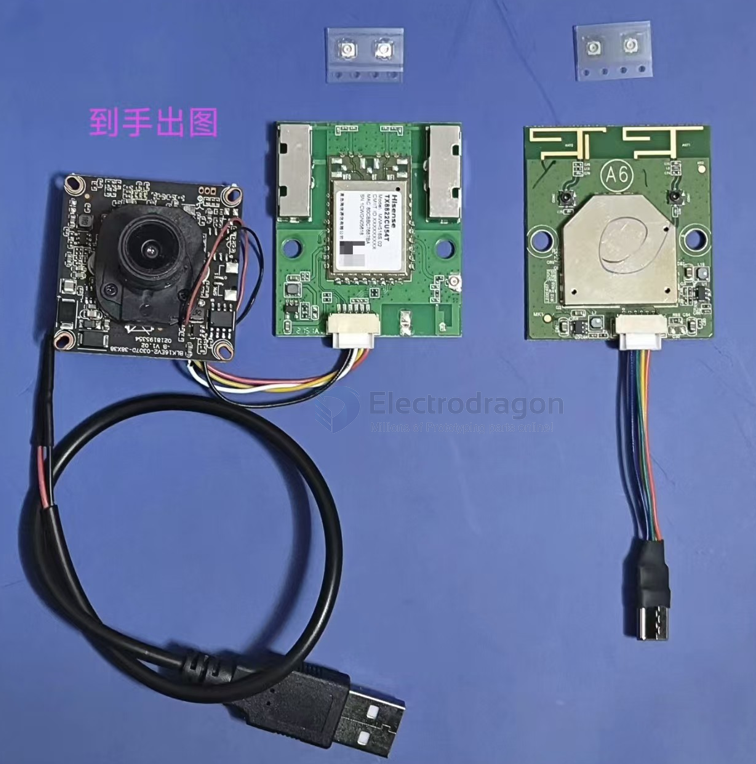

# openIPC-dat

- [[openIPC-dat]] - [[VTX-openIPC-dat]] - [[VRX-openIPC-dat]]

== [[VRX-dat]] + [[VTX-dat]]

- [[openIPC-dat]] - [[camera-IP-dat]]

- [[opensource-dat]] - [[openIPC-dat]] ?? - [[IMX307-dat]] - [[VTX-dat]]

- [[camera-digital-dat]] - [[Sigmastar-dat]] - [[openHD-dat]] - [[opensource-dat]] - [[openIPC-dat]] - [[rubyFPV-dat]] - [[video-digital-dat]]

https://github.com/OpenIPC/firmware

- [[camera-IP-dat]] - [[sensor-camera-dat]]

## best support 

- [[openIPC-dat]] - [[HiSilicon-dat]] - [[SigmaStar-dat]] - [[Goke-dat]] - [[Ingenic-dat]]

- [[hi3516-dat]] - [[HiSilicon-dat]] - [[HI3518-dat]]

- [[goke-dat]] - [[GK7205V210-dat]] - [[camera-IP-dat]] - [[openIPC-dat]]

- [[Sigmastar-dat]] - [[SSC338-dat]] - [[openIPC-dat]]

test == 17db枫叶天线 == 50ms // 35km

## wifi

- [[wifi-adapter-dat]] - [[openIPC-wifi-adapter-dat]] 

- [[realtek-dat]] - [[WIFI-USB-dat]] 

rtl8731成品模块+PA放大器 - [[RTL8731-dat]]

- [[RTL8812-dat]]

- [[wifi-dat]] - [[wifi-WFB-NG-dat]]

## camera 

- [[sensor-camera-dat]] 

- [[sony-dat]] - [[imx415-dat]] - [[IMX307-dat]]

## SDK 

- [[uboot-dat]] - [[openIPC-dat]] == unlock 

## info 

https://github.com/OpenIPC/wiki/blob/master/en/installation.md

https://docs.openipc.org/getting-started/homepage/

flash tool - https://github.com/OpenIPC/companion/releases

## branches 

- [[APFPV-dat]] - [[openIPC-dat]]

## parts 

- [[MCU-dat]] - [[SBC-dat]] 

- [[camera-digital-dat]] - [[Sigmastar-dat]]

- [[RF-modules-dat]] - [[RF-dat]]

- [[EMax-dat]] - [[runcam-dat]] - [[openIPC-dat]] - [[camera-IP-dat]]

- [[Eachine-dat]] - [[Eachine-Sphere-Link-dat]]

## tech 

- [[wifi-dat]] - [[wifi-WFB-NG-dat]]

- [[VRX-dat]] - [[VRX-openIPC-dat]] - [[openIPC-dat]]

- [[VTX-dat]] - [[VTX-openIPC-dat]] - [[openIPC-dat]]

## build 

### build air-unit // [[VTX-dat]]

via - [[ethernet-dat]] - [[powervision-dat]]

OpenIPC 摄像机方案（主流黄金组合）

采用支持 OpenIPC 的安防/机器视觉模组（如 GK7205、SSC338 等芯片的 IPC 摄像机），机载直接运行 WFB-NG 将编码后的 H.265/H.264 视频通过发射网卡推出去，省去了额外的树莓派机载电脑，成本低且效率极高。

传统树莓派机载方案（较老）

早期用树莓派 + CSI 摄像头 + 树莓派官方系统的方案，目前在 OpenIPC 普及后逐渐被更低延迟的 IPC 方案替代。

### build ground-unit // [[VRX-dat]]

- [[VRX-dat]] - [[openIPC-dat]] - [[VRX-openIPC-dat]] - [[VRX-openIPC-bonnet-dat]]

- [[pixelpilot-dat]] - [[openIPC-dat]]

- [[serial-dat]]

## 芯片方案确认：

TP-Link Archer T4U 根据硬件版本不同，历史上使用过 Realtek（如 RTL8812AU）等芯片。

WFB-NG 飞行图传对网卡有特殊要求：地面端网卡必须能够开启 Monitor 模式（混杂/监听模式） 并支持注入，才能正确解包无人机发出的 WFB-NG 射频流。

## build 

- [[VTX-openIPC-dat]] == build 1 

## ref 

https://github.com/OpenIPC/hardware

- [[video-digital]] - [[openIPC]] - [[video]]