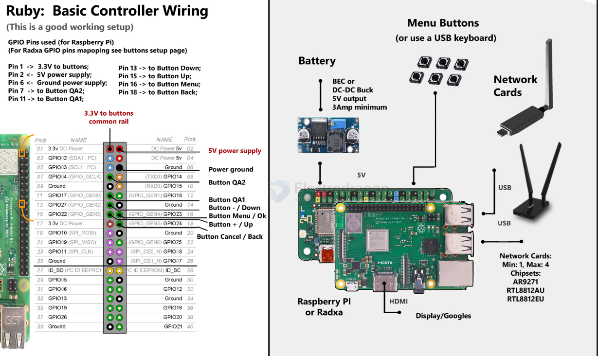
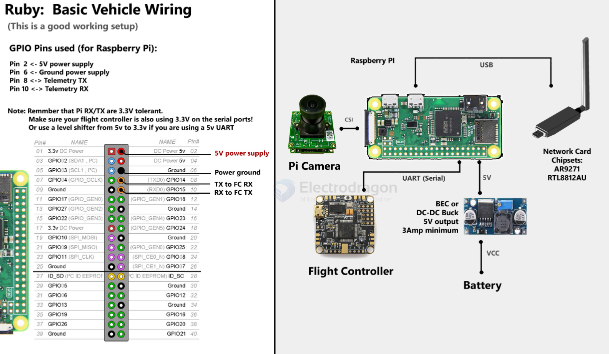

# rubyFPV-dat

- [[opensource-dat]] - [[openHD-dat]] - [[openIPC-dat]] - [[rubyFPV-dat]]

- [[betaflight-dat]]   

**Ruby FPV** is a high-performance open-source digital video transmission (VTX) and telemetry platform built for FPV drones, fixed-wing aircraft, and rovers.

## Key Highlights
- **Ultra-Low Latency:** High frame rates (up to 120fps) designed for rapid response in fast-paced flight.
- **Robust Link Resilience:** Built-in forward error correction (FEC) and adaptive algorithms to resist radio interference.
- **All-in-One Integration:** Handles HD video, telemetry (MAVLink, MSP, LTM), and RC control link over a single digital connection.

## Hardware & Software Ecosystem
- **Supported Hardware:** Raspberry Pi, Rockchip SoCs, and OpenIPC modules.
- **Flight Controllers:** ArduPilot, Betaflight, INav, and CubePilot.

## Official Resources
- **Website:** [rubyfpv.com](https://rubyfpv.com/)
- **GitHub:** [github.com/RubyFPV](https://github.com/RubyFPV/)

## parts of controller and vehicle 

- [[MCU-dat]] - [[SBC-dat]] 

- [[camera-digital-dat]] 

- [[RF-transceiver-dat]] - [[RF-dat]]

- [[power-BEC-dat]] - [[dcdc-down-dat]] == 3A / 5V 

## controller 

If you DIY, here is the list of components required to make a working controller:

- 1 SBC (Single Board Computer, ie Raspberry, Radxa; see below)
- 1 BEC/UBEC or any good 5V power supply;
- 1+ radio card(s) in 433/868/915Mhz, 2.4Ghz or 5.8Ghz bands(multiple can be used for Rx diversity or multiple radio links); see the list below of all supported radio cards.
- 1 HDMI display; Or any device that can display HDMI;
- 4 (+3 additional optional) Push buttons. This is for the menu navigation on the controller. If you choose to use a rotary encoder for menu navigation, or a USB keyboard, then you don't need these push buttons.

wiring 

prebuild - [[VRX-dat]] - [[VRX-digital-dat]] - [[runcam-VRX-dat]] - [[runcam-dat]] - [[rubyFPV-dat]]

## vehicle 

If you DIY, here is the list of components required to make a working vehicle (drone, plane, car, UAV):

- 1 SBC (Single Board Computer, ie Raspberry, OpenIPC hardware camera, see below);
- 1 camera (see below the full list of supported camera types);
- 1 BEC/UBEC or any good 5V power supply (for providing a solid, high current capable, 5V supply to the PI board and network cards);
- 1+ radio card(s) in 433/868/915Mhz, 2.4Ghz or 5.8Ghz bands(multiple can be used for Rx diversity or multiple radio links); see the list below of all supported radio cards.

wiring 

## apps 

- [[FPV-dat]] - [[quadcopter-dat]] - [[UAV-dat]]

## info 

Building an affordable and straightforward Ruby FPV setup relies on pairing a cost-effective, all-in-one OpenIPC camera on the aircraft with a standard Raspberry Pi on the ground station.

1. Air Unit (On the Drone / Vehicle)

- [[Sigmastar-dat]] - [[SSC338-dat]]

Hardware: OpenIPC / Sigmastar (e.g., SSC338Q or similar SStar) camera module.

Benefits:

Integrates the processor, video sensor (often Sony sensors), and Wi-Fi interface into a single tiny, lightweight board.

No separate single-board computer needed on the drone.

Flashes directly onto onboard storage (no flight-risk micro-SD cards on the airframe).

Very cost-effective compared to older Raspberry Pi air units.

2. Ground Station / Receiver (Ground Unit)

Hardware: Raspberry Pi 4 (or Pi 3 / Pi Zero 2 W depending on budget and display needs) paired with a supported high-power Wi-Fi/radio USB adapter.

Benefits:

Fully supported and natively documented within the Ruby FPV ecosystem.

Easy installation: Flash the Ruby ground controller image onto an SD card.

Connects to a standard HDMI screen or FPV goggles with HDMI-in, plus inexpensive push buttons for the on-screen menu.

3. Power & Connectivity Essentials

Power Supply: A clean 5V BEC / regulator (minimum 2A–3A output) to step down flight battery voltage safely.

Telemetry Connection: Simple 3-wire UART connection from the OpenIPC air unit to your flight controller (ArduPilot / Betaflight / INav) for MAVLink or MSP telemetry.

Why This Setup Works Best
Minimal Soldering & Wiring: Combines camera and computer into one tiny package on the drone.

Automated Ecosystem: Ruby's firmware natively supports OpenIPC hardware, drastically reducing manual configuration hurdles.

## ref 

https://github.com/RubyFPV/RubyFPV

