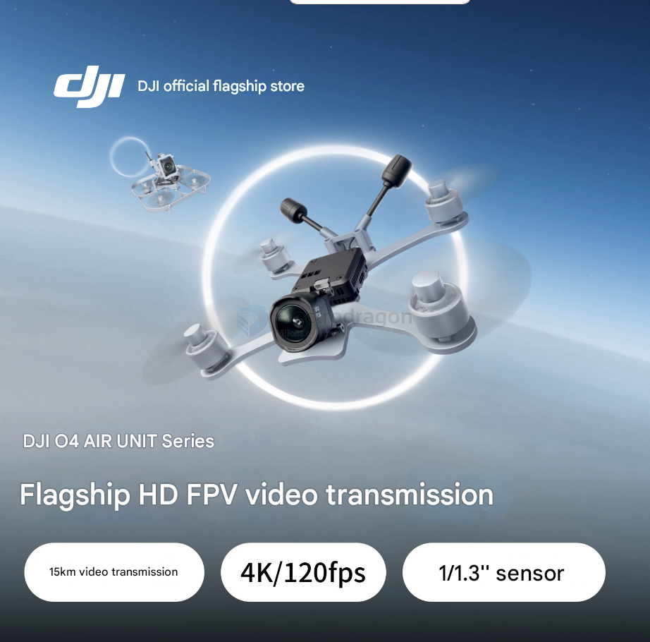

# video-transmission-dat

- [[VTX-dat]] - [[VRX-dat]] - [[video-dat]] - [[video-transmission-dat]]

## solutions  

- [[video-tranmission-analog-dat]] 

- [[video-tranmission-digial-dat]] 

### ⚠️ 模拟图传做不到 10-20km（不划算）
- 实用 2-5km；极限 10-20km 需 1-2W + 高增益定向天线 + **地面跟踪云台**（画质仍差）

### 数字方案对比
| 方案 | 距离 | 成本 | 难度 | 画质 |
| :--- | :--- | :--- | :--- | :--- |
| ⭐ **DJI O3/O4** | 10-15km | ¥2500-4000 | ✅ 简单 | 极好 |
| ⭐ **Walksnail Avatar** | 10-20km | ¥1500-2500 | ✅ 简单 | 很好 |
| ⭐ **OpenHD / RubyFPV** | **20-50km+** | ¥500-1500 | ⚠️ 折腾 | 好 |
| ⭐ **4G/5G 图传** | **∞**（有蜂窝信号）| ¥1000+（+月租）| ⚠️ 依赖网络 | 好 |

- duplicate of [[wireless-camera-dat]]

## other solutions  

### walksnail 

- [[walksnail-dat]] - [[caddx-dat]]

### DJI-camera

- [[DJI-dat]] 

### WiFI video transmission

- [[ESP32-cam-dat]] - [[SCM1030-dat]]

- [[WIFI-video-dat]]

long Distance Video, RF digital and analog video transmission

### Other RC video transmission

## APP 

- [[video-RC-car-dat]]

## tech 

- [[fiber-optic-dat]]

# wireless-camera-dat

- duplicate of [[video-transmission-dat]]

- [[wifi-camera-dat]]

## applications 

- [[FPV-dat]] - [[surveillance-dat]]

## FPV transmission

- [[video-transmission-dat]] - [[DJI-dat]]

### DJI O4 vs Analog Video Camera

Comparing DJI O4 and analog video cameras involves several aspects. Here's a breakdown:

**Summary Table**

| Feature       | DJI O4 (Digital) | Analog Video Camera |
| ------------- | ---------------- | ------------------- |
| Image Quality | **High**         | Low                 |
| Range         | **Long**         | Short               |
| Features      | **Advanced**     | Basic               |
| Complexity    | High             | **Low**             |
| Cost          | High             | **Low**             |
| Interference  | **Low**          | High                |

### Can a 2W Analog FPV Transmission System Run 24/7?

**Yes, but with precautions:**

#### ✅ Conditions for Safe 24/7 Operation:
- **Good cooling** (heatsink + fan recommended)
- **Stable power supply**
- **Antenna always connected**
- **High-quality VTX components**

#### ⚠️ Risks:
- Overheating
- Component wear/failure
- Possible RF interference

#### 🔧 Tips:
- Add active cooling
- Use lower power if long range isn’t needed
- Monitor temperature
- Consider industrial-grade VTX or digital systems for reliability

#### Issue: This device is not well-suited for continuous surveillance applications.

Limitation: Requires a cool-down period after 4-5 hours of operation, suggesting potential overheating or reliability concerns with extended use.

## DJI O4 Air FPV Transmission System

## ref 

- [[sensor-Camera-dat]]

- [[video-transmission]]
