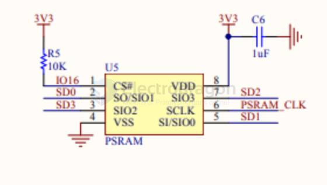

# PSRAM-dat

## hook to ESP32 

- [[SCM1030-dat]]

| ESP32 | PSRAM | note |
| ----- | ----- | ---- |
| IO16  | CS    |      |
| SD0   | SIO1  |      |
| SD1   | SIO0  |      |
| SD2   | SIO1  |      |
| SD3   | SIO2  |      |
| CLK   | SCLK  |      |

- [[PIR-dat]]