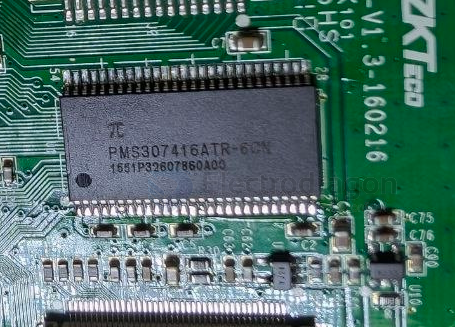

# DRAM-dat

- [[DDR4-dat]] - [[DDR3-dat]] - [[DDR5-dat]]

- [[ESP32-HDK-dat]]

**Dynamic Random Access Memory (DRAM)** is a type of volatile memory that stores data in capacitors within integrated circuits.

### Key Characteristics:

- **Dynamic**: Requires periodic refreshing (every few milliseconds) because capacitors leak charge over time
- **Volatile**: Data is lost when power is removed
- **Random Access**: Any memory location can be accessed directly in any order
- **High Density**: Can store more data per chip compared to SRAM
- **Lower Cost**: Cheaper per bit than SRAM due to simpler cell structure

### How DRAM Works:

1. **Storage Cell**: Each bit is stored as charge in a tiny capacitor
2. **Transistor Switch**: Controls access to the capacitor
3. **Refresh Cycle**: Memory controller periodically reads and rewrites data to maintain charge
4. **Row/Column Addressing**: Uses multiplexed addressing to reduce pin count

### Types of DRAM:

- **SDRAM**: Synchronous DRAM - synchronized with system clock
- **DDR SDRAM**: Double Data Rate - transfers data on both clock edges
- **DDR2/DDR3/DDR4/DDR5**: Successive generations with higher speeds and lower power
- **LPDDR**: Low Power DDR for mobile devices
- **GDDR**: Graphics DDR for video cards

### Common Applications:

- System RAM in computers and smartphones
- Frame buffers in graphics cards
- Buffer memory in networking equipment
- Temporary storage in embedded systems

### DRAM vs Other Memory Types:

| Type   | Speed    | Cost   | Density | Volatility   | Refresh      |
| ------ | -------- | ------ | ------- | ------------ | ------------ |
| DRAM   | Medium   | Low    | High    | Volatile     | Required     |
| SRAM   | High     | High   | Low     | Volatile     | Not Required |
| Flash  | Low      | Medium | High    | Non-volatile | Not Required |
| EEPROM | Very Low | High   | Low     | Non-volatile | Not Required |

## DRAM chip 

`PMS307416A` == Synchronous Dynamic RAM == 2048K Words x 16 Bits x 4 Banks (128-MBIT)

Features   
- Clock frequency: 166, 133 MHz   
- Fully synchronous; all signals referenced to a positive clock edge   
- Four banks operation   
- Single 3.3V power supply   
- LVTTL interface   
- Programmable burst length -- (1, 2, 4, 8, full page)   
- Programmable burst sequence: Sequential/Interleave   
- 4096 refresh cycles every 64 ms   
- Random column address every clock cycle   Programmable /CAS latency (2, 3 clocks)   
- Burst read/write and burst read/single write operations capability   
- Burst termination by burst stop and precharge command   
- Byte controlled by LDQM and UDQM   
- Packages 400-mil 54-pin TSOP-II   
- Lead-free package

https://www.scribd.com/document/744434108/PMS307416A

- [[micron-dat]] 

8Gb: x4, x8, x16 DDR4 SDRAM - DDR4 SDRAM = `MT40A2G4` = `MT40A1G8` = `MT40A512M16`

## ref 

