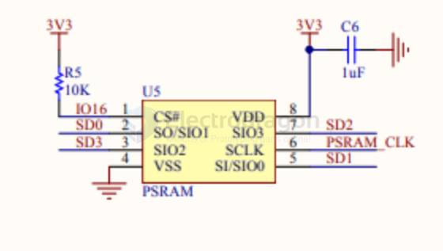

# PSRAM-dat

# ✅ What is PSRAM (Pseudo-static RAM)?

**PSRAM** is a type of external memory that combines the **ease-of-use of SRAM** (no need for refresh) with the **cost and density of DRAM**.

## 📌 Characteristics:
- Acts like SRAM to the system.
- Internally uses DRAM-like technology.
- Available on many SoCs like ESP32-WROVER (4MB/8MB PSRAM).

## 🧠 Good Reasons to Use PSRAM:

| Feature             | Benefit                                                                 |
|---------------------|-------------------------------------------------------------------------|
| ✅ **Large Memory**  | ESP32 internal RAM is limited (~520KB), PSRAM gives extra space (4MB+). |
| ✅ **Multimedia Buffers** | Needed for camera frames, audio streaming, image processing, etc.     |
| ✅ **Heap Allocation** | Useful for `malloc()`/`calloc()` in applications with large dynamic memory needs. |
| ✅ **Caching / File Buffers** | Good for storing temporary web pages, images, JSON, etc.            |
| ✅ **Smooth UI/GUI** | Enables usage of libraries like LVGL for rich graphical interfaces.      |

## hook to ESP32 

- [[SCM1030-dat]]

| ESP32 | PSRAM | note |
| ----- | ----- | ---- |
| IO16  | CS    |      |
| SD0   | SIO1  |      |
| SD1   | SIO0  |      |
| SD2   | SIO1  |      |
| SD3   | SIO2  |      |
| CLK   | SCLK  |      |

- [[PIR-dat]]

