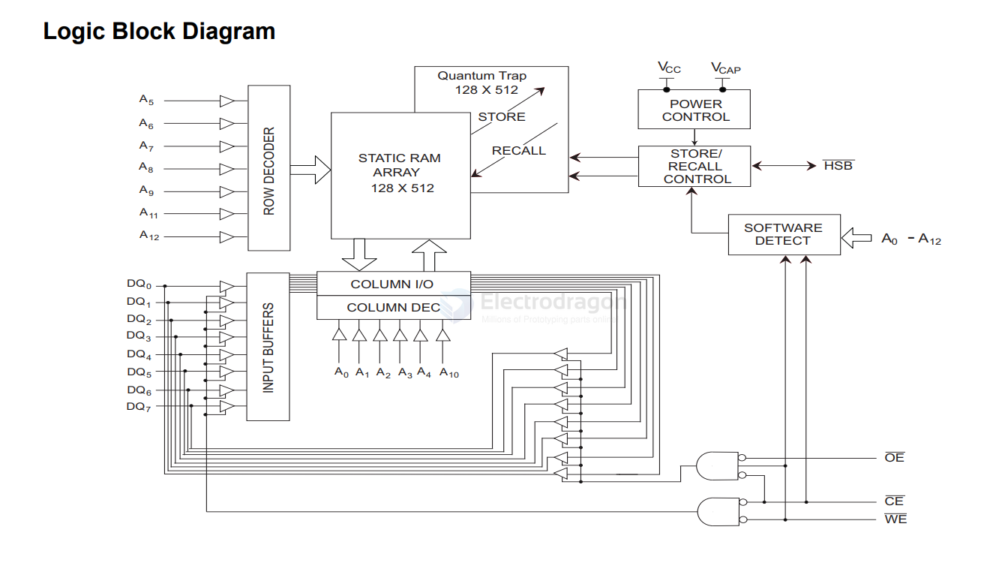

# RAM-dat

- [[memory-dat]] - [[flash-dat]] - [[sd-dat]] - [[eeprom-dat]] - [[DRAM-dat]] - [[SDram-dat]] - [[RAM-dat]]

- [[cypress-dat]] - [[infineon-dat]] - [[RAM-dat]]

- [[DRAM-dat]] - [[PSRAM-dat]] - [[SDRAM-dat]] - [[nvSRAM-dat]]

- [[dallas-dat]]

## nvSRAM

- STK12C68-5L35M
- STK12C68-5L40M
- STK12C68-5L55M

STK12C68 - 64 Kbit (8 K x 8) AutoStore nvSRAM

The Cypress STK12C68 is a fast static RAM with a nonvolatile element in each memory cell. The embedded nonvolatile elements incorporate QuantumTrap technology producing the world’s most reliable nonvolatile memory. The SRAM provides unlimited read and write cycles, while independent nonvolatile data resides in the highly reliable QuantumTrap cell. Data transfers from the SRAM to the nonvolatile elements (the STORE operation) takes place automatically at power-down. On power-up, data is restored to the SRAM (the RECALL operation) from the nonvolatile memory. Both the STORE and RECALL operations are also available under software control. A hardware STORE is initiated with the HSB pin.

For a complete list of related documentation, click here.

https://www.infineon.com/assets/row/public/documents/10/57/infineon-stk12c68-64-kbit-8-k-x-8-autostore-nvsram-datasheet-additionaltechnicalinformation-en.pdf?fileId=8ac78c8c7d0d8da4017d0ecc045f45bf

## ref 

- [[ram-dat]]