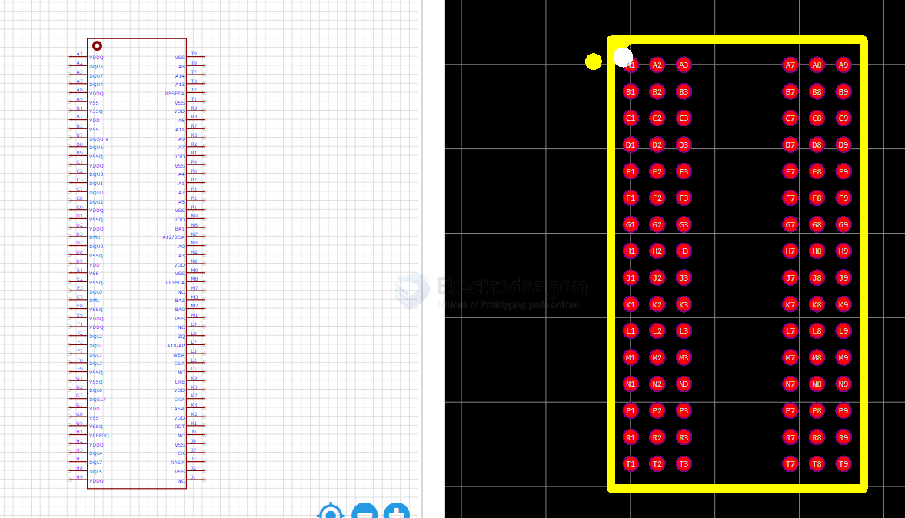
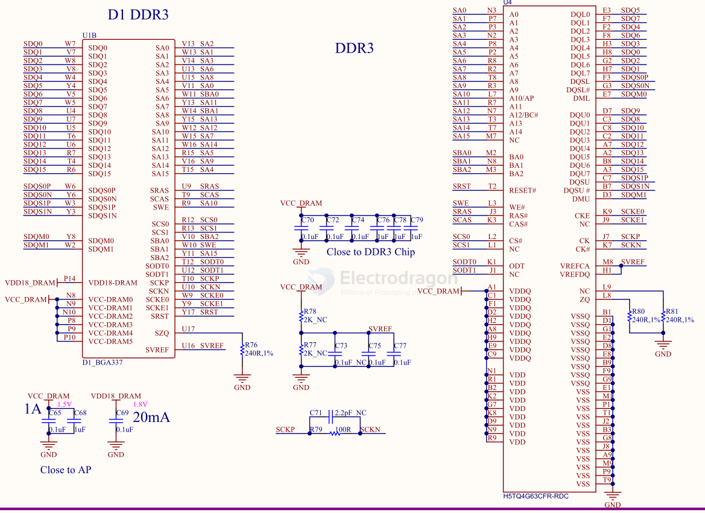
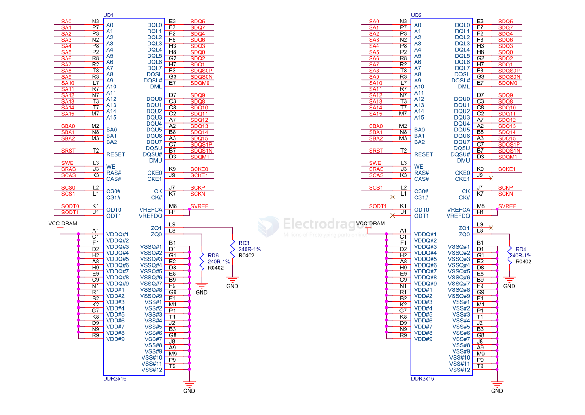
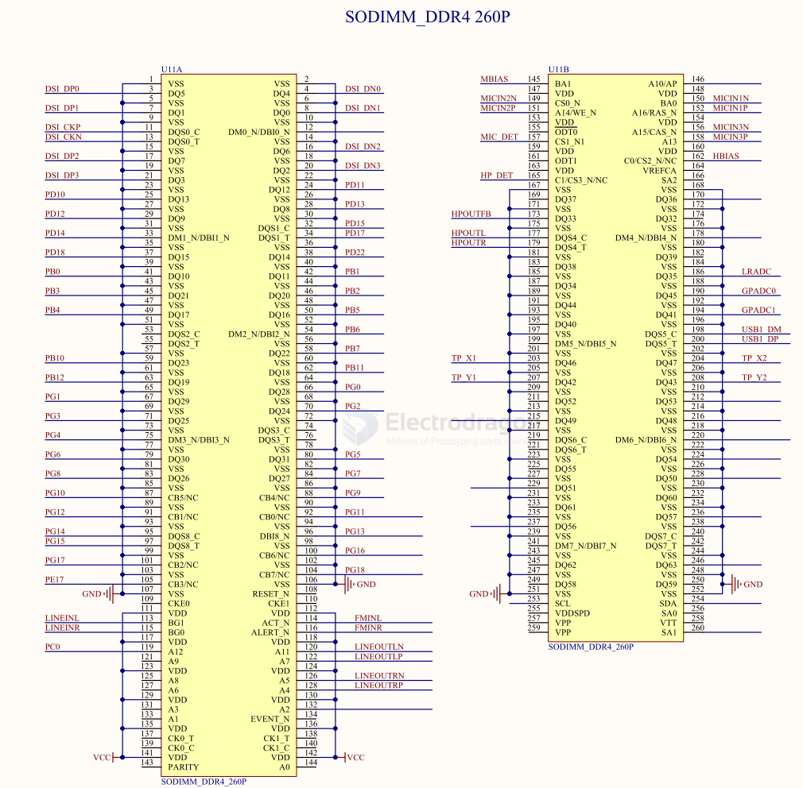

# SDRAM-dat

## SDRAM - Synchronous Dynamic Random Access Memory == H5TQ4G63CFR-RDC

SCH 

## DDR3 16BIT*2

## DDR4 - Double Data Rate 4

260P

## unsort 

MT41K256M16TW-107 XIT:P TR - SDRAM - DDR3L Memory IC 4Gbit Parallel 933 MHz 20 ns 96-FBGA (8x14)

## ref 

- [[RAM-dat]]