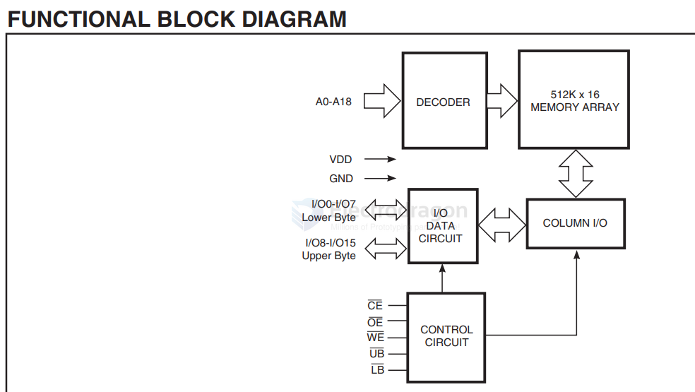

# SRAM-dat

- [[SRAM-dat]] - [[ISSI-dat]]

- [[SRAM-dat]] - [[RAM-dat]] - [[SDRAM-dat]] - [[PSRAM-dat]] - [[DRAM-dat]]

IS61WV51216BLL - IC SRAM 8MBIT PARALLEL 44TSOP II

	
SRAM - Asynchronous Memory IC 8Mbit Parallel 10 ns 44-TSOP II

- IS61WV51216ALL
- IS61WV51216BLL
- IS64WV51216BLL

512K x 16 HIGH-SPEED ASYNCHRONOUSCMOS STATIC RAM WITH 3.3V SUPPLY

## diagram 

## ref 

