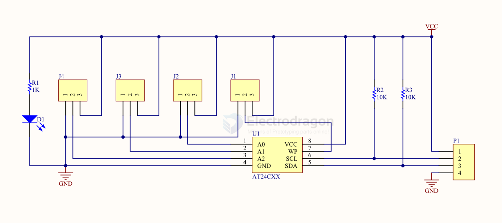
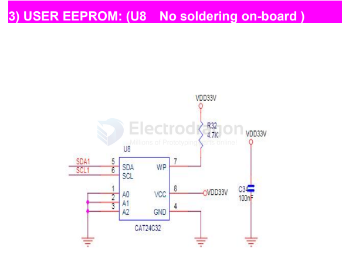

# eeprom-dat

## tech 

wiki documentation == https://en.wikipedia.org/wiki/EEPROM

arduino library == http://playground.arduino.cc/Main/LibraryForI2CEEPROM

- [[I2C-dat]]

## boards 

- [[MOT1005-dat]]

- [[MPC1073-DAT]]

## SCH 

SCH1 

ID EEPROM: (No soldering on-board )

USER EEPROM: (No soldering on-board )

It connected to the same IIC port with DAC. you need to solder the IC and ConfirmIIC slavedevices. If you a novice of Raspberry Pi, We really wouldn't advise do that.The DAC MINI boarddoes not have this feature reserved.

## common chips 

- cheaper alternatives == [[BL24C256-dat]] in [[beling-dat]]

## unsort 

- [[Xilinx-dat]] - XCF16PVOG48C == [[FPGA-dat]] - Configuration Memory Flash 16Mb PROM (ST Micro), Lead Free

Original and genuine `AT24C02C` -SSHM-T surface mount memory chip (EEPROM, serial port, SOIC-8)

## ref 

- [[memory-dat]] - [[EEPROM]]