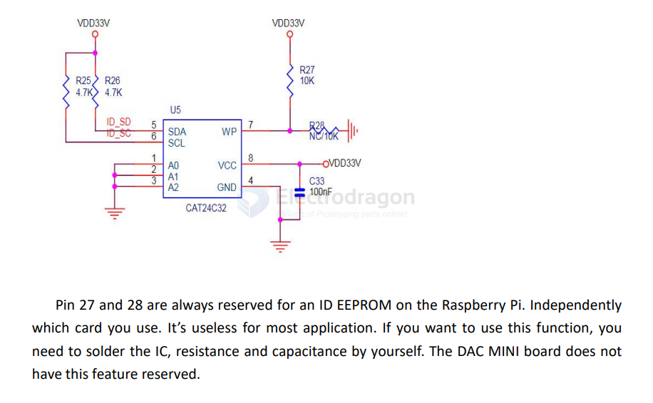

# eeprom-dat

ID EEPROM: (No soldering on-board )

USER EEPROM: (No soldering on-board )

It connected to the same IIC port with DAC. you need to solder the IC and ConfirmIIC slavedevices. If you a novice of Raspberry Pi, We really wouldn't advise do that.The DAC MINI boarddoes not have this feature reserved.

## common chips 

- cheaper alternatives == [[BL24C256-dat]] in [[beling-dat]]

## boards 

- [[MPC1073-DAT]]

## ref 

- [[memory-dat]] - [[EEPROM]]