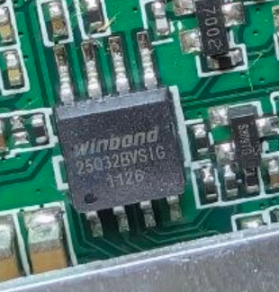
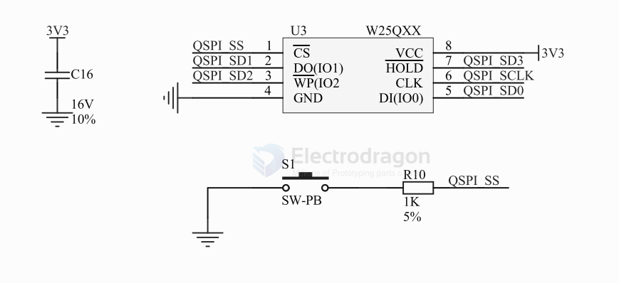
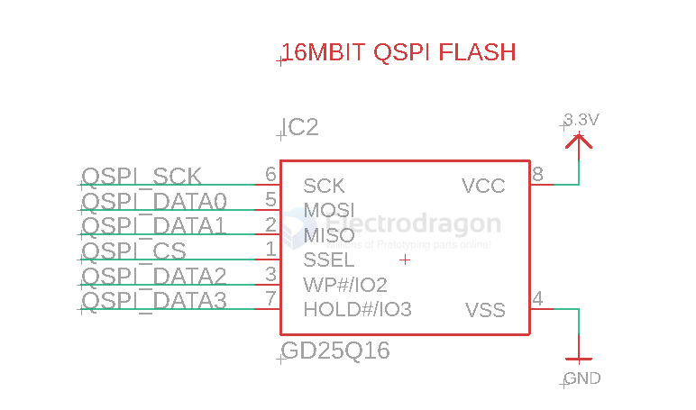
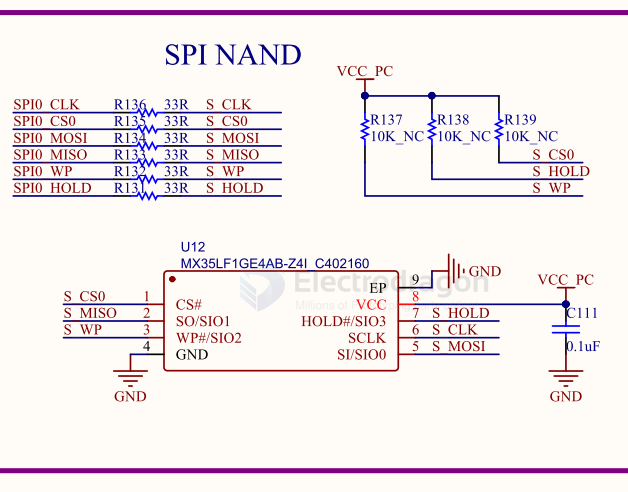

# flash

## Nand Flash 

- Raspberry Pi CM Module 4 - [[RMP-RPI-CM4-dat]]

## Nor Flash 

## What is NOR Flash?
NOR flash is a type of non-volatile memory that allows random read access. It is commonly used for storing firmware and allows executing code directly from flash (XIP - Execute In Place).

- [[micron-dat]] - [[SDram-dat]]

MT25QU02GCBB8E12-0SIT TR == IC FLASH 2GBIT SPI 24TPBGA - [[SPI-dat]]

MT40A512M16TB-062E:R == SDRAM - DDR4 記憶體 IC 8Gbit 並行 1.6 GHz 19 ns 96-FBGA (7.5x13)

## Comparison Table

| Feature               | Parallel NOR Flash                  | SPI NOR Flash (SPI Flash)      |
| --------------------- | ----------------------------------- | ------------------------------ |
| **Interface**         | Parallel (8/16-bit bus)             | Serial (SPI: MOSI, MISO, SCLK) |
| **Speed**             | High (fast random access)           | Lower (due to serial nature)   |
| **Pins Required**     | Many (20+ pins)                     | Few (4–6 pins)                 |
| **Physical Size**     | Larger                              | Smaller                        |
| **Cost**              | More expensive                      | Cheaper                        |
| **Power Consumption** | Higher                              | Lower                          |
| **Read Access**       | Random access (byte-wise)           | Page-based, sequential access  |
| **Write Access**      | Sector/page erase/write             | Sector/page erase/write        |
| **XIP Support**       | Yes (native)                        | Limited or requires mapping    |
| **Use Cases**         | Boot code, firmware (MCUs, routers) | Microcontrollers, IoT, sensors |
| **Typical Capacity**  | Up to 512 MB                        | Up to 2 GB                     |

---

## Summary

- **SPI Flash** is a type of **NOR Flash** that uses a **serial interface (SPI)**.
- SPI NOR Flash sacrifices speed and flexibility for **lower cost, lower pin count, and small size**.
- **Parallel NOR Flash** is better for **code execution** and high-speed access.

S29GL128P90TFIR10 - NOR Flash 128Mb 3V 90ns Parallel NOR Flash

## code 

T25S80 

## SCH 

- flash with bypass button 

- QSPI 

data bit 0~3 

## SPI NAND 

## SPI Nor VS. NAND Flash 

### ✅ Summary Table

| Feature           | SPI NOR       | SPI NAND            |
| ----------------- | ------------- | ------------------- |
| Capacity          | Low to medium | Medium to very high |
| Random read speed | ✅ Fast        | ❌ Slower            |
| Write/erase speed | ❌ Slower      | ✅ Faster            |
| Reliability       | ✅ High        | ❌ Needs ECC         |
| Bootable (XIP)    | ✅ Yes         | ❌ No                |
| Cost per bit      | ❌ Higher      | ✅ Lower             |

---

### TL;DR

- 🧠 **SPI NOR Flash** = small, reliable, fast reads → great for firmware.
- 📦 **SPI NAND Flash** = large, cheaper, needs ECC → great for data storage.

## 📦 Common Winbond SPI NOR Flash Models

Winbond's SPI NOR flash chips are usually labeled **W25Q** or **W25X** series.  
They vary by **capacity**, **voltage**, **speed**, and **features** like Dual/Quad SPI.

---

### 🧰 Common W25Q Series (Most Popular)

| Model         | Capacity | Voltage | Features                     |
|---------------|----------|---------|------------------------------|
| **W25Q16JV**  | 16 Mbit  | 2.7–3.6V| Standard SPI, Dual/Quad SPI  |
| **W25Q32JV**  | 32 Mbit  | 2.7–3.6V| Very popular, common in MCUs |
| **W25Q64JV**  | 64 Mbit  | 2.7–3.6V| Standard/Dual/Quad SPI       |
| **W25Q128JV** | 128 Mbit | 2.7–3.6V| XIP, dual/quad SPI support   |
| **W25Q256JV** | 256 Mbit | 2.7–3.6V| Larger firmware/data storage |
 
- 25Q40 = 4 Mb = 512 KB
- 25Q80 = 8 Mb = 1 MB

- 25Q16 = 16 Mb = 2 MB
- 25Q32 = 32 Mb = 4 MB
- 25Q64 = 64 Mb = 8 MB
- 25Q128 = 128 Mb = 16 MB

## un-sort 

TC58FVM7(T/B)2AFT(65/80) - 128-MBIT (16M × 8 BITS / 8M × 16 BITS) CMOS FLASH MEMORY

AM29LV116DT-90EI - 	IC FLASH 16MBIT PARALLEL 40TSOP

spansion - S29GL-P MirrorBit® Flash Family - S29GL01GP, S29GL512P, S29GL256P, S29GL128P 1 Gigabit, 512 Megabit, 256 Megabit and 128 Megabit 3.0 Volt-only Page Mode Flash Memory featuring 90 nm MirrorBit Process Technology

IC FLASH 32MBIT PARALLEL 48TSOP - SST39VF3202-70-4I-EKE - FLASH Memory IC 32Mbit Parallel 70 ns 48-TSOP

S29GL01GS, S29GL512S, S29GL256S, S29GL128S - 128 Mb/256 Mb/512 Mb/1 Gb GL-S MIRRORBIT™ flash Parallel, 3.0 V

- [[flash-dat]] - [[PUY-dat]]

## ref

## ref 

- [[flash-dat]]