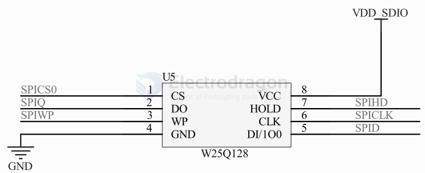

# spi-flash-dat

## boards 

- [[MOT1020-dat]] 

## chip 

- [[W25Q64-dat]] == https://www.winbond.com/resource-files/w25q64fv%20revq%2006142016.pdf

## tech 

- [[SPI-dat]]

## WSON 

## Octal SPI and QIO Flash 

Yes, 8-bit SPI flash does exist in the context of the ESP32 and similar chips. This refers to "Octal SPI" flash, which uses 8 data lines for higher-speed data transfer. However, most ESP32 modules—including the ESP32-WROOM-32E—typically use Quad SPI (4 data lines). The ESP32 chip supports up to 8 data lines for SPI flash, but most modules only connect 4 lines (QIO mode). Octal SPI flash is less common and usually found in high-performance or special applications.

## SPI Flash SCH

general design 

w/STM32

w/arduino

basic 

### w/linux 

bypass flash 

若flash中已有系统，可通过：

- 短接flash的 1、4 两脚，然后重新上电，上电后松开短接，即可重新进入fel模式，进行再次下载
- 在启动到内核前，回车进入 [[uboot-dat]]，执行 即可重新进入fel模式

    sf probe 0;sf erase 0 0x100000;reset
    

## SPI NOR Flash 

Nor Flash为F1C200S芯片提供了第二种启动方式。

上电后，F1C200S首先从内部BROM (芯片内置，无法擦除)启动；

首先检查 SD0 有没有插卡, 如果有插卡就读卡 8k偏移数据，是否是合法的启动数据, 如果是BROM 引导结束, 否则进入下一步；

第二步：检测SPI0 NOR FLASH是否存在, 是否有合法的启动数据, 如果是BROM 引导结束, 否则进入下一步；

第三步：检测SPI0 NAND FLASH 是否存在, 是否有合法的启动数据, 如果是BROM 引导结束, 否则进入下一步；

最后，因为找不到任何可以引导的介质，系统会进入usb fel模式，此时可以使用USB烧录。

此处SPI Nor Flash可以同时兼容Nand Flash，不过目前裸机资料基本上都是以SPI Nor Flash为基础，所以此处焊接了W25Q128JVEIQ 128Mbit(16Mbyte)SPI Nor Flash。

该部分原理图如下所示：

图2.9 W25Q128JVEIQ原理图

其中：

R4为上拉电阻(F1C200S内部也存在上拉电阻，可以不焊)，防止未供电时芯片错误写入数据;

C16为滤波电容;

SW2为FEL模式开关，将SPI_MISO短路到地后，F1C200S将无法检测到SPI Nor Flash，从而进入USB Fel模式，此时可以松开按键，烧录内容至SPI Nor Flash。

/WP为SPI Nor Flash保护引脚，低电平有效，有效时无法写入数据

/HOLDor/RESET为SPI Nor Flash保持或者复位输入引脚。

此处由于SPI Nor Flash内部默认设置，/HOLDor/RESET和/WP引脚即使不拉高，芯片也会照样运作。

## winbond size and ids 

MANUFACTURER_ID - OPTIONAL, 
- 0x1F44 for adesto(ex atmel) 4mbit flash
- 0xEF30: 4mbit
- 0xEF40: 64mbit, 16mbit = tested

16mbit

## ref 

- [[memory]]