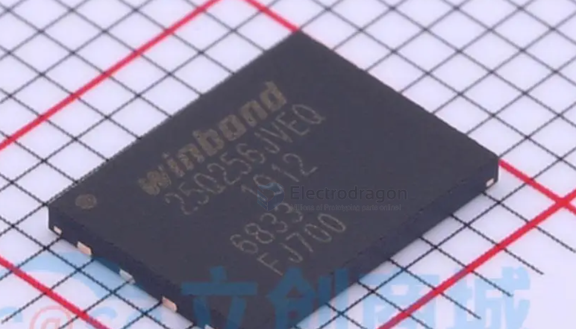

# spi-flash-dat

## WSON 

## SPI Flash SCH

w/STM32

w/arduino

basic 

### w/linux 

bypass flash 

若flash中已有系统，可通过：

- 短接flash的 1、4 两脚，然后重新上电，上电后松开短接，即可重新进入fel模式，进行再次下载
- 在启动到内核前，回车进入 [[uboot-dat]]，执行 sf probe 0;sf erase 0 0x100000;reset即可重新进入fel模式

## ref 

- [[memory]]