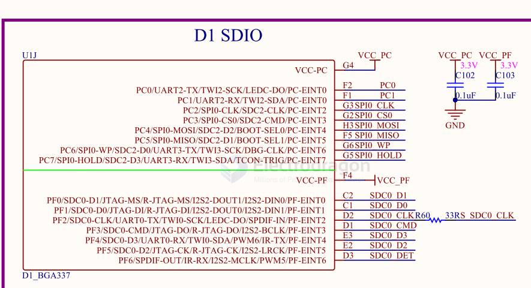
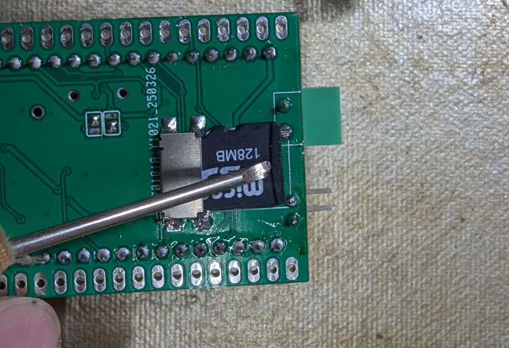

# memory-dat

- [[sd-dat]] - [[flash-dat]] - [[spi-flash-dat]] - [[eeprom-dat]]

- [[SDIO-dat]]

- [[RAM-dat]]

legacy wiki page == https://www.electrodragon.com/w/index.php?title=Category:Memory

## USB

- [[USB-dat]] - [[USB-OTG-dat]]

- [[USB-CDC-dat]] - [[USB-HID-dat]] - [[USB-MSC-dat]] - [[USB-DFU-dat]] - [[WebSerial-dat]]

- [[ESP32-S3-SDK-dat]] SPIFFS over USB

| Method                     | How it Works                                                               | Pros                                            | Cons                                                             |
| -------------------------- | -------------------------------------------------------------------------- | ----------------------------------------------- | ---------------------------------------------------------------- |
| **USB CDC (Serial)**       | Use ESP32 as a virtual COM port, send file chunks, write to SPIFFS.        | Simple, fast, Arduino example ready.            | Needs a custom PC-side tool.                                     |
| **USB HID**                | Implement HID protocol, PC app sends packets, ESP32 writes them to SPIFFS. | Works like a custom USB device (gamepad style). | More coding, needs PC app to talk HID.                           |
| **USB MSC (Mass Storage)** | Make ESP32 appear as a USB flash drive, map it to SPIFFS/LittleFS.         | Very user-friendly (drag & drop files).         | More complex, risk of flash corruption if PC writes incorrectly. |
| **USB DFU / WebSerial**    | Use DFU or ESP Web Tools to push files.                                    | Standard protocol, browser-based.               | May need partition config.                                       |

- [[WIFI-SDK-dat]]

## SDIO 

## use a tools instead of fat fingers 

## ref 

- [[sd]] - [[memory]]