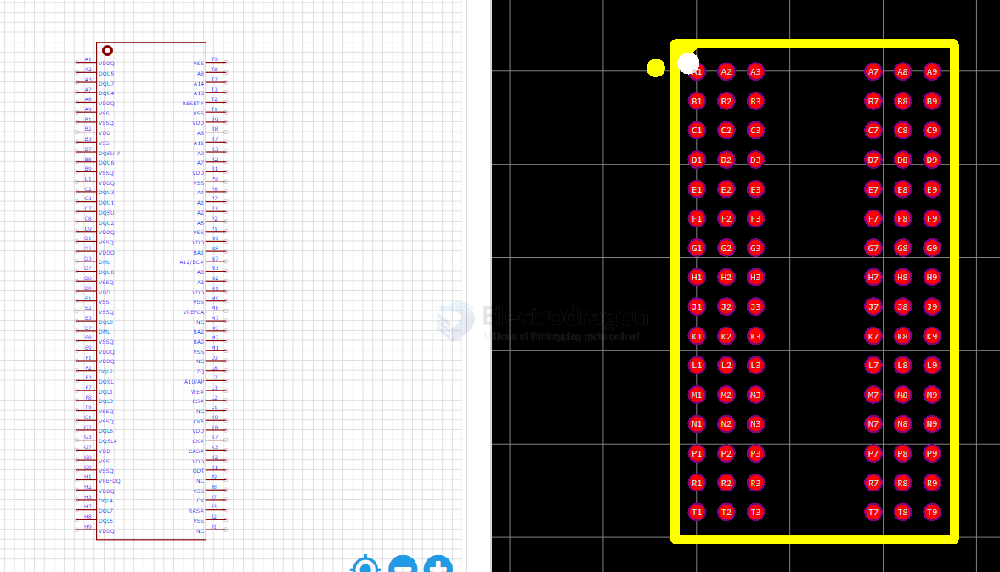
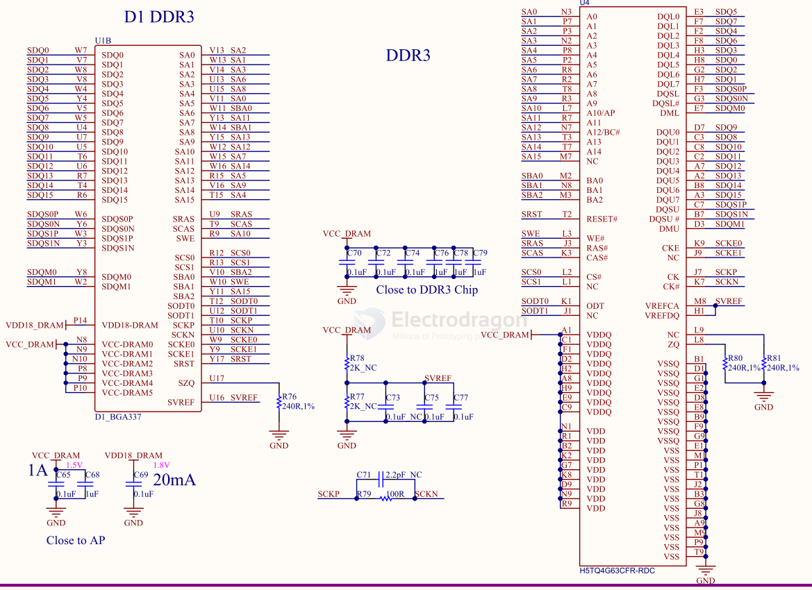
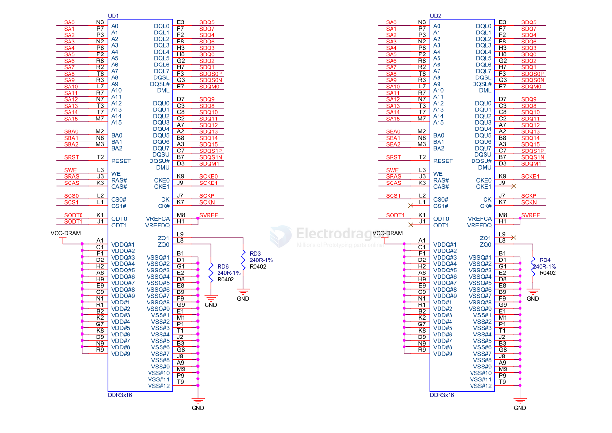
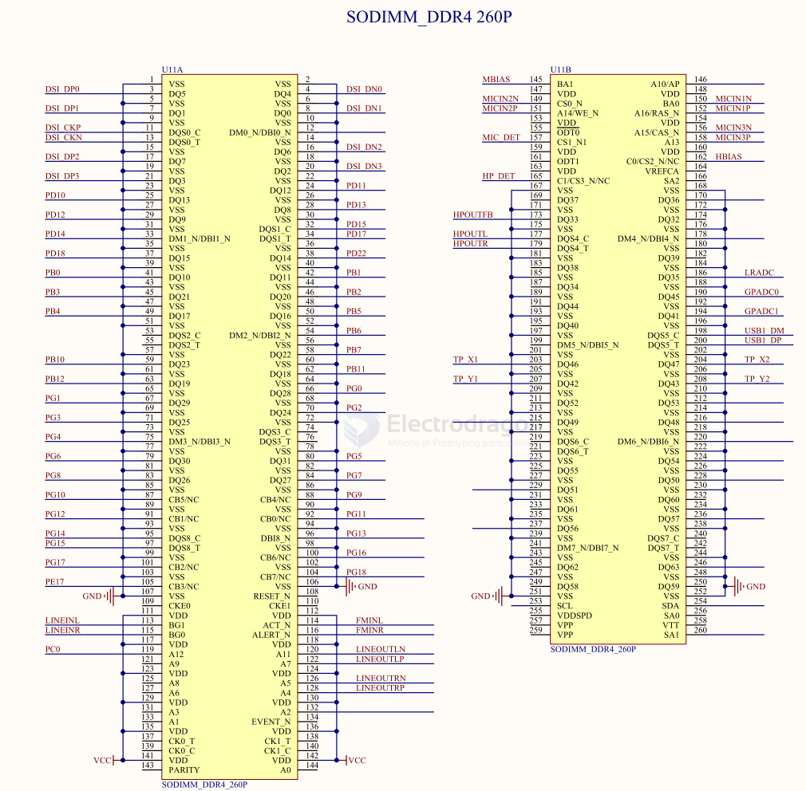

# memory-dat

- [[sd-dat]] - [[flash-dat]] - [[spi-flash-dat]] - [[eeprom-dat]]

- [[SDIO-dat]]

## DRAM 

- [[ESP32-HDK-dat]]

**Dynamic Random Access Memory (DRAM)** is a type of volatile memory that stores data in capacitors within integrated circuits.

### Key Characteristics:

- **Dynamic**: Requires periodic refreshing (every few milliseconds) because capacitors leak charge over time
- **Volatile**: Data is lost when power is removed
- **Random Access**: Any memory location can be accessed directly in any order
- **High Density**: Can store more data per chip compared to SRAM
- **Lower Cost**: Cheaper per bit than SRAM due to simpler cell structure

### How DRAM Works:

1. **Storage Cell**: Each bit is stored as charge in a tiny capacitor
2. **Transistor Switch**: Controls access to the capacitor
3. **Refresh Cycle**: Memory controller periodically reads and rewrites data to maintain charge
4. **Row/Column Addressing**: Uses multiplexed addressing to reduce pin count

### Types of DRAM:

- **SDRAM**: Synchronous DRAM - synchronized with system clock
- **DDR SDRAM**: Double Data Rate - transfers data on both clock edges
- **DDR2/DDR3/DDR4/DDR5**: Successive generations with higher speeds and lower power
- **LPDDR**: Low Power DDR for mobile devices
- **GDDR**: Graphics DDR for video cards

### Common Applications:

- System RAM in computers and smartphones
- Frame buffers in graphics cards
- Buffer memory in networking equipment
- Temporary storage in embedded systems

### DRAM vs Other Memory Types:

| Type   | Speed    | Cost   | Density | Volatility   | Refresh      |
| ------ | -------- | ------ | ------- | ------------ | ------------ |
| DRAM   | Medium   | Low    | High    | Volatile     | Required     |
| SRAM   | High     | High   | Low     | Volatile     | Not Required |
| Flash  | Low      | Medium | High    | Non-volatile | Not Required |
| EEPROM | Very Low | High   | Low     | Non-volatile | Not Required |

## SDRAM - Synchronous Dynamic Random Access Memory == H5TQ4G63CFR-RDC

SCH 

## DDR3 16BIT*2

## DDR4 - Double Data Rate 4

260P

## SDIO 

## use a tools instead of fat fingers 

## ref 

- [[sd]] - [[memory]]