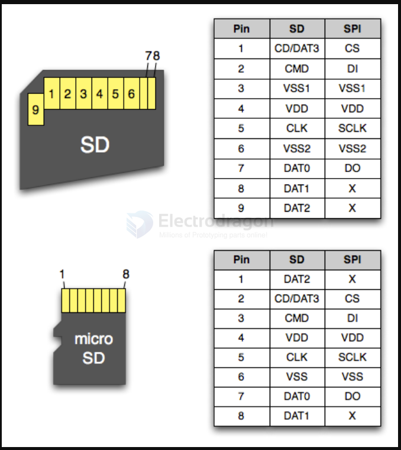

# microsd-dat

- [[microsd-card-holder-dat]] - [[sd-dat]]

Micro sd card pins are:

- CS-Card Select
- DI-Data In [MOSI]-Master, Out Slave Input
- VSS-Ground
- VDD-Power
- CLK-Clock [SCLK]-Serial Clock
- DO-Data Out [MISO]-Master Input, Slave Output
- NC (Memory Cards)

SD 

| pin | 4-bit SD | 1-bit SPI |
| --- | -------- | --------- |
| 9   | DAT2     | -         |
| 1   | CD/DAT3  | CS        |
| 2   | CMD      | DI        |
| 3   | VSS1     | VSS1      |
| 4   | VDD      | VDD       |
| 5   | CLK      | SCLK      |
| 6   | VSS2     | VSS2      |
| 7   | DAT0     | DO        |
| 8   | DAT1     | -         |

## common error 

### sdmmc_host_start_command returned 0x107

increase power supply? 
- https://github.com/espressif/esp-idf/issues/5436

testing with 1bit mode? 

update firmware? 
https://github.com/espressif/arduino-esp32/issues/7373

test log 
https://esp32.com/viewtopic.php?t=2604&start=10

## ref 

