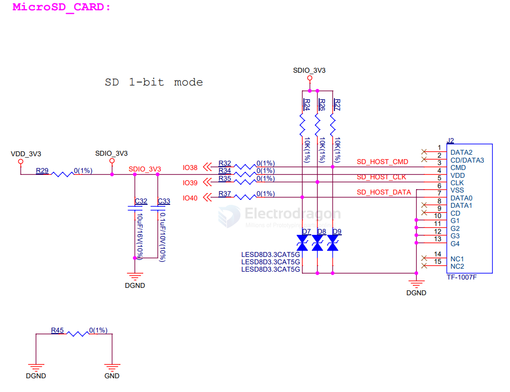
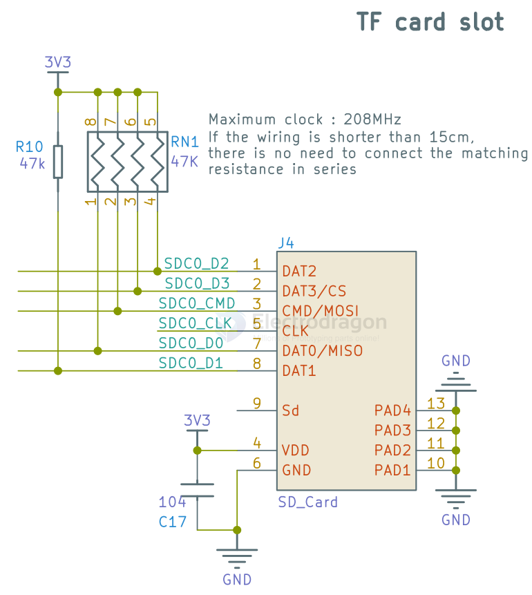
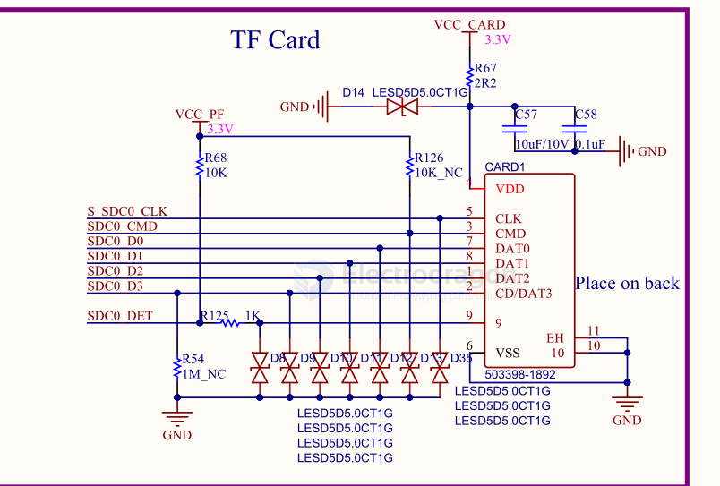
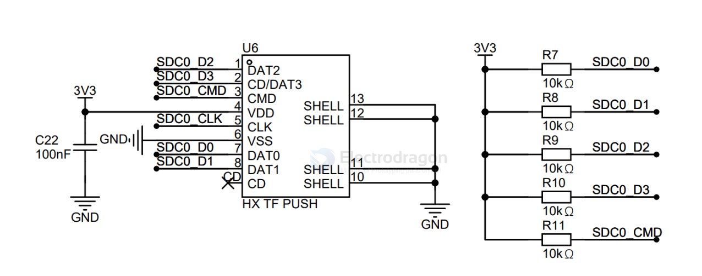

# sd-dat

- [[microsd-dat]] - [[sd-flashing-dat]]

- [[SD-SDK-dat]]

## 4. 📍 Embedded vs. Removable == SD VS SDMMC 

| Feature     | SD Card                      | eMMC / SDMMC-connected storage |
| ----------- | ---------------------------- | ------------------------------ |
| Removable   | ✅ Yes                        | ❌ No (soldered)                |
| Typical use | Cameras, laptops, dev boards | Phones, tablets, SBC eMMC boot |
| Speed       | Good, but depends on class   | Higher with HS200/HS400 modes  |
| Interface   | SPI or SD native             | SD/MMC native only             |

📝 Key Points

- **SDMMC** usually refers to the **native high-speed SD/MMC bus** on MCUs/SoCs.  
- Normal **SD card** can use that SDMMC bus — or just SPI mode — depending on the hardware.  
- In embedded boards (like STM32, ESP32-S3, Raspberry Pi), **SDMMC peripheral** = faster, multi-bit parallel bus.  
- **eMMC** is basically an MMC chip soldered permanently, always accessed via the SDMMC interface.

## Comparison: SDIO vs. SPI Interface

Both **SDIO (Secure Digital Input Output)** and **SPI (Serial Peripheral Interface)** are used for communication with SD cards and other peripherals, but they have key differences in speed, complexity, and use cases.

### Feature Comparison

| Feature                  | **SDIO Interface**                                                          | **SPI Interface**                                                                       |
| ------------------------ | --------------------------------------------------------------------------- | --------------------------------------------------------------------------------------- |
| **Bus Type**             | Parallel (4-bit or 1-bit)                                                   | Serial (1-bit)                                                                          |
| **Speed**                | Faster (up to 100+ Mbps)                                                    | Slower (typically 1–25 Mbps)                                                            |
| **Data Lines**           | 4-bit mode: **CLK, CMD, DATA0-3**   1-bit mode: **CLK, CMD, DATA0**      | **MOSI, MISO, SCK, CS** (1-bit communication)                                           |
| **Complexity**           | More complex (requires SD controller)                                       | Simpler (easier to implement in microcontrollers)                                       |
| **Performance**          | Higher data transfer rate                                                   | Lower data rate                                                                         |
| **Power Consumption**    | More efficient for high-speed transfers                                     | Can be less efficient due to longer transfers                                           |
| **Multi-Device Support** | Can support multiple devices efficiently                                    | Requires separate chip select (CS) lines for each device                                |
| **Use Cases**            | SD cards, Wi-Fi modules, Bluetooth modules, GPS, and high-speed peripherals | Simple microcontroller communication, low-speed SD card access, sensors, small displays |

### Summary

- **SDIO** is better for **high-speed data transfers** (e.g., Wi-Fi, SD cards in high-performance applications).  
- **SPI** is simpler, easier to implement, and works well for **low-speed, low-power applications** where high transfer rates are not required.  

## SPI inteface for ESP32-WROVER 

SP 4-wire - [[SPI-dat]]

    #define SD_CS IO13
    #define SD_MISO IO2
    #define SD_MOSI IO15
    #define SD_CLK IO14

- https://github.com/Edragon/Arduino-ESP32/tree/master/Sketchbook/driver-Data

This is how I connected my SD card:

https://github.com/espressif/arduino-esp32/tree/master/libraries/SD

## 1-bit microSD 

- CMD 
- CLK 
- DATA == D0

## SDIO interface for ESP32 == 4-bit mode

SD (Secure Digital) card interface, specifically the SDIO (Secure Digital Input Output) or 4-bit SD mode.

Dat 0~4 used in [[SCM1030-dat]]

MicroSD Card Connections

The following pins are used to interface with the microSD card when it is on operation.

| MicroSD card | ESP32   |                       | extra      |
| ------------ | ------- | --------------------- | ---------- |
| CLK          | GPIO 14 |                       |            |
| CMD          | GPIO 15 | pull-up               |            |
| DATA0        | GPIO 2  | pull-up               |            |
| DATA1        | GPIO 4  | pull-up (not working) | flashlight |
| DATA2        | GPIO 12 | X                     |            |
| DATA3        | GPIO 13 | pull-up               |            |

## official arduino code - SD

Note:  The SPI pins can be manually configured by using `SPI.begin(sck, miso, mosi, cs).` Alternatively, you can change the CS pin and use the other default settings by using `SD.begin(cs)`.
 
    +--------------+---------+-------+----------+----------+----------+----------+----------+
    | SPI Pin Name | ESP8266 | ESP32 | ESP32‑S2 | ESP32‑S3 | ESP32‑C3 | ESP32‑C6 | ESP32‑H2 |
    +==============+=========+=======+==========+==========+==========+==========+==========+
    | CS (SS)      | GPIO15  | GPIO5 | GPIO34   | GPIO10   | GPIO7    | GPIO18   | GPIO0    |
    +--------------+---------+-------+----------+----------+----------+----------+----------+
    | DI (MOSI)    | GPIO13  | GPIO23| GPIO35   | GPIO11   | GPIO6    | GPIO19   | GPIO25   |
    +--------------+---------+-------+----------+----------+----------+----------+----------+
    | DO (MISO)    | GPIO12  | GPIO19| GPIO37   | GPIO13   | GPIO5    | GPIO20   | GPIO11   |
    +--------------+---------+-------+----------+----------+----------+----------+----------+
    | SCK (SCLK)   | GPIO14  | GPIO18| GPIO36   | GPIO12   | GPIO4    | GPIO21   | GPIO10   |
    +--------------+---------+-------+----------+----------+----------+----------+----------+
   
    For more info see file README.md in this library or on URL:
    https://github.com/espressif/arduino-esp32/tree/master/libraries/SD
   

## official arduino code - SD_MMC

    // Default pins for ESP-S3
    // Warning: ESP32-S3-WROOM-2 is using most of the default GPIOs (33-37) to interface with on-board OPI flash.
    //   If the SD_MMC is initialized with default pins it will result in rebooting loop - please
    //   reassign the pins elsewhere using the mentioned command `setPins`.
    // Note: ESP32-S3-WROOM-1 does not have GPIO 33 and 34 broken out.
    // Note: if it's ok to use default pins, you do not need to call the setPins
    int clk = 14;
    int cmd = 15;
    int d0 = 2;
    int d1 = 4;
    int d2 = 12;
    int d3 = 13;  // GPIO 34 is not broken-out on ESP32-S3-DevKitC-1 v1.1

## arduino code 

    #include <SPI.h>
    #include <SD.h>
    File myFile;

    void setup()
    {
    // Open serial communications and wait for port to open:
    Serial.begin(9600);
    while (!Serial) {
    ; // wait for serial port to connect. Needed for Leonardo only
    }
    Serial.print("Initializing SD card...");
    // On the Ethernet Shield, CS is pin 4. It's set as an output by default.
    // Note that even if it's not used as the CS pin, the hardware SS pin
    // (10 on most Arduino boards, 53 on the Mega) must be left as an output
    // or the SD library functions will not work.
    pinMode(10, OUTPUT);
    if (!SD.begin(4)) {
    Serial.println("initialization failed!");
    return;
    }
    Serial.println("initialization done.");
    // open the file. note that only one file can be open at a time,
    // so you have to close this one before opening another.
    myFile = SD.open("test.txt", FILE_WRITE);
    // if the file opened okay, write to it:
    if (myFile) {
    Serial.print("Writing to test.txt...");
    myFile.println("Hello,world!");
    // close the file:
    myFile.close();
    Serial.println("done.");
    } else {
    // if the file didn't open, print an error:
    Serial.println("error opening test.txt");
    }
    // re-open the file for reading:
    myFile = SD.open("test.txt");
    if (myFile) {
    Serial.println("test.txt:");
    // read from the file until there's nothing else in it:
    while (myFile.available()) {
    Serial.write(myFile.read());
    }
    // close the file:
    myFile.close();
    } else {
    // if the file didn't open, print an error:
    Serial.println("error opening test.txt");
    }
    }

    void loop()
    {
    // nothing happens after setup
    }

## SD SCH 2 

SCH 3 

SCH 4 

SDMMC接口用于接入Micro SD卡，系统启动时，可以从SD卡中加载U-Boot，内核，RootFS，实现Linux启动。

该部分原理图如下所示：

如上图所示，相关线路说明如下所示：

CLK: SDMMC时钟，每个时钟周期传输一个命令或数据位。频率可在0至25MHz之间变化。SD卡总线管理器可以自由产生0至25MHz的频率，没有任何限制。

CMD: 命令传输线，命令通过该CMD线串行传输。

D0～D3: 数据通过这些数据线传输。

按照SDMMC规范，SDMMC线路还需要增加10K上拉电阻，如果没有可以会影响数据传输，本原理图中R7-R11即上拉电阻。同时，为了保证电源质量，增加了C22滤波电容。

SHELL引脚为SDMMC连接器固定引脚，此处接地处理，CD引脚用于探测SD卡是否插入，这一块悬空未使用。

## SCH 5 

## test tools 

- CrystalDiskMark

- [h2testw](https://h2testw.org/) - [[h2testw_1.4.zip]]

## ref 

- [[memory-dat]] - [[interface-dat]] - [[sd-card-holder-dat]] - [[microsd-card-holder-dat]]

- [[memory]]