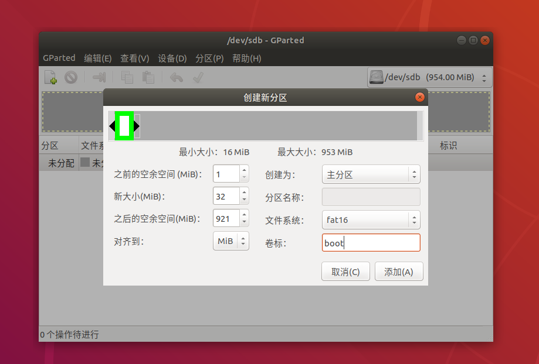
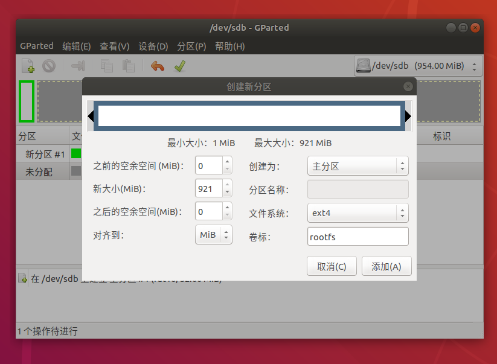
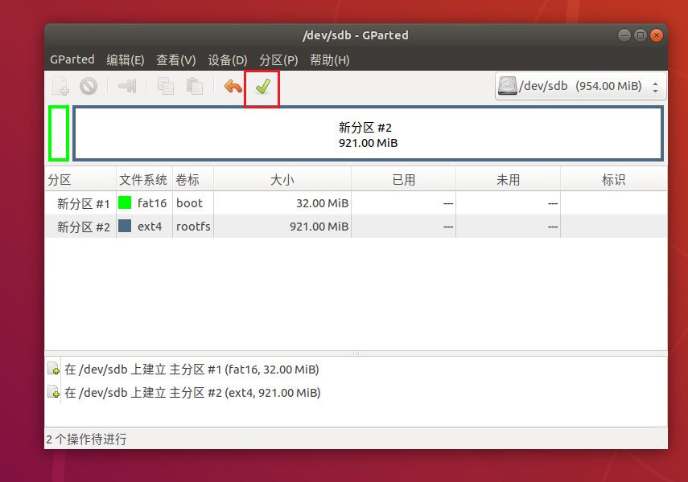

# sd-flashing-dat

- https://www.balena.io/etcher/

- [win32disk](http://www.onlinedown.net/soft/110173.html)

- [SD Card Formatter](https://www.sdcard.org/downloads/formatter/eula_windows/SDCardFormatterv5_WinEN.zip)

## 分区 

GPartd格式化SD卡过程

接着开始创建分区，

首先创建boot分区，用于u-boot读取设备树、内核等文件，我们需要在分区前方空出一定的空间，用于u-boot以及SPL程序存放，如下图所示，首先点击左上角按钮，创建新分区，然后按照下图创建boot分区。

此处为U-Boot以及SPL预留了1Mib的空间，完全足够存放这些程序。

接着创建rootfs分区，我们将剩下的空间全部作为rootfs，文件系统选择ext4，如下图所示：

图3.x rootfs分区创建过程

最后点击保存，确认后生效，拔出SD卡备用，操作可参考下图：

