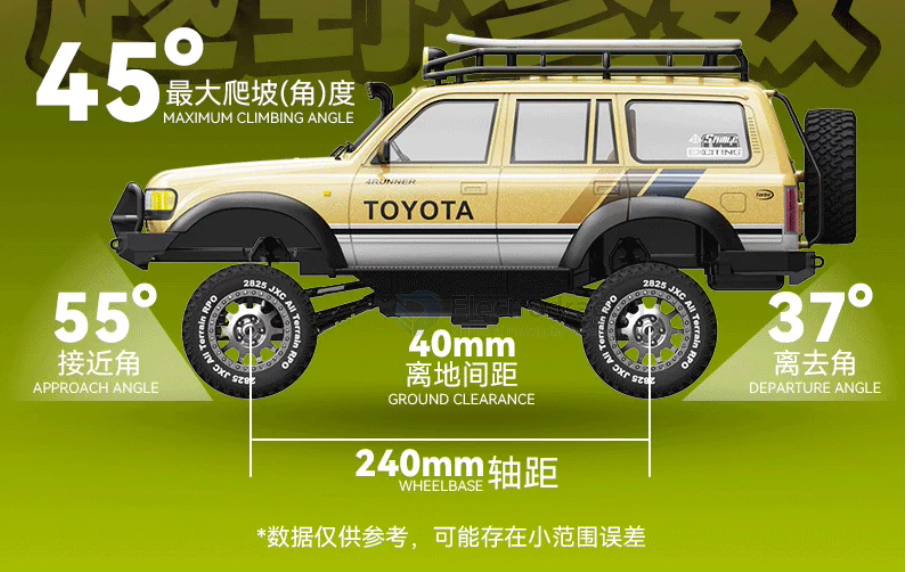

# off-road-dat

## Counterweight / Weight Bias in Off-Roading?
*(什么是配重 / 重量偏置？)*

In the context of RC cars and full-scale off-road vehicles, **counterweight** (or more accurately, **weight distribution / weight bias**) refers to the strategic placement of extra weight on the chassis or axles to manipulate the vehicle's center of gravity (CoG). 

The goal of adding counterweight is not just to make the car heavier, but to **force the tires to press harder against the ground for maximum traction and to prevent the vehicle from rolling over.**

Here is the detailed breakdown of how counterweight works in off-roading, formatted for easy copying:

---

### 1. Key Terminology (核心术语)

* **Counterweight (配重):** The actual physical weights (usually made of heavy metals like brass or lead) added to specific parts of the car.
* **Center of Gravity / CoG (重心):** The theoretical point where the entire weight of the car is balanced. Lower is always better for off-roading.
* **Sprung Weight vs. Unsprung Weight (簧上件与簧下件重量):**
  * **Sprung Weight:** Everything supported by the suspension springs (chassis, body, electronics). 
  * **Unsprung Weight:** Everything directly touching the ground below the springs (wheels, tires, axles). **Off-roaders always try to add counterweight to unsprung weight.**

---

### 2. Why Do We Add Counterweight? (为什么要加配重？)

#### A. Lowering the Center of Gravity (降低重心)
If an RC car is top-heavy (heavy body shell, battery sitting high up), it will easily roll over sideways when driving across a side-hill slope, or flip backward when climbing. By adding heavy brass parts down at the wheel hubs or axles, you drag the CoG downward, making the car incredibly stable.

#### B. Increasing Mechanical Traction (增加机械抓地力)
Tires need downward force to bite into loose dirt, mud, or rocks. Adding weight directly over the axles forces the rubber tires to deform and conform to the terrain, massively increasing grip.

#### C. Shifting Weight Forward (前置配重 - Front Bias)
When a car climbs a steep hill, physics naturally shifts all the vehicle's weight to the rear wheels, causing the front wheels to lift and the car to flip backward. To combat this, off-road enthusiasts use a **front-heavy bias** (typically a 60:40 split, where 60% of the car's weight is over the front axle and 40% is over the rear). 

---

### 3. Common Methods of Adding Counterweight in RC Cars (常见配重改装方法)

* **Brass Portal Covers / Knuckles (黄铜桥盖/转向座):** This is the single most popular upgrade for rock crawlers. Replacing stock plastic axle covers with heavy brass parts adds weight directly to the unsprung mass. It lowers the CoG perfectly without putting extra stress on the suspension springs.
* **Internal Wheel Weights (轮毂内加重块):** Wrapping lead tape or installing heavy brass rings inside the wheel rims. 
  * *Note:* While highly effective for low-speed crawlers, heavy rotating wheels are **not recommended for high-speed monster trucks**, as the extra rotational mass places massive strain on the motor and drive shafts during high-speed acceleration.
* **Chassis Weight Strips (底盘配重块):** Sticking small adhesive lead weights to the absolute lowest, most forward positions of the chassis frame.

## and consider wheelbase 

**Wheelbase (轴距)**—the distance between the center of the front wheels and the center of the rear wheels—has a massive, direct impact on an RC car's off-road performance. 

In off-roading, wheelbase represents a constant mechanical trade-off: **A short wheelbase gives you superior agility and obstacle clearance, while a long wheelbase gives you superior stability on steep slopes and high-speed tracks.**

Here is the detailed breakdown of how wheelbase changes off-road handling, formatted for easy copying:

---

### 1. Short Wheelbase (短轴距) — The King of Tight Spaces & Obstacle Clearance 🦎

A short wheelbase is highly favored in technical rock crawling where navigating over sharp peaks and tight wedges is required.

* **Advantages:**
  * **Excellent Breakover Angle (纵向通过角):** This is the single biggest advantage. Because the front and rear wheels are closer together, the belly of the chassis sits higher relative to the ground between the axles. It is much harder to get "high-centered" (肚皮搁浅) when cresting a sharp hill or crossing a pointed log.
  * **Tighter Turning Radius (转弯半径小):** Short cars can turn sharply in tight wooded areas or narrow rocky paths, making it easier to find a clean "line" through obstacles.
* **Disadvantages:**
  * **The "Vertical Flip" Tendency (易纵翻):** When climbing a very steep incline, the front wheels will lift off the ground much sooner because the vehicle's center of mass easily shifts behind the rear axle line. It flips backward easily.
  * **High-Speed Instability (高速易打转):** At high speeds, short-wheelbase cars are twitchy. Any slight bump can cause the rear end to swing out, leading to a spin-out (spin-out / 甩尾).

### 2. Long Wheelbase (长轴距) — The King of Steep Slopes & High-Speed Stability 🐆

A long wheelbase is favored by high-speed desert trucks, heavy-duty scale trail trucks, and competitive hill climbers.

* **Advantages:**
  * **Superior Steep Climbing (更耐爬坡):** When tackling an incredibly steep, near-vertical wall, a long wheelbase keeps the front tires pressed firmly against the ground. The center of gravity stays safely planted between the axles longer, preventing backward rollovers.
  * **High-Speed Tracking (高速稳定性):** A longer footprint dampens sudden chassis pitch (up and down bouncing) and yaw (side-to-side shaking). It allows the car to track dead straight over rough washboard surfaces or desert sand without spinning out.
* **Disadvantages:**
  * **Poor Breakover Angle (极易托底):** Because the gap between the front and rear tires is wide, the belly of the car hangs low over sharp peaks. It is highly susceptible to scraping its stomach on rocks or getting stuck like a seesaw.
  * **Wider Turning Radius (转弯半径大):** It handles like a school bus in tight, technical spaces, requiring multi-point turns to navigate sharp corners.

---

## ⚖️ Summary Cheat Sheet: Choosing Your Wheelbase

| Performance Metric                        | Short Wheelbase (短轴)       | Long Wheelbase (长轴)             |
| :---------------------------------------- | :--------------------------- | :-------------------------------- |
| **Sharp Crests / Logs (Breakover Angle)** | **⭐⭐⭐⭐⭐ (Excellent)**        | ⭐⭐ (Easy to get high-centered)    |
| **Steep Wall Climbing (Anti-Rollover)**   | ⭐⭐ (Flips backward easily)   | **⭐⭐⭐⭐⭐ (Very stable)**           |
| **Tight Technical Trails (Agility)**      | **⭐⭐⭐⭐⭐ (Highly agile)**     | ⭐⭐⭐ (Requires backing up to turn) |
| **High-Speed Bashing / Rough Terrain**    | ⭐⭐ (Twitchy, bounces easily) | **⭐⭐⭐⭐⭐ (Smooth and stable)**     |

### 🛠️ Real-World Engineering Application

If you are currently designing a custom chassis, building a robot dog/rover, or adjusting an adjustable RC chassis (like many 1/10 scale rock crawlers that let you swap links between **313mm** and **324mm**):

1. **For Technical Rock Crawling:** Lean toward a slightly shorter wheelbase to prioritize clearing sharp underbelly obstacles.
2. **For Trail Running or High-Speed Off-Roading:** Lean toward a longer wheelbase to give the suspension more room to soak up bumps smoothly and maintain straight-line tracking.

## consider

Here is the complete breakdown of what you should consider, organized into logical categories for easy copying:

---

### 1. The Physical Geometry (The Two Metrics You Mentioned)

* **Ground Clearance (离地间隙) — Determines *if* you will get stuck**
  * **What to look for:** The distance between the lowest points of the vehicle (usually the bottom of the differentials and the center belly of the chassis) and the ground. If the ground clearance is too low, the car will "high-center" or "bottom out" on rocks, leaving the wheels spinning helplessly in the air.
  * **Advanced Feature:** Look for **Portal Axles (门式车桥)**. These use gears at the wheel hubs to lift the axle tubes higher than the wheel centers, instantly maximizing ground clearance.
* **Suspension Travel (避震行程/压缩与回弹) — Determines tire-to-ground contact**
  * **What to look for:** This includes both compression (upward travel) and droop (downward extension). Off-road vehicles don't fear bumps; they fear lifting a tire. A tire in the air provides zero traction.
  * **Advanced Feature:** **Chassis Articulation / Flex (扭腰角度)**. This measures how far the front and rear axles can twist relative to each other. Extreme articulation keeps all four tires firmly planted on highly uneven boulders.

### 2. The Four Hidden Dimensions of Off-Road Performance

#### A. Power Transmission & Distribution (The Differential System) 👑
As discussed earlier, this is the "software" that governs mechanical traction.
* **What to look for:** What happens when one wheel loses traction or hangs in the air? If it is an open differential, all power escapes through that free-spinning tire.
* **Best Configurations:**
  * For slow-speed crawling: Must have a **permanently locked axle (straight axle)** or **selectable remote diff locks**.
  * For high-speed bashing: Must use **ultra-high viscosity silicone differential oil** to limit slip and send power to the tires with grip.

#### B. Clearance Angles (Approach, Departure, and Breakover Angles)
Having a high chassis belly isn't enough; the shape of the bumpers and body overhangs dictates if you can climb onto an obstacle.
* **Approach Angle (接近角):** The angle between the ground and a line drawn from the front tire to the lowest part of the front bumper. If this angle is too shallow, the front bumper will slam into a rock wall before the tires can touch it.
* **Departure Angle (离离去角):** The same concept but at the rear bumper. Prevents the rear bumper from dragging or getting hooked when exiting a steep drop.
* **Breakover Angle (纵向通过角):** The angle forming a triangle under the belly between the front and rear tires. This dictates whether the car will get stuck on its stomach when cresting a sharp hill peak.

#### C. Grip Carriers (Tread Pattern, Rubber Compound, and Foams)
Tires are the single point of contact between the vehicle and the earth. Massive horsepower means nothing if the tires act like plastic.
* **Tread Design:** Muddy terrain requires aggressive, self-cleaning paddle or chevron lugs. Rock crawling requires dense, blocky tread grids to bite onto razor-sharp rock lips.
* **Compound & Inserts:** Look for **ultra-soft, sticky rubber compounds**. The internal tire foams (胎瓤) should not be too stiff; they must allow the tire tire to deform and "wrap" around rocks, dramatically increasing the surface contact area.

#### D. Weight Distribution & Center of Gravity (CoG)
* **What to look for:** The center of gravity must be as low as possible. A top-heavy car will flip backwards when climbing a steep grade, or roll sideways on a side-hill slide.
* **Best Configurations:** True off-road and crawling rigs utilize a **front-weight bias** (e.g., 60% weight on the front axle, 40% on the rear) by shifting the motor and battery forward. Enthusiasts also add unsprung weight, such as heavy brass portal covers or wheel weights, to anchor the axles to the ground.

---

### 🛠️ Off-Road Evaluation Checklist (Summary)

When assessing any RC vehicle's true off-road pedigree, check the following in order:

1. **Chassis Basics:** Is the ground clearance adequate? Are the shock travel and axle articulation wide enough?
2. **Body Design:** Do the bumpers sit high and tucked inward? (Excellent approach/departure angles).
3. **Drivetrain:** Can the differentials be locked, or do they use heavy fluid to resist spinning out?
4. **Footwear:** Are the tires made of a sticky, soft compound with deep off-road lugs?
5. **Balance:** Is the weight bias low and shifted toward the front axle to prevent rollovers?

## differential 

**差速器（Differential）**和**差速锁（Diff Lock）**是两个最核心的机械概念。它们的作用正好完全相反：一个负责“解开”，一个负责“锁死”。

## Why Are Lockable Diff Crawlers So Expensive? (为什么带可调差速锁的攀爬车这么贵？)

You hit the nail on the head. In the RC world, rigs equipped with **remote-operable differential locks** (where you can lock/unlock via the transmitter, like the Traxxas TRX-4 or Axial SCX10 III) are indeed very expensive. 

This is because the mechanical complexity is much higher: each axle needs an internal shift fork mechanism, and the chassis must house 1–2 additional micro servos (微型舵机), cables, or linkages to actuate the lock.

However, if your goal is pure off-road and rock crawling performance, **there is a highly budget-friendly alternative that even hardcore veterans prefer:**

---

### 1. The Budget-Friendly Savior: Pure Locked Axles (Spool / Straight Axle)
*(性价比最高的终极方案：纯直轴车)*

Many highly capable and affordable entry-level rock crawlers do not have differential gears inside their axles at all. Instead, the left and right drive shafts are permanently locked or connected via a solid piece of metal.
* **Spool / Locked Axle (直轴/死锁桥):** The axle is physically incapable of differentiating. 
* **The Benefit (优势):** Zero complex moving parts, no extra servos, and no cables. This makes the vehicle **significantly cheaper** and incredibly durable. Since there is no shifting mechanism to strip, it rarely breaks under heavy load.
* **Off-Road Performance (越野效果):** In terms of climbing ability, it performs **exactly the same** as a $500+ premium truck with its diffs locked. All four wheels receive 100% torque all the time.

### 2. DIY Modding for Cheaper RC Cars
*(如果你手头已有带开放式差速器的便宜小车，可以用几块钱成本自行改装)*

If you already own a cheap RC car with an open differential, you can transform its climbing ability with these DIY hacks:

* **The Blu-Tack / Hot Glue Method (完全锁死法):** Open up the differential gear cup (差速器齿轮箱) and pack it tightly with Blu-Tack (蓝丁胶), shredded tissue paper, or hot glue. This jams the spider gears (伞齿轮) completely, turning it into a permanent locked axle. Your off-road capability will immediately skyrocket.
* **The Million-Weight Silicone Oil Method (限滑法):** Fill the differential with ultra-thick silicone oil—specifically **1,000,000 (1M) to 2,000,000 (2M) cSt viscosity**. When driving slowly on pavement, it will still allow some differentiation for turning. However, the moment a wheel tries to spin out rapidly in the mud, the extreme thickness of the oil resists the spinning and forces power to the wheel with traction.

---

### ⚠️ The Only Trade-off of a Permanent Locked Axle
*(纯直轴的唯一缺点)*

When driving on high-traction surfaces like flat concrete or asphalt, you will notice **understeer (推头 - the car wants to go straight instead of turning)** and the inner tires might hop or chirp on the ground. 

* **Note:** This is perfectly normal because the left and right wheels are forced to spin at the exact same speed even though they travel different path lengths in a turn. However, the moment you put the car onto dirt, sand, mud, or rocks, **this disadvantage completely disappears** as the loose ground allows the tires to slip naturally.

### Summary (总结)
If budget is a concern, **you absolutely do not need to buy an expensive truck with remote-locking differentials.** Simply buy a rig that comes with permanent locked axles (直轴攀爬车) from the factory, or lock the gears yourself on a cheap chassis. You can enjoy top-tier off-road capability for a fraction of the price.

## off-road performance

When talking about the **off-road performance** of an RC car—meaning its ability to traverse complex, rugged terrain such as rocks, mud, sand, and grass—the most critical and impactful component above all else is the **Differential Lock (or Limited-Slip Differential / Locked Axle)**. 

The **Suspension & Shock Absorber System** comes in a close second.

Many RC beginners intuitively think shocks are the most important because "off-roading is all about bumps." However, if your car's power cannot be effectively transmitted to the ground, even the most perfect suspension will leave you stuck in place with spinning wheels.

Here is a deep dive into how these systems affect off-road performance, ranked by their impact:

---

### 1. The Differential System — Determines the Performance Ceiling 👑

While an open differential is great for smooth cornering on flat pavement, it is the biggest weakness when off-roading.

* **The Fatal Flaw:** A standard open differential follows the "path of least resistance." When off-roading, if one wheel loses contact with the ground or steps into slick mud, the differential will send **100% of the power to that spinning, tractionless wheel**, while the wheel firmly planted on the ground gets zero torque. This is called getting "bottomed out" or "bogged down."
* **The Solution:** * **Locked Axle / Spool:** Common in professional rock crawlers. It completely eliminates the differential function, locking the left and right wheels together. No matter if one wheel is dangling in the air, the other wheel still receives 100% torque. This is **the most brutal and effective way to instantly boost off-road capability.**
  * **Limited-Slip / High-Viscosity Diff Oil:** Common in off-road buggies, truggies, or monster trucks. High-viscosity silicone oil (ranging from 10k to over 500k cSt) is poured into the diff gear cup. It resists free spinning, ensuring that power is always forced over to the wheel with traction.

### 2. Suspension & Shocks — Determine Speed and Stability 🥈

If the differential determines *whether* your car can pass an obstacle, the suspension determines *how fast and stably* it can do so.

* **Core Purpose:** The main goal of an off-road suspension is not just comfort or cushion; it is to **keep the tires in contact with the ground as much as possible**. A tire in the air provides zero traction and zero acceleration.
* **Key Factors for Off-Roading:** * **Suspension Travel:** Off-road cars need long-travel suspension (large up-and-down movement). This allows the wheels to drop down into deep ruts or stretch over large rocks while keeping the chassis relatively stable.
  * **Damping (Oil-filled Shocks):** Pure springs will cause the RC car to bounce uncontrollably like a trampoline. Oil-filled shocks use internal silicone oil and pistons to create damping resistance, absorbing the spring's rebound energy. This stops the car from bouncing wildly after a jump or when hammering through rough corrugations.

### 3. Tires and Ground Clearance — The Foundation

While these aren't complex mechanical mechanisms, they act as the absolute baseline for off-road driving.

* **Ground Clearance:** If your chassis is too low, you will get high-centered on rocks or sand heaps. If the belly of the car is stuck, no amount of mechanical genius will save it.
* **Tire Tread & Compound:** Off-roading requires aggressive, deep treads (like pin tires, paddle tires, or soft-compound crawling tires) to bite into loose dirt, mud, or grip onto slick rocks.

---

## 💡 Summary & Application Guide

Depending on your driving style, your upgrade priorities will change completely:

| RC Vehicle Type                                           | Most Critical Component         | Why?                                                                                                                                                                                                  |
| :-------------------------------------------------------- | :------------------------------ | :---------------------------------------------------------------------------------------------------------------------------------------------------------------------------------------------------- |
| **Rock Crawlers / Technical Trail** (e.g., Traxxas TRX-4) | **Differential Locks**          | Extreme low-speed driving. Success relies entirely on all four wheels having hard, continuous torque to crawl up steep, rocky ledges.                                                                 |
| **Basher / Monster Truck / Buggy** (e.g., Arrma Kraton)   | **Oil Shocks + Heavy Diff Oil** | High-speed driving. Needs heavy damping to absorb brutal jump landings and rough terrain; cannot use fully locked diffs (or it will flip during high-speed turns), so heavy diff oil bridges the gap. |

**Bottom Line:** If your RC car frequently gets stuck because one or two wheels are spinning uselessly in the air, **locking the diffs or adding thicker diff oil** yields the most immediate improvement. If your car flips easily, spins out, or bounces uncontrollably on rough ground, **upgrading to high-quality, long-travel oil shocks** is your best bet.

## ref 

