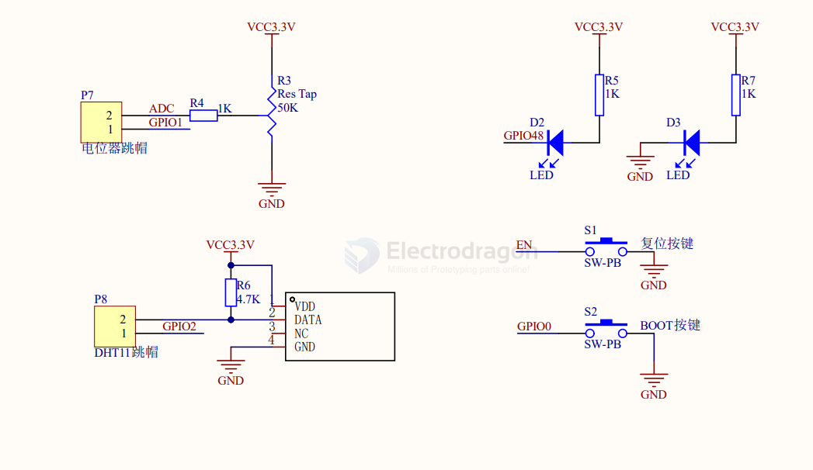
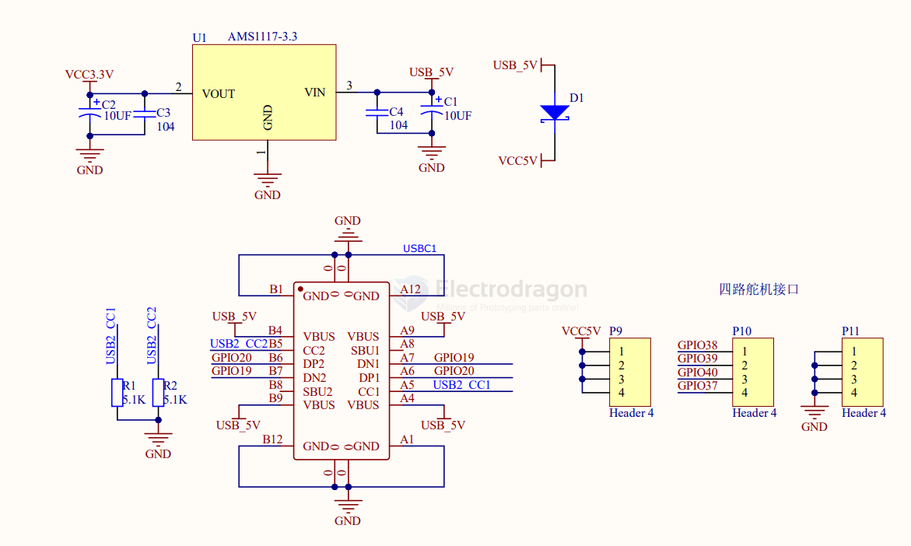

# peripherals-dat

- [[interface-dat]]

- [[indicator-dat]] - [[WS2812-dat]] - [[LED-dat]] - [[7-seg-dat]] - [[LCD-dat]] - [[OLED-dat]] - [[interactive-dat]]

- [[CPU-dat]] - [[memory-dat]] - [[programming-dat]]

- [[SPI-dat]] - [[I2C-dat]] - [[I2S-dat]] - [[GPIO-dat]] - [[UART-dat]] - [[PWM-dat]] - [[pulse-dat]]

- [[ADC-dat]]

- [[RTC-dat]]

- [[USB-dat]] - [[USB-OTG-dat]]

- [[sensor-dat]] - [[sensor-touch-dat]] - [[camera-dat]] - [[DHT11-dat]] - [[sensor-light-dat]]

- [[interface-interactive-dat]] - [[display-dat]]

- [[memory-dat]] - [[sd-dat]]

- [[serial-dat]] - [[auto-serial-dat]]

- [[interactive-dat]] - [[button-dat]] - [[switch-dat]] - [[keyboard-dat]]

- [[acturator-dat]] - [[buzzer-dat]]

- [[ESD-dat]]

- [[DMA-dat]]

- [[clock-dat]]

## other categories

- [[network-dat]] - [[encryption-dat]] - [[WIFI-DAT]] - [[BLE-dat]] - [[ethernet-dat]]

- [[power-dat]] - [[LDO-dat]]

- [[led-driver-dat]]

- [[voltage-reference-dat]]

## basic 

LEDs, buttons, [[trim-pot-dat]], [[DHT11-dat]] 

- [[AMS1117-dat]] - [[type-c-dat]] - [[servo-dat]]

## ref 

read more at - [[V3S-dat]]

- [[ESP32-HDK-dat]]