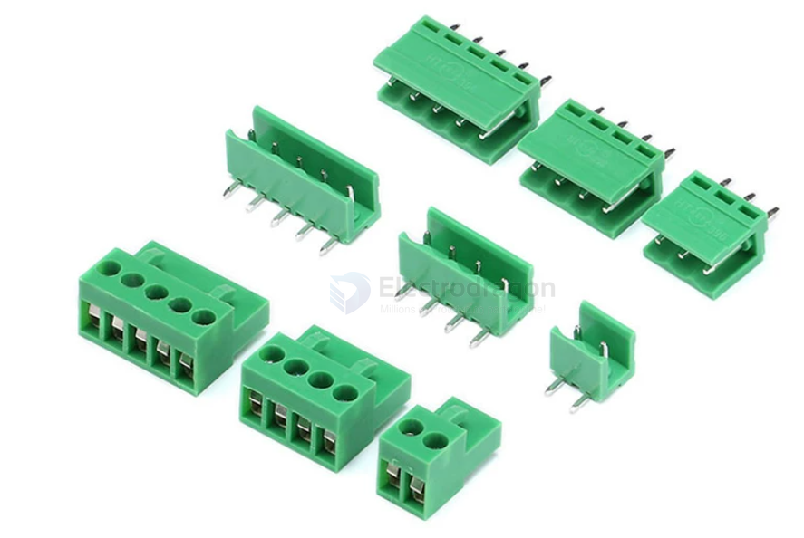
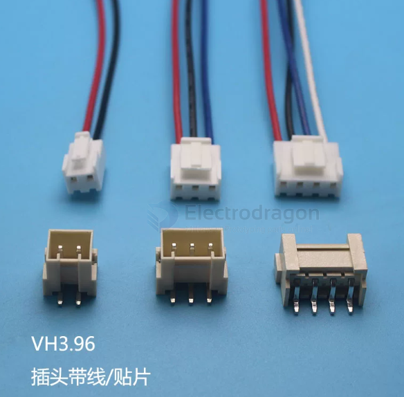
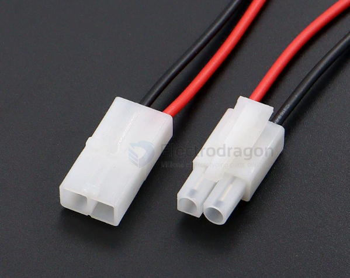
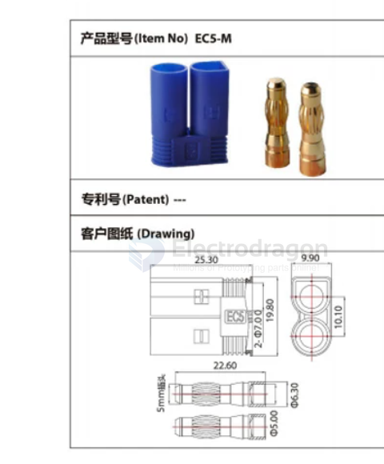

# pitch-dat

- [[CONN-power-dat]] - [[conn-battery-dat]] - [[conn-rc-dat]] - [[CONN-dat]] - [[pitch-dat]]
  
- [[CONN-deans-dat]] - [[CONN-tamiya-dat]]

- [[CONN-dat]] - [[cable-dat]]

- [[molex-dat]] - [[51006-0200-dat]] - [[pitch-dat]] - [[CONN-dat]] - [[CONN-RC-dat]]

- 1.0 mm - [[SH1.0-dat]]
- 1.25 mm - [[GH1.25-dat]] - [[conn-pin-header-dat]]
- 1.27 mm - DC3-6/8/10/12/14/16-50P  - [[conn-pin-header-dat]]
- 1.5 mm - [[ZH1.5-dat]] - [[conn-pin-header-dat]]
- 2.00 mm - [[PH2.0-dat]] - [[HY2.0-dat]] - [[PHD2.0-dat]], [[molex-dat]] - [[51006-0200-dat]] - Connector Housing, 51006, Plug, 2 Ways, 2 mm, Molex 50012 Series Pin Contacts  - [[conn-pin-header-dat]]
- 2.54 mm - [[XH2.54-dat]] - [[KF2510-dat]] - [[XHB2.54-dat]] - [[SM2.54-dat]], KF250-2.54-2/3/4/5-8P-1/2 - [[conn-JST-dat]] - [[conn-pin-header-dat]]
- 3.5 mm - KF2EDGKRH/NH-3.5mm, KF250-2.54/3.5mm
- 3.81 mm - KF2EDGV
- 3.96 mm - [[CONN-VH3.96-dat]] - [[CONN-CH3.96-dat]] - [[CONN-HT3.96-dat]]
- 4.2 mm - 5557 - 
- 4.5 mm - EL4.5-2P接插件小田宫4.5mm - [[EL4.5-dat]]
- 5.0 mm - KF243-5.0-2/3/4/5/6/8P, KF235-5.0-2/3/4/5/6/8P, KF202-5.0-2/3/4/5/6/8P, KF243A-5.0-2/3/4/5/6/8P, KF211V/KF211R-5.0mm, KF211R-5.0-2/3/4/5/6/8P卧插 250V 5.0mm, KF332K-5.0-2P/3P 直插 300V/10A 5.0mm
- 5.08 mm - [[HT508R-dat]] - [[KF103-dat]], KF2EDG15VM/RM/KM-5.08, KF2EDG15VM-5.08-2/3/4/5/6/8P
- 6.2 mm - L6.2-2p大田宫头公母空中对插连接线间距6.2mm端子电源线20cm - [[L6.2-dat]]
- 6.35 mm - HB611-6.35-2/3/4P, KF635-6.35-2P/3P
- 7.5 mm - KF206-7.5-2/3/4/5/6/8P
- 7.62 mm - KF25S-7.62-2P/3P/4P, KF2EDGVM/RM/KM, KF28C-7.62-2P/3P/4P
- 8.25 mm - HB825-8.25-2P/3P/4P
- 8.5 mm - KF8500-8.5-2P 3P 4P
- 8.52 mm - KF35C-8.25-2P/3P/4P
- 9.5 mm - KF48C-9.5-2P/3P/4P - HB9500 2P 3P, KF950-9.5-2P/3P, KF45C-9.5-2/3/4P
- 10.00 mm - EC5-F(母头) EC5-M(公头)
- 10.16 mm - KFA1016-10.16-2P/3P, KF135T-10.16-2P/3P
- 11 mm - KF65C-11.0-2/3/4P
- 13 mm - KF78S-13.0-2/3/4P

## by size 

- DC 2.5 mm 
- DC 2.1 mm 

## undefined pitch 

- AM-1015-F/M

## section 3.96mm 

- [[HT3.96-dat]] 

- [[CONN-VH3.96-dat]]

## section 6.2mm

### L 6.2 mm 

## section 10.1 mm 

## ref 

