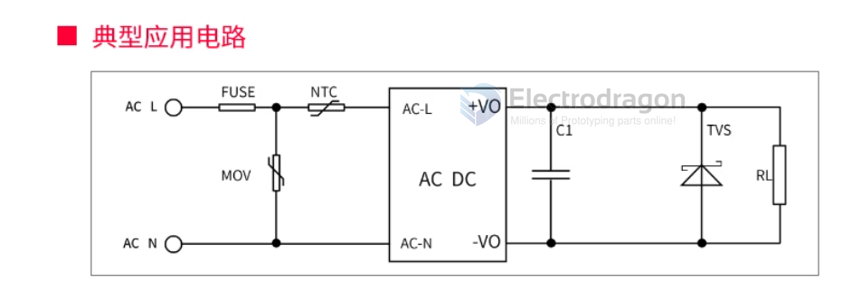

# ACDC dat 

## Modules 

- [[OPM1178-dat]] - [[OPM1110-dat]] - [[OPM1111-dat]] - [[OPM1016-dat]]

- [[OPM1113-dat]]

## peripheral SCH 

- [[fuse-dat]] - [[MOV-dat]] - [[NTC-dat]]

## SCH ref 

- 4x diodes rectify bridge 

## ref 

[[ACDC]]