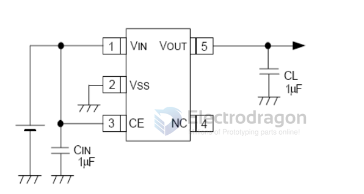
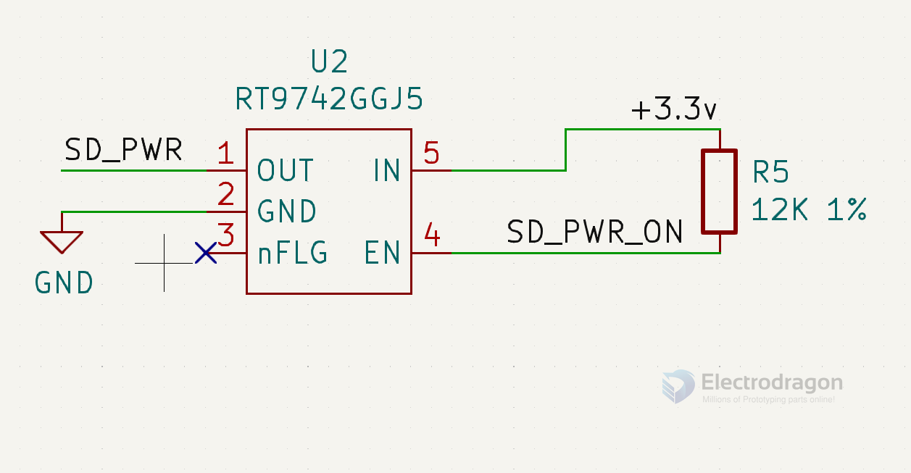

# LDO-dat 

- [[microne-dat]] - [[silergy-dat]] - [[ti-power-dat]]

## 6211 

| chip              | package | VIN |
| ----------------- | ------- | --- |
| [[AMS1117-dat]]           | SOT-89  |     |
| 6211              |         |     |
| SPX3819           |         |     |
| RT9013 / RT9193   |         |     |
| SGM2028 / SGM2019 |         |     |
| MIC5219           |         |     |
| XC6219            |         |     |
| LP2985            |         |     |

1 - VIN
2 - GND
3 - EN
4 - BYP
5 - VOUT

## 9742 

## option 231 

- 18V, Low Power, 
- High Accuracy, High PSRR LDO Regulators
- Maximum Output Current: 500mA

## SGM2036 

- VGPS = 2.8V 

## large current 

- [[LM7805-dat]] - [[TI-power-dat]] - [[LM317-dat]]

[LD1086DT33TR](https://www.mouser.com/ProductDetail/STMicroelectronics/LD1086DT33TR?qs=ZqrNm9%252BX9x495avHxGunSw%3D%3D&srsltid=AfmBOoo8TbJZVeh8Kv_urL5uG9JMlbgNaeSaF4P_AzeEG9Svc2ydWkUq) == LDO Voltage Regulators 3.3V 1.5A Positive

## ref 

- [[DC-dat]]

- [[LDO]]

- [[silergy]]