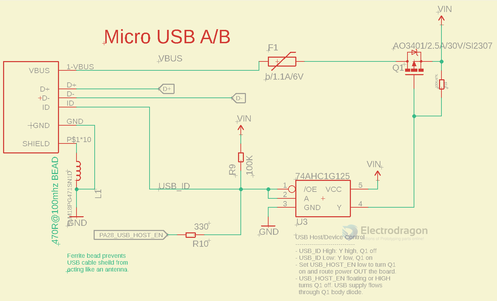
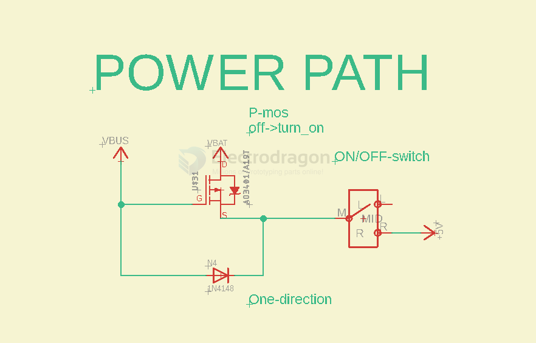
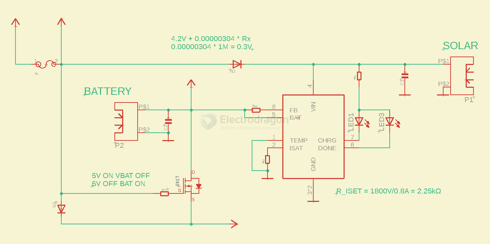

# power-flow-contro-dat

## USB Logic control for [[SDR1096-DAT]]

[[logic-gate-dat]]

- OE stay off by pull up resistor (default)
- OE turn on by **USB_ID or PA28_USB_HOST_EN pull down**
  - **USB_ID or PA28_USB_HOST_EN pull down** further turn on [[mos-p]]
  - VBUS -> VIN via [[mos-p]] (default off by pull up resistor)

## P-ch Mosfet select for [[ARM1007-dat]]

working table 

| Input | mos-ctrl | working          |
| ----- | -------- | ---------------- |
| VBAT  | ON       | direct to +5V    |
| VBUS  | OFF      | via diode to +5V |

## P-ch Mosfet select V2 for [[ARM1003-dat]]

- [[mosfet-dat]]

| VBUS @ gate | p-mos | BAT | VCC    | note       |
| ----------- | ----- | --- | ------ | ---------- |
| ON          | OFF   | OFF | = VBUS | via diode  |
| OFF         | ON    | ON  | = VBAT | via mosfet |

