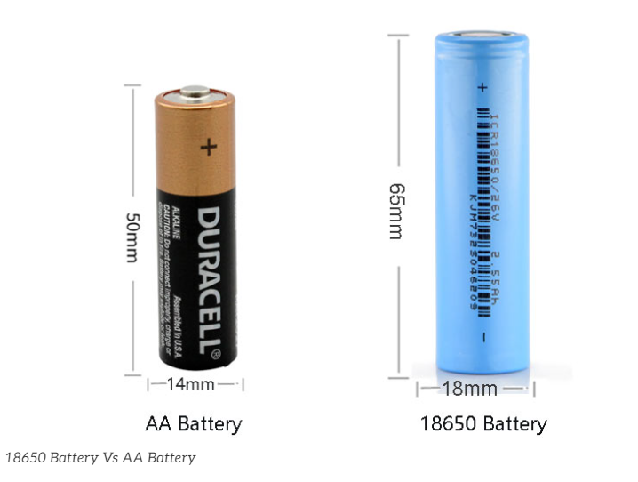

# 18650

18mm x 65mm

- [[18650-battery-holder-dat]]

## safety concern 

After 30 years of development, the preparation process of 18650 battery has been very mature. In addition to the great improvement in performance, its safety is also perfect. 

To prevent the metal casing from exploding, the battery is now fitted with a safety valve at the top. The safety valve is now a standard part of every 18650 Li-ion battery and is the most important barrier. When the pressure inside the cell becomes too high, the top safety valve opens to vent and depressurize, preventing an explosion. 

However, when the safety valve is open, chemicals leaking from inside the battery can react with oxygen in the air at high temperatures and still cause a fire. 

In addition, most 18650 batteries now also come with their own protection panel with overcharge and overdischarge and short circuit protection, which has high safety performance.

- [[battery-protection-dat]]

