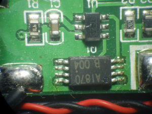

# BMS-dat

## A1870 + 3GJG (bad quality combination)

A1870 - [[uc1870+ver1_x76b.pdf]]

G3JQ - S8261 - [[S8261_E.pdf]]

## DW01 + FM8205

## Precautions before applying BMS:

1. Before installing the protection board, make sure the batteries are matched:
   
- the voltage difference between each battery should not exceed 0.05V, 
- the internal resistance difference should not exceed 5mΩ
- and the capacity difference should be less than 30mAh. 

The smaller the voltage difference between the batteries, the better the performance of the protection board.

2. Connect the batteries in parallel first, then in series, and ensure correct welding (use nickel strips for spot welding on 18650 batteries, and solder for other batteries). 

Never use screws to fasten them, as this may damage the IC of the protection board.

3. If you are replacing the protection board on old batteries, please check whether the batteries are in good condition before purchasing.

4. During installation, use a multimeter to check whether the voltage of each battery in the series is the same. 
   
If the voltage difference exceeds 1.0V, it may indicate a fault such as poor range, power cut-off at startup, or short charging time, which are often caused by battery cell issues. 

A protection board fault typically results in: inability to charge, or the battery has voltage but cannot discharge.

## ref 

- [[BMS]] - [[battery]]