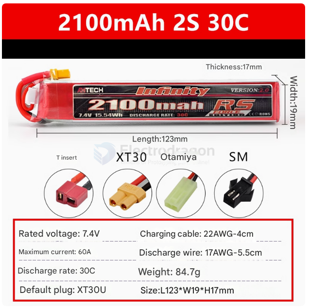

# battery-RC-dat

- Rated Voltage: 7.4V
- Charging Cable: 22AWG-4cm
- Maximum Current: 60A
- Discharge Cable: 17AWG-5.5cm
- **Discharge Rate**: 30C
- Weight: 84.7g
- Default Plug: XT30U
- Dimensions: L123*W19*H17mm

## ref 

- [[battery-dat]]