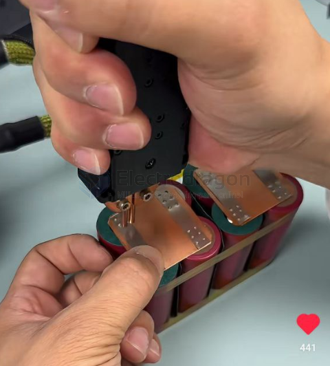

# battery-soldering-dat

支持点焊镍片、铁片、不锈钢片等多种材质强劲多能，焊接牢固，焊点优良

Support spot welding of nickel sheets, iron sheets, stainless steel sheets and other materials. Strong and versatile, strong welding, excellent welding points

## stack soldering 

The green part is Insulating Gasket

Copper sheet at the bottom, nickel-plated strip on top, stacked together for welding.

## ref 

- [[battery]] - [[18650]]