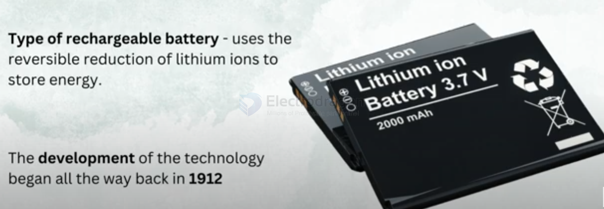

# li-ion-battery-dat

## How to revive / repair / fix a li-ion battery 

- https://www.youtube.com/watch?v=M-rqGF3NW8M&list=PLNgzTn8HTYzZhmBzrffCIMSWORd4BJm_l&index=24

constant charging by a 4.3V 300mA CC/CV power supply 

## Check the Battery's Protection Circuit (BMS)

Some lithium batteries have a protection circuit that cuts off charging if the voltage drops too low (below 2.5V or so). In some cases, you may need to bypass or reset the BMS to allow charging again. However, this can be risky, and it’s not recommended unless you’re experienced with battery repair.

- [[battery-charger-dat]]

- [[BMS-dat]]

## ref 
