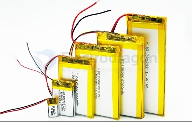

# pouch-battery-dat

## **Characteristics of Pouch Batteries**
1. **Lightweight Design**  
   - Uses **aluminum-plastic film**, making it lighter than metal-cased batteries.  
2. **High Energy Density**  
   - Pouch batteries have **10%-15% higher volumetric energy density** than prismatic and cylindrical batteries, ideal for long-range applications.  
3. **Better Safety**  
   - In case of damage, pouch batteries **swell and vent gas instead of exploding**, making them safer than cylindrical cells.  
4. **Flexible Shape and Size**  
   - Can be **customized to fit different device designs**, making them ideal for **compact electronic devices and high-end EVs**.  
5. **Lower Mechanical Strength**  
   - The **soft casing is more prone to damage** and requires additional structural protection.  
6. **Higher Production Cost**  
   - Manufacturing is **more complex and expensive** than cylindrical or prismatic cells.

---

## **Pouch vs. Cylindrical vs. Prismatic Batteries**
| **Type** | **Casing Material** | **Energy Density** | **Safety** | **Weight** | **Applications** |
|---------|----------------|----------------|------------|--------|----------------|
| **Pouch Battery** | Aluminum-plastic film | **Highest** | High (Swells instead of exploding) | **Lightest** | **High-end EVs, smartphones, laptops, drones** |
| **Cylindrical Battery (18650/21700)** | Stainless steel shell | Medium | Medium (Has safety valves) | Heavy | **EVs (Tesla), laptops, power tools** |
| **Prismatic Battery** | Aluminum or steel case | High | Medium (Rigid structure) | Medium | **EVs, energy storage systems** |

---

## **Applications of Pouch Batteries**
1. **Electric Vehicles (EVs)**  
   - Used by **BYD, NIO, Hyundai, BMW**, and other manufacturers.  
2. **Consumer Electronics**  
   - Common in **smartphones, laptops, tablets**, and other portable devices.  
3. **Energy Storage Systems**  
   - Some **home and commercial energy storage systems** use pouch batteries for higher energy density.  
4. **Drones & E-Mobility**  
   - Due to their **lightweight design**, pouch batteries are preferred for **drones, e-skateboards, and lightweight EVs**.

---

## **Future Trends**
- **High-Nickel Chemistry** (Improving energy density, reducing cobalt usage)  
- **Solid-State Batteries** (Enhancing safety and increasing energy capacity)  
- **Recycling & Sustainability** (Reducing environmental impact and improving recyclability)  

---

## Soft-pack (pouch) battery 

A Soft-pack Pouch Lithium Battery (or Pouch-type Lithium Battery) refers to a specific form factor of Lithium-ion or Lithium-Polymer (Li-Poly) batteries that is encased in a flexible, soft pouch made of materials like aluminum foil. This type of battery is typically lighter and more compact compared to cylindrical cells (like 18650) or prismatic cells, and it offers certain advantages in terms of flexibility, form factor, and space efficiency.

1. Good safety performance: 
   
The soft packing battery does not cause an explosion accident as like the steel shell battery or aluminum shell battery. Generally, in the case of a safety hazard, the outer casing will only bulge at most.

2. Small size, light weight, high energy: 

in terms of weight, the soft pack battery is 40% lighter than the equivalent capacity of the steel casing lithium battery, and 20% lighter than the aluminum casing battery. In terms of capacity, the soft-pack lithium battery is 10-15% higher than the steel casing battery of the same specification scale, and 5-10% higher than the aluminum casing battery.

3. The internal resistance is small: 

We all know that the lithium battery itself will have an inevitable self-discharge reaction, and the greater the internal resistance, the more intense the self-discharge. Relatively speaking, the internal resistance of the soft-pack lithium battery is small, which greatly reduces the self-consumption of the battery.

4. Flexible planning: 

the shape of the soft pack battery can be determined by specific business needs, customized planning according to the detailed dimensions of the battery box, perhaps through a variety of battery arrangements to achieve full use of the internal space of the battery box, to meet Differentiated needs.

