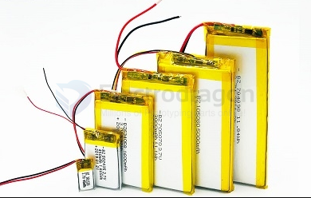

# lithium-ion-battery-dat

- [[LiFePO4-Battery-dat]] - [[18650-dat]]

## How to revive / repair / fix a li-ion battery 

- https://www.youtube.com/watch?v=M-rqGF3NW8M&list=PLNgzTn8HTYzZhmBzrffCIMSWORd4BJm_l&index=24

constant charging by a 4.3V 300mA CC/CV power supply 

## Check the Battery's Protection Circuit (BMS)

Some lithium batteries have a protection circuit that cuts off charging if the voltage drops too low (below 2.5V or so). In some cases, you may need to bypass or reset the BMS to allow charging again. However, this can be risky, and it’s not recommended unless you’re experienced with battery repair.

- [[battery-charger-dat]]

- [[BMS-dat]]

## Soft-pack (pouch) battery 

A Soft-pack Pouch Lithium Battery (or Pouch-type Lithium Battery) refers to a specific form factor of Lithium-ion or Lithium-Polymer (Li-Poly) batteries that is encased in a flexible, soft pouch made of materials like aluminum foil. This type of battery is typically lighter and more compact compared to cylindrical cells (like 18650) or prismatic cells, and it offers certain advantages in terms of flexibility, form factor, and space efficiency.

1. Good safety performance: 
   
The soft packing battery does not cause an explosion accident as like the steel shell battery or aluminum shell battery. Generally, in the case of a safety hazard, the outer casing will only bulge at most.

2. Small size, light weight, high energy: 

in terms of weight, the soft pack battery is 40% lighter than the equivalent capacity of the steel casing lithium battery, and 20% lighter than the aluminum casing battery. In terms of capacity, the soft-pack lithium battery is 10-15% higher than the steel casing battery of the same specification scale, and 5-10% higher than the aluminum casing battery.

3. The internal resistance is small: 

We all know that the lithium battery itself will have an inevitable self-discharge reaction, and the greater the internal resistance, the more intense the self-discharge. Relatively speaking, the internal resistance of the soft-pack lithium battery is small, which greatly reduces the self-consumption of the battery.

4. Flexible planning: 

the shape of the soft pack battery can be determined by specific business needs, customized planning according to the detailed dimensions of the battery box, perhaps through a variety of battery arrangements to achieve full use of the internal space of the battery box, to meet Differentiated needs.

## ref 

