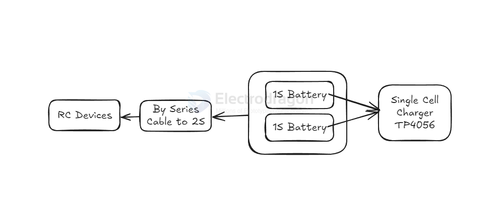

# battery-pack-dat

- battery upgrade by [[battery-holder-dat]]

- battery upgrade by [[cable-dat]] (Series And Parallel Connection Cable)

- battery test by [[electronic-loader-dat]]

## Simple 1S to 2S management Solutions 

## "Powerful" battery

### 1. Upgrade to Higher Cell Count (More Voltage)
- **Switch from 2S (7.4V) to 3S (11.1V) or 4S (14.8V)** for more motor RPM and torque.
- ✅ **Check compatibility** of your **ESC and motor** before upgrading.
  - If not rated for higher voltage, you risk burning them out.

**Pros:**
- Significant performance boost
- Higher speed and torque

**Cons:**
- Can overheat/damage components
- May require stronger drivetrain

---

### 2. Increase Battery Discharge Rate (C-Rating)
- **Higher C-rating = more current output**, improving throttle response and torque.

**Example:**
- 2S 5000mAh 20C → 5A × 20 = 100A max discharge
- 2S 5000mAh 50C → 5A × 50 = 250A max discharge

**Pros:**
- Better throttle response
- Handles load more effectively (climbing, off-road)

**Cons:**
- Higher cost
- May be slightly heavier

---

### 3. Increase Capacity (mAh)
- **Higher mAh = longer run-time** and **less voltage sag under load**

**Example:**
- Upgrade from 2200mAh to 5000mAh for more endurance

## ref 

- [[battery-dat]]