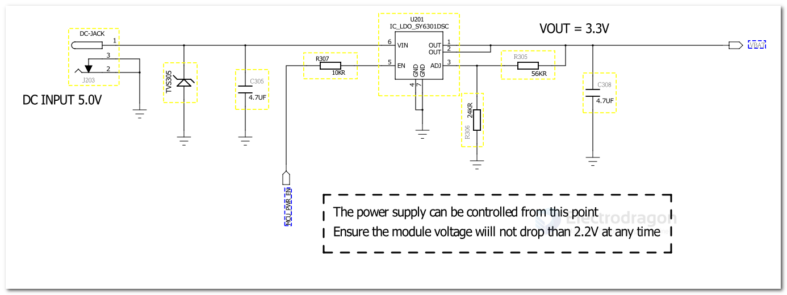

# DCDC-bulk-dat

- [[MPS-dat]] - [[MP1658-dat]]

## template

| chip         | Co.         | Vin       | Ipeak | Inorm | freq | package | cost CNY  |
| ------------ | ----------- | --------- | ----- | ----- | ---- | ------- | --------- |
| TPS5430      |             | 5.5-36V   | 3A    |       |      |         |
| TPS54331     |             | 3.5-28V   | 3A    |       |      | SOP-8   |
| TPS54302 DDCR | [[TI-power-dat]]  | 4.5-28V   | 3A    |       |      | SOT23-6 | 0.98      |
| LM2596S-5.0  |             | 40V       | 3A    |       |      |         |
| TLV62569DBVR |             | 2.5V~5.5V | 2A    |       |      |         |
| TPS5450DDAR  |             | 5.5V~36V  | 5A    |       |      |         |
| TPS54560DDAR |             | 4.5V~60V  |       |       |      |         | 30+: 5.37 |
| XL1509       | [[XL-dat]]  |           |       |       |      |         |
| LM5164DDAR   |             | 6V~100V   |       |       |      |         |
| MP2143       | [[MPS-dat]] | 24V       | 3A    |       |      |         |

TPS543x 3A、宽输入范围降压转换器

TPS5430：5.5V 至 36V

TPS54331 具有 Eco-mode 的 3A、28V 输入、直流/直流降压转换器

TPS 54202 DDCR

TPS 563201 DDCR

MT2492 - 2A,4.5V-16V Input,600kHz Synchronous Step-Down Converter
ME3116AM6G - 最高输入 40V 带载可达 1A 的 DC/DC 降压型稳压器 ME3116

- [[dcdc-down-output-dat]]

## circuits 

## ref 

- [[LDO-dat]]
  
- [[XL-dat]] - [[MPS-dat]]

- [[dcdc-down]]