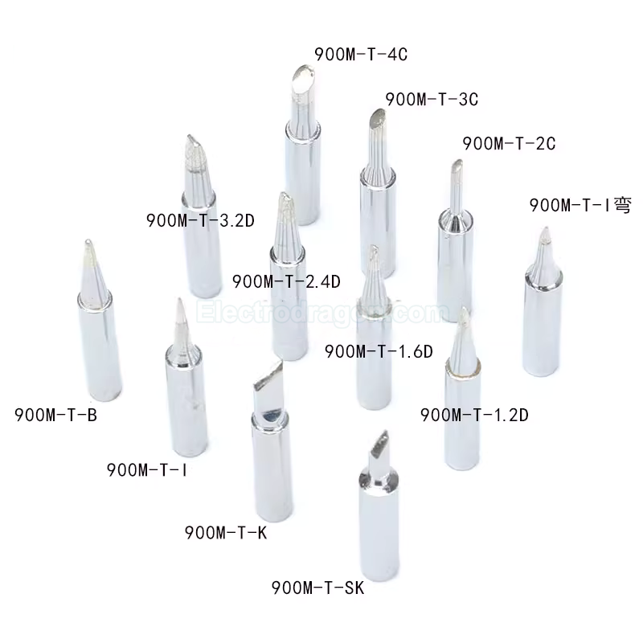
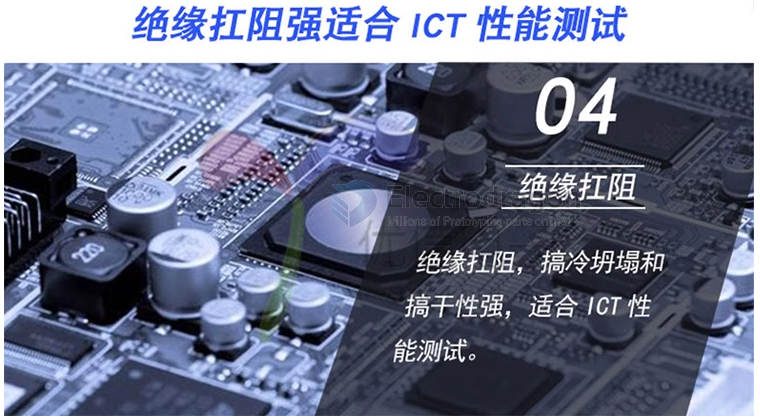

# soldering-dat

- [[PSO1043-dat]] - [[PSO1038-dat]]

- [[PCB-cleaner-dat]]

- [[solder-paste-dat]]

## Soldering Iron and Tips 

soldering iron 
- [[PTOS009-dat]]

usb soldering iron - [[PSO1055-dat]]

- [[PSO1025-dat]] - [[PSO1024-dat]] - [[PSO1023-dat]]

all soldering tips family 1 

Common soldering tips system: (C1151), ESD(C1152), 900, 900M, 907, 933, 936, 937, 942

## soldering wires 

- [[PSO1030-dat]]

## Soldering Flux 

- [[PSO1046-dat]]

## Common type Solder Paste 

| melting point | tin content | Note                                                        |
| ------------- | ----------- | ----------------------------------------------------------- |
| 183 C         | 63%         | best for most common PCB, small spacing, high parts density |

## soldering skills 

### soldering chip with pads underneath, such as QFN, BGA, LGA, etc.

### FPC soldering 

- [[FPC-dat]]

### alternative temperature-sensitive items soldering

> No special solder paste is needed; the key point is not to heat the FPC connector directly—apply heat from the back side of the PCB.
> 
> **Explanation:**
> When soldering temperature-sensitive components like FPC (Flexible Printed Circuit) connectors, you generally do not need to use any special type of solder paste. The most important thing is to avoid applying hot air or direct heat to the FPC connector itself, as it can be easily damaged by high temperatures. 
> Instead, use a hot air gun or soldering tool to heat the solder joints from the back side of the PCB. This approach helps protect the delicate connector and ensures a reliable solder joint.

## ref 

- [[desoldering-dat]]

- [[welding-dat]] - [[spot-welding-dat]]

- [[ICT-testing]]