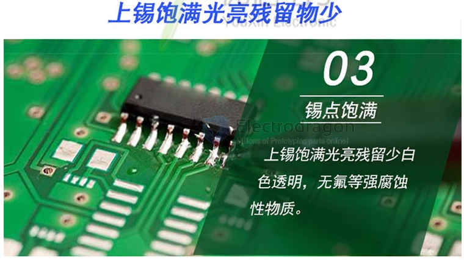

# soldering-dat

- [[PSO1055-dat]] - [[PSO1043-dat]] - [[PSO1038-dat]]

## Soldering Iron and Tips 

- [[PTOS009-dat]]

- [[PSO1025-dat]] - [[PSO1024-dat]] - [[PSO1023-dat]]

all soldering tips family 1 

## soldering wires 

- [[PSO1030-dat]]

## Soldering Flux 

- [[PSO1046-dat]]

## Common type Solder Paste 

| melting point | tin content | Note                                                        |
| ------------- | ----------- | ----------------------------------------------------------- |
| 183 C         | 63%         | best for most common PCB, small spacing, high parts density |

## ref 

- [[desoldering-dat]]

- [[ICT-testing]]