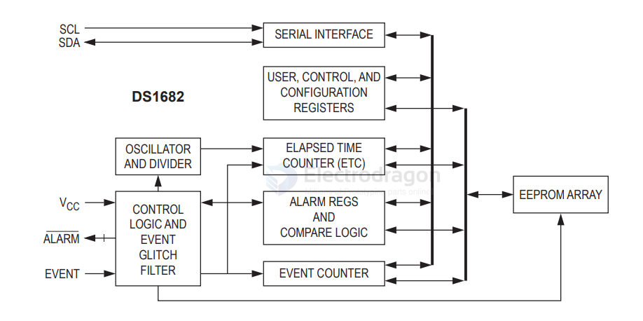

# recorder-Total-Elapsed-Time-dat

- [[recorder-Total-Elapsed-Time-dat]] - [[DS1682-dat]] - [[analog-device-dat]]

Applications

- High-Temp, Rugged, Industrial Applications Where Vibration or Shock Could Damage a Quartz Crystal
- Any System Where Time-of-Use is Important (Warranty Tracking)

## diagram 

## ref 

