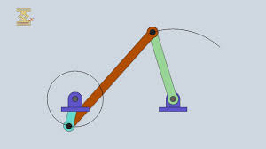
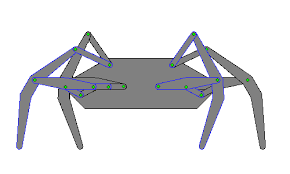
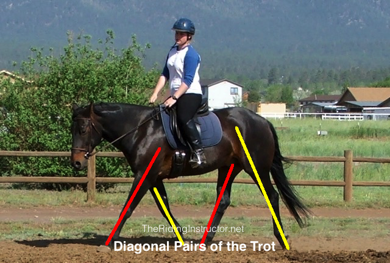

# Quadruped-Locomotion-dat


Direct-Drive Servos

When your servo horns are the feet, the most efficient movement is a **coordinated rotation** that mimics a wheel but maintains the balance of a quadruped.

### 1. The Diagonal Trot (Recommended)
This is the smoothest and fastest way to move. You move diagonal pairs in a "circular" or "elliptical" path.

* **Group 1:** Front Left (FL) and Rear Right (RR)
* **Group 2:** Front Right (FR) and Rear Left (RL)

**The Logic:**

1.  **Group 1** rotates "down and back" (pushing the floor) while **Group 2** rotates "up and forward" (lifting through the air).
2.  The pairs switch roles. 
3.  By using a 180° phase shift between the two groups, the robot's body stays level while moving forward.


---

### 2. The "Crawl" (High Stability)

If your robot is top-heavy or the servo horns are very long, a Trot might be too shaky. Use a **Sequence Walk** instead.

* **Sequence:** FL -> RR -> FR -> RL
* **Action:** Only one "foot" moves forward at a time while the other three stay on the ground.
* **Benefit:** The Center of Mass (CoM) is always supported by a triangle of legs, making it nearly impossible to tip over.

---

3. Mechanical Implementation Tips


| Foot Design | Benefit | Best For |
| :--- | :--- | :--- |
| **Offset "L" Shape** | Increases the "stride" length without needing a larger servo rotation. | Speed |
| **Circular/C-Shape** | Provides a smooth "rolling" contact point with the floor. | Stability/Grass |
| **Rubber-Tipped Point** | Increases friction to prevent the servos from slipping during the "push" phase. | Hard floors |


1. Simple Code Logic (Pseudocode)
To implement the **Trot**, your code should look something like this:

```cpp
// Phase 1
Servo_FL.write(45); // Push
Servo_RR.write(45); // Push
Servo_FR.write(135); // Lift/Reset
Servo_RL.write(135); // Lift/Reset

delay(200);

// Phase 2
Servo_FL.write(135); // Lift/Reset
Servo_RR.write(135); // Lift/Reset
Servo_FR.write(45); // Push
Servo_RL.write(45); // Push


```


### Crank-Rocker




### Klann Linkage





### Diagonal Trot



### trot gait 


The **Trot Gait** is a symmetrical, "two-beat" gait used by four-legged animals and robots. Its defining characteristic is the **simultaneous movement of diagonal pairs of legs**.

### 1. The Trot Gait Mechanics
In a trot, the legs move in the following sequence:
* **Pair A:** Front Left (FL) and Rear Right (RR) move together.
* **Pair B:** Front Right (FR) and Rear Left (RL) move together.


* **Symmetry:** The movement of the left side is a mirror image of the right side, shifted in time.
* **Duty Factor:** In a standard trot, each foot is on the ground for about 50% of the stride cycle.
* **Efficiency:** It is highly energy-efficient for traveling at medium speeds because it maintains a stable "support line" between the diagonal feet.

---

### 2. Comparison of Common Quadruped Gaits

Beyond the trot, quadrupeds use several other gait patterns depending on the required speed and terrain stability.

#### A. The Walk (Static Stability)
* **Pattern:** Each leg moves individually (e.g., RL -> FL -> RR -> FR).
* **Stability:** At least three legs are on the ground at all times, keeping the Center of Mass (CoM) within the support triangle.
* **Usage:** Best for very slow, precise movement over uneven terrain.

#### B. The Pace (Lateral Gait)
* **Pattern:** Both legs on the **same side** move together (e.g., FL + RL, then FR + RR).
* **Characteristics:** This creates a side-to-side swaying motion. It is common in camels and some breeds of horses.
* **Robot Note:** Harder to balance in robotics due to the large lateral weight shift.

#### C. The Bound (Pitching Gait)
* **Pattern:** Both front legs move together, followed by both rear legs.
* **Characteristics:** High-speed leaping motion. It involves significant "pitch" (tilting up and down) of the body.
* **Usage:** Used by squirrels and dogs for rapid acceleration or clearing obstacles.


#### D. The Gallop (Asymmetrical High Speed)
* **Pattern:** A four-beat sequence with a "flight phase" where all four feet are off the ground.
* **Characteristics:** The fastest possible gait. It utilizes the elasticity of the spine to increase stride length.

#### E. The Pronk (High Impact)
* **Pattern:** All four legs jump and land simultaneously.
* **Usage:** Often seen in springboks or gazelles. In robotics, it's used to test motor peak power and landing impact absorption.

---

### 3. Summary Table

| Gait Name  | Pairing Type        | Beats | Best For                               |
| :--------- | :------------------ | :---- | :------------------------------------- |
| **Walk**   | Single Leg          | 4     | Maximum Stability                      |
| **Trot**   | **Diagonal Pairs**  | **2** | **Efficiency / Medium Speed**          |
| **Pace**   | Lateral Pairs       | 2     | Long-distance travel (certain species) |
| **Bound**  | Front/Rear Pairs    | 2     | Clearing Obstacles / Rapid Burst       |
| **Gallop** | No Pairs (Sequence) | 4     | Maximum Speed                          |