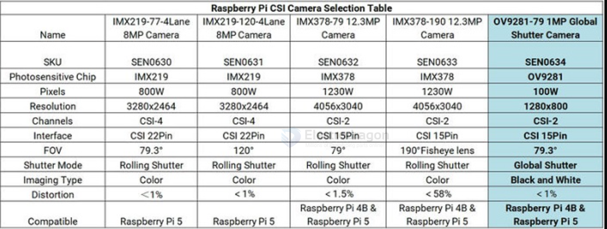

# camera-dat 

- [[video-dat]] - [[image-dat]]

- [[camera-interface-dat]] - [[camera]] - [[video-transmission-dat]]

- [[detecting-camera-dat]]

- [[camera-analog-dat]] - [[camera-digital-dat]] - [[camera-action-dat]]

- [[camera-SDK-dat]]

## boards 

- [[ESP1000-dat]]

- [[SCM1030-dat]] - [[SCM1027-dat]]

- [[MPC1080-dat]]

- [[SCM1000-dat]] - [[SCM1002-dat]] - [[SCM1012-dat]] - [[SCM1013-dat]] - [[SCMS015-dat]]

## Chip 

[[OmniVision-dat]] == [[DVP-dat]] - [[CSI-dat]]

- [[OV3660-dat]]

- [[OV9281-dat]]

- [[OV2710-dat]]

- [[ov5659-dat]] - [[ov2659-dat]] 

- [[OV7670-dat]] - [[OV2640-dat]] - [[OV5640-dat]] - [[OV7725-dat]]

- [[OV7740-dat]] - [[OV5642-dat]]

- [[OV5648-dat]]

OV series boards - [[SCM1008-dat]] - [[SCM1009-dat]] - [[SCM1017-dat]] - [[SCM1024-dat]] - [[SCM1020-dat]] - [[SCM1004-dat]] 

- [[SONY-dat]]

### more cameras 

| model	| max resolution	| color type	| output format	| Len Size |
| ---	| ---	               | ---	| ---	| --- |
| [[OV2640-dat]]	|1600 x 1200	|color	|YUV(422/420)/YCbCr422 / RGB565/555 / 8-bit compressed data / 8/10-bit Raw RGB data|	1/4"|
| [[OV3660-dat]]	|2048 x 1536	|color	|raw RGB data / RGB565/555/444 / CCIR656 / YCbCr422 / compression|	1/5"|
| [[OV5640-dat]]	|2592 x 1944	|color	|RAW RGB / RGB565/555/444 / CCIR656 / YUV422/420 / YCbCr422 / compression|	1/4"|
| [[OV7670-dat]]	|640 x 480	|color	|Raw Bayer RGB / Processed Bayer RGB / YUV/YCbCr422 / GRB422 / RGB565/555	|1/6"|
| [[OV7725-dat]]	|640 x 480	|color	|Raw RGB / GRB 422 / RGB565/555/444 / YCbCr 422|	1/4"|
|NT99141|	1280 x 720	|color	|YCbCr 422 / RGB565/555/444 / Raw / CCIR656 / JPEG compression	|1/4"|
|GC032A	|640 x 480	|color	|YUV/YCbCr422 / RAW Bayer / RGB565	|1/10"|
|GC0308	|640 x 480	|color	|YUV/YCbCr422 / RAW Bayer / RGB565 /Grayscale	|1/6.5"|
|GC2145	|1600 x 1200	|color|	YUV/YCbCr422 / RAW Bayer / RGB565	|1/5"|
|BF3005	|640 x 480	|color	|YUV/YCbCr422 / RAW Bayer / RGB565	|1/4"|
|BF20A6	|640 x 480	|color	|YUV/YCbCr422 / RAW Bayer / Only Y	|1/10"|
|SC101IOT|	1280 x 720	|color	|YUV/YCbCr422 / Raw RGB|	1/4.2"|
|SC030IOT|	640 x 480	|color	|YUV/YCbCr422 / RAW Bayer	|1/6.5"|
|SC031GS|	640 x 480	|monochrome	|RAW MONO / Grayscale	|1/6"|
|HM0360	|656 x 496	|monochrome	|RAW MONO / Grayscale	|1/6"|
|HM1055	|1280 x 720	|color	|8/10-bit Raw / YUV/YCbCr422 / RGB565/555/444	|1/6"|

### selection table 

## Camera Interface 

- [[USB-camera-dat]] - [[wireless-camera-dat]]

- [[camera-interface-dat]] - [[SCCB-dat]] - [[CSI-dat]] - [[UVC-dat]] - [[analog-video-dat]] - [[HDMI-dat]]

[[CSI-dat]]: - [[MPC1080-dat]]   

[[SCCB-dat]]: - [[SCM1008-dat]] - [[SCM1009-dat]] - [[SCM1017-dat]] - [[SCM1024-dat]] 

[[UVC-dat]]: - [[SCM1020-dat]] - [[SCM1002-dat]] - [[SCM1004-dat]]

[[analog-video-dat]]: - NA

- [[DVP-camera-dat]]

## Camera Functionalities

- [[Camera-Functionalities-dat]]
- 
- [[auto-focus-dat]]

- [[3D-camera-dat]] - [[night-vision-dat]] - [[camera-pan-dat]] - [[camera-tilt-dat]] - [[camera-zoom-dat]]

- [[video-dat]]

## output format 

- [[MJPEG-dat]] - [[YUV-dat]] - [[RGB-dat]] - [[H264-dat]] 

output format is MJPEG 640X480. Only in this format and resolution can a high frame rate be achieved.

## use-guide 

- [[ESP32-cam-dat]] - [[RPI-camera-dat]]

## other camera types 

- GC0328

- GC0328 dual camera (horizontal screen) for MF1 only
- OS08A20 camera for M4Ndock

## ref 

- [[camera-dat]] - [[omni-vision-dat]]

- [[SCM1009]] - [[SCM1008]] - [[SCM1030]]

- [[camera]]
