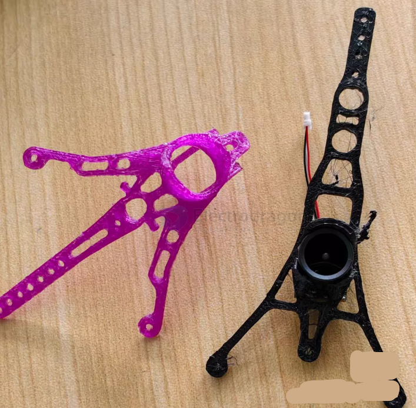
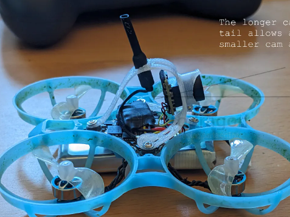
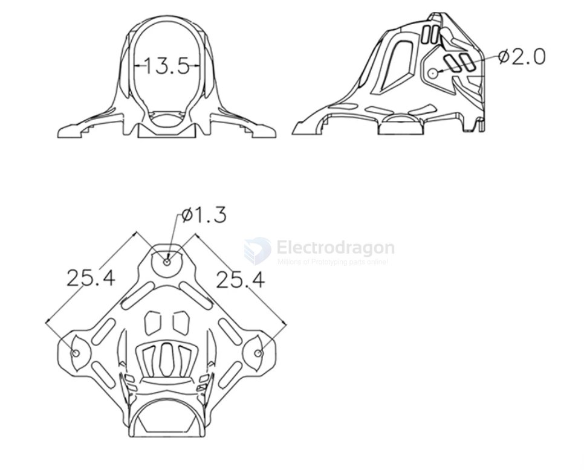
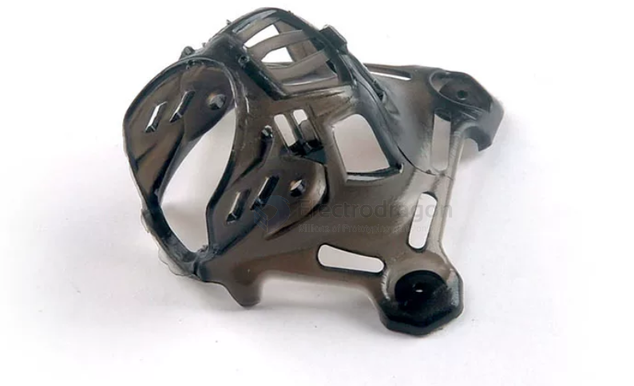
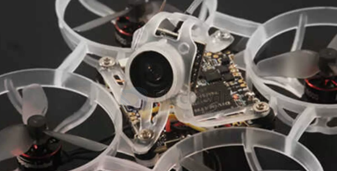
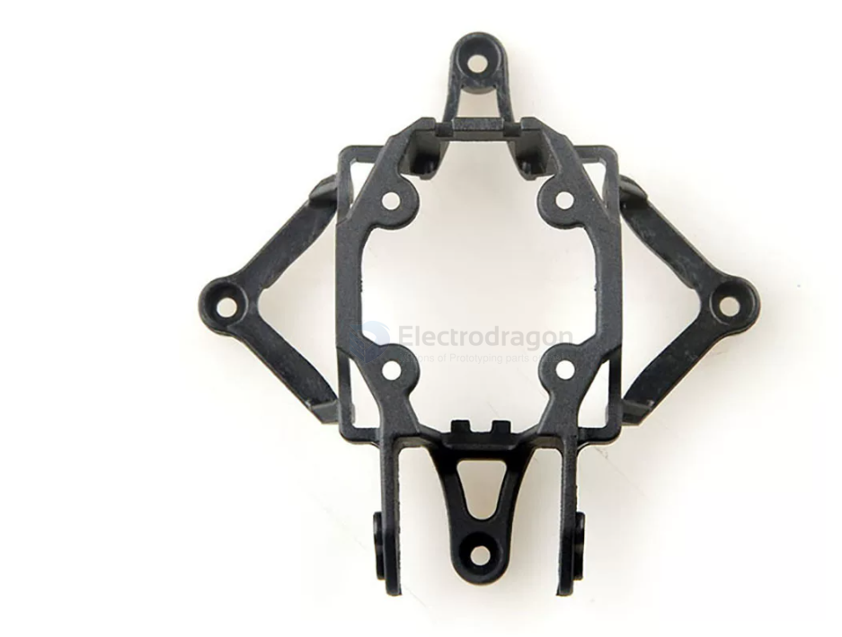
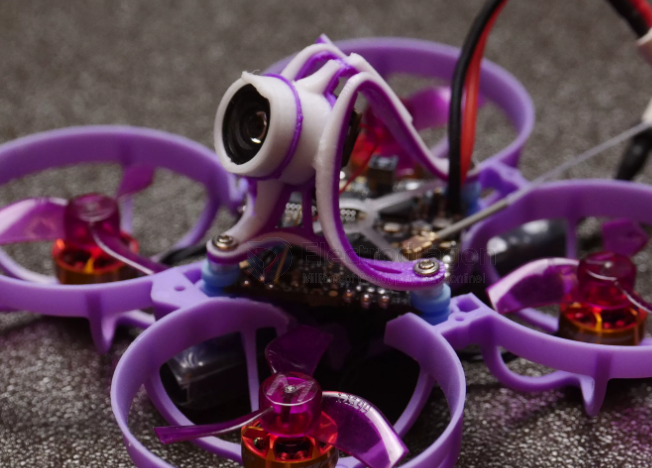
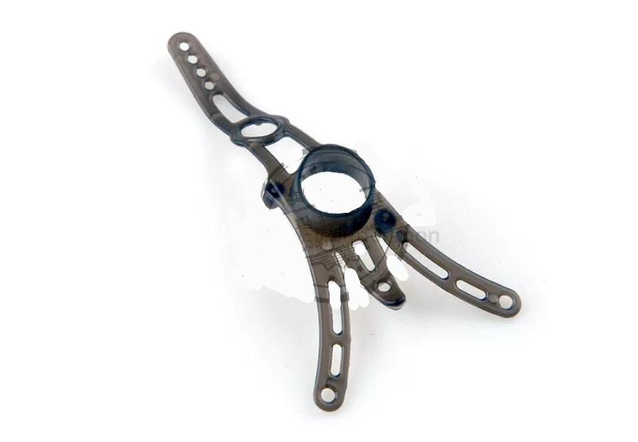
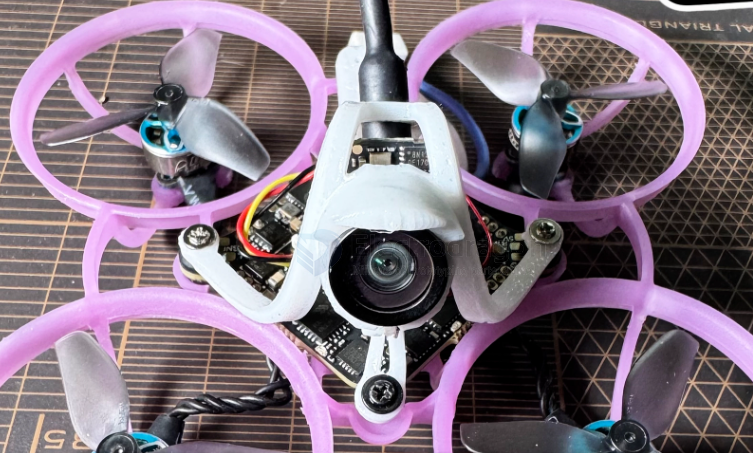

# camera-FPV-canopy-dat

- [[camera-FPV-dat]] - [[camera-FPV-canopy-dat]] - [[FPV-build-dat]] - [[FPV-dat]] - [[VTX-dat]] - [[sensor-camera-dat]] - [[camera-mount-dat]]

## canopy 

build 1 - maybe the best all-in-one FPV camera canopy for analog camera 

- [[fab-3d-print-dat]]

https://www.printables.com/model/976803-betafpv-air-canopy-for-lower-cam-angles-for-air65

I printed the model in `nylon (PA12)` "Fiberlogy Nylon PA12 Natural", which results in excellent stability and durability. I assume that the original canopy is also made of nylon. 

Alternatively, `TPU` could also be suitable. 

If only `PLA or ABS` are available, I would reduce the material thickness to a minimum. This means that these materials can also be bent quite well and become robust and flexible. 

## FPV camera canopy 

digital DJI O3 

- Item Name: Camera mount bracket for Mobula6 2024
- Material: PP
- Color option: Transparent black/Transparent white
- Net Weight: 0.62g
- Camera angle could adjustable easily
- Transparent black for Mobula62024, transparent for Mobula6 ECO 2024
- Package Included:
- 1 x Camera mount bracket
- 2 x M1.2×5 screws

- [[betaFPV-air-2-dat]] - [[betaFPV-dat]] == lens dia 9-10mm 

## ref 

