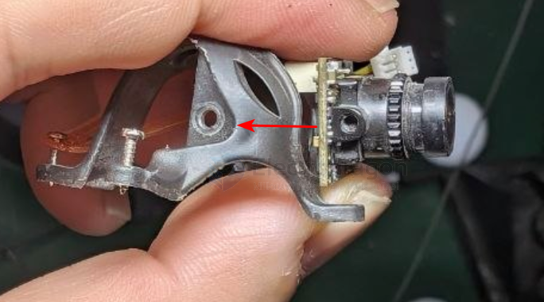
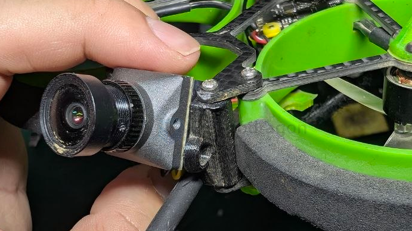
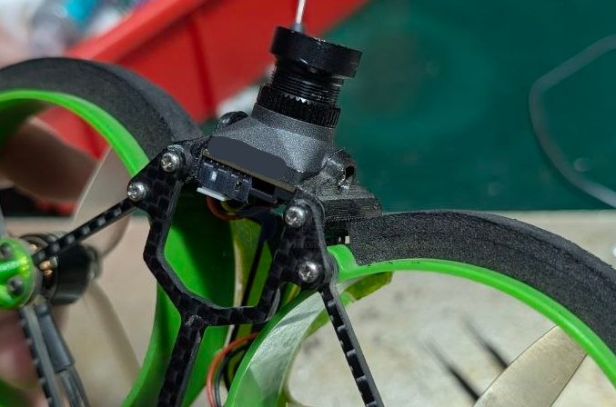
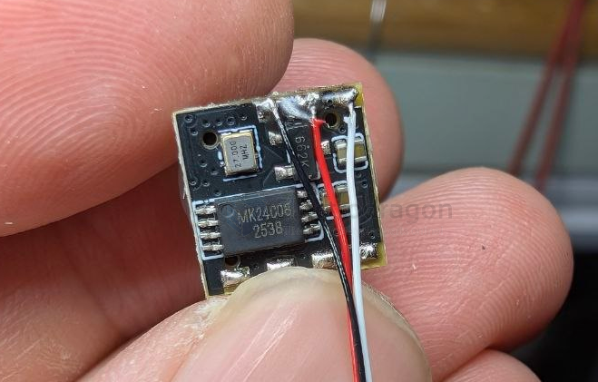
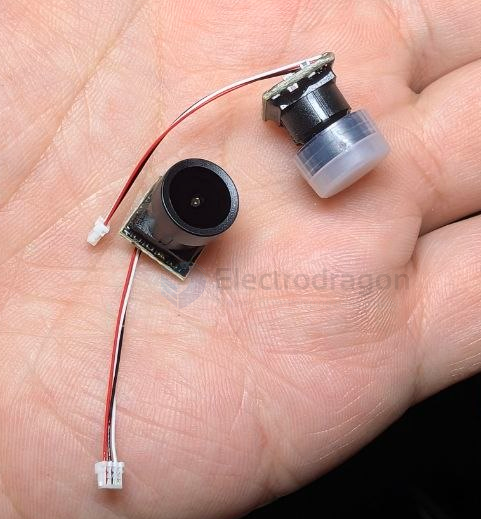

# camera-FPV-dat

- [[FPV-build-dat]] - [[FPV-frame-dat]] - [[flight-controller-dat]] - [[motor-FPV-dat]] - [[propeller-FPV-dat]] - [[camera-FPV-dat]]

- [[runcam-dat]] 

- [[camera-FPV-dat]] - [[camera-analog-dat]] - [[camera-digital-dat]] - [[caddxFPV-ratelpro-dat]] - [[runCam-dat]] - [[VTX-dat]] - [[DJI-O4-dat]]

- [[FPV-dat]] - [[RC-dat]]

- [[camera-FPV-dat]] - [[MS-519-dat]]

- [[camera-dat]] - [[camera-digital-dat]] - [[camera-analog-dat]]

- [[camera-action-dat]]

- [[FPV-accesories-dat]]

- [[camera-rack-dat]]

- [[runCAM-dat]] - [[runCAM-nano4-dat]] - [[runCAM-nano3-dat]] - [[runCAM-nano2-dat]] - [[runcam-split3-dat]]

- [[camera-FPV-dat]] - [[camera-FPV-angle-dat]]

- [[lens-dat]]

## installation 

### bolt lock install 

for [[caddx-ratelpro-dat]] - [[caddx-ant-dat]]

- [[bolt-dat]] == M2 x 6? == [[camera-FPV-dat]]

side view install M2 x6 

- [[FUS-X111-dat]]

- [[cable-dat]] - [[CONN-dat]]

### canopy belting hold install 

- [[camera-FPV-dat]] - [[camera-FPV-canopy-dat]] - [[FPV-build-dat]] - [[FPV-dat]] - [[VTX-dat]] - [[sensor-camera-dat]] - [[camera-mount-dat]]

## super-mini 1gram FPV camera

not yet break it down, only the back side now 

- [[EEPROM-dat]] - [[LDO-dat]] - [[crystal-dat]]

## wiring 

- [[camera-FPV-dat]] - [[CONN-JST-dat]]

## camera 

- [[camera-FPV-dat]] - [[caddx-ratel2-dat]] - [[caddx-ratelpro-dat]]

- [[camera-digital-dat]]

- [[camera-analog-dat]] - [[MS-519-dat]]

| model             | lens    | PCB size |
| ----------------- | ------- | -------- |
| runcam Nano 3     |         |          |
| Foxeer Pico razer | M7 10mm |          |
| runcam Nano 2     | M8 12mm | 14x14    |
| caddx ANT 1200TVL | M8 12mm | 14x14    |

- M1.2和M2孔是指摄像头保护罩安装到机架上的孔径
- 如果改装到[[mobula6-dat]] 或者[[mobula7-dat]] 的机架上请选择M1.2孔径。

- Caddx Ant（~¥80-120，轻量经典）
- Runcam Nano 4 / Phoenix 
- BetaFPV C02/C03
- 或你熟悉的 Ratel Pro（但偏重 9.5g，对 2 寸机稍重）

## maker 

- [[caddx-dat]] - [[camera-FPV-dat]] - [[camera-wireless-dat]]

- [[caddx-dat]] - [[runcam-dat]]

- [[caddx-RatelPro-dat]] - [[caddx-dat]] - [[caddx-ANT-dat]] - [[caddx-ratel2-dat]] - [[caddx-baby-ratel2-dat]]

- [[caddx-ratel2-dat]]

## thumb camera 

Hawkeye thumb 4k camera

RunCam Thumb Pro

https://www.reddit.com/r/TinyWhoop/comments/11t4yw6/so_impressed_by_runcam_thumb_pro_4k30_on_my/

hawkeye 

## ref 

- [[camera-dat]]