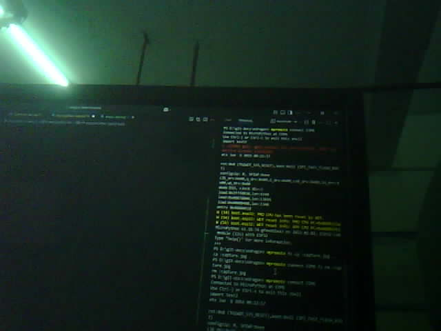

# OV2640-lemariva-dat.md

## for ESP1000 - ESP32-CAM

- [[2640-2.py]] using IO3@high to detect and capcture image exmaple 

## original code 

https://github.com/lemariva/micropython-camera-driver
https://github.com/lemariva/upyCam
https://github.com/lemariva/upyCam/tree/timelapse-camera

flash camera driver firmware 

    esptool --port COM6 --baud 460800 write-flash 0x1000 micropython_camera_feeeb5ea3_esp32_idf4_4.bin

run for [[SCM1030-dat]] - ESP32-CAM

    import camera
    camera.init(0, format=camera.JPEG, fb_location=camera.PSRAM, xclk_freq=camera.XCLK_20MHz)
    buf = camera.capture()

full code to capture a single image 

    import camera

    camera.init(0, format=camera.JPEG, fb_location=camera.PSRAM, xclk_freq=camera.XCLK_20MHz)

    buf = camera.capture()

    with open('capture.jpg', 'wb') as f:
        f.write(buf)

- [[ESP1000-dat]]

### lemariva/upyCam

- config file config.py.example to config.py 

